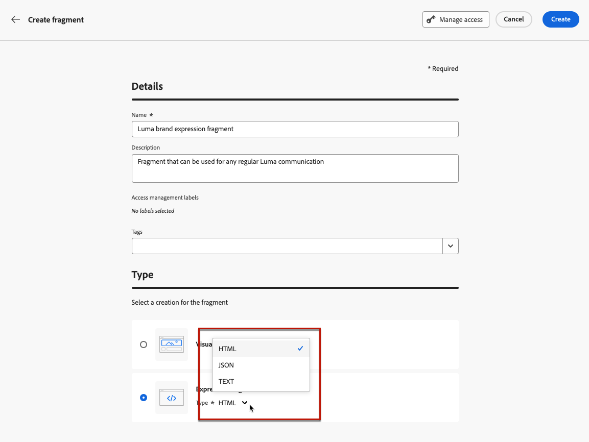

# 使用片段 {#fragments}

片段是可重复使用的组件，可在其中一个或多个电子邮件中引用 [!DNL Journey Optimizer] 营销活动和历程。

此功能允许预先构建多个自定义内容块，营销用户可以使用这些内容块在改进的设计过程中快速组合电子邮件内容。

➡️ [在这些视频中了解如何管理、创作和使用片段](#video-fragments)

>[!CAUTION]
>
>要创建、编辑和存档片段，您必须具有 **[!DNL Manage Library Items]** 权限包含在 **[!DNL Content Library Manager]** 产品配置文件。 [了解详情](../administration/ootb-product-profiles.md#content-library-manager)

要充分利用片段，请执行以下操作：

* 创建您自己的片段。 您可以创建可视化片段或表达式片段。 [了解详情](#create-fragments)
* 您可以根据需要在内容中多次使用它们。 请参阅 [添加可视片段](../email/use-visual-fragments.md) 和 [利用表达式片段](../personalization/use-expression-fragments.md)

>[!NOTE]
>
>当前位置 [!DNL Journey Optimizer]：
>
>* 可视化片段仅适用于电子邮件渠道。
>
>* 表达式片段不适用于Web渠道和应用程序内渠道。

## 访问和管理片段 {#access-manage-fragments}

要访问片段列表，请选择 **[!UICONTROL 内容管理]** > **[!UICONTROL 片段]** 从左侧菜单。

在当前沙盒中创建的所有片段 —  [从 **[!UICONTROL 片段]** 菜单](#create-fragments)，使用 [另存为片段](#save-as-fragment) 选项 — 将显示。

您可以按以下项筛选片段：

* 类型： **[!UICONTROL 可视化]** 或 **[!UICONTROL 表达式]**
* 标记
* 创建或修改日期

您可以选择显示所有片段，或仅显示当前用户创建或修改的项目。

您还可以显示 **[!UICONTROL 已存档]** 片段。 [了解详情](#archive-fragments)

从 **[!UICONTROL 更多操作]** 按钮进行以下操作：

* 复制片段。

* 使用 **[!UICONTROL 浏览引用]** 选项，用于查看使用它的历程、营销策划或模板。 [了解详情](#explore-references)

* 将片段复制到另一个沙盒。 <!--Learn more?-->

* 将片段存档。 [了解详情](#archive-fragments)

* 编辑片段的 [标记](../start/search-filter-categorize.md#tags).

### 编辑片段 {#edit-fragments}

要编辑片段，请执行以下步骤。

1. 单击以下位置中的所需项目： **[!UICONTROL 片段]** 列表。
1. 从片段属性中，您可以 [浏览引用](#explore-references)， [管理其访问权限](../administration/object-based-access.md)，并更新片段详细信息，包括 [标记](../start/search-filter-categorize.md#tags).

   

1. 选择相应的按钮以编辑内容，就像从头开始创建片段时所做的那样。 [了解详情](#create-from-scratch)

>[!NOTE]
>
>在编辑片段时，更改将自动传播到该片段使用的所有内容，但中使用的内容除外 **[!UICONTROL 实时]** 历程或营销活动。 您还可以中断来自原始片段的继承。 在中了解详情 [向您的电子邮件添加可视化片段](../email/use-visual-fragments.md#break-inheritance) 和 [利用表达式片段](../personalization/use-expression-fragments.md#break-inheritance) 部分。

### 浏览引用 {#explore-references}

您可以显示当前使用片段的历程、营销活动和内容模板列表。

要执行此操作，请选择 **[!UICONTROL 浏览引用]** 来自 **[!UICONTROL 更多操作]** 菜单或片段属性屏幕中的菜单的操作工具栏。

选择一个选项卡，可在历程、营销活动、模板和片段之间切换。 您可以查看其状态，然后单击名称以重定向到引用片段的相应项目。

>[!NOTE]
>
>如果片段用在历程、营销策划或模板中，且标签阻止您访问片段，您将在选定选项卡顶部看到一条警报消息。 [了解有关对象级访问控制(OLAC)的更多信息](../administration/object-based-access.md)

### 存档片段 {#archive-fragments}

您可以从不再与您的品牌相关的项目中清理片段列表。

要执行此操作，请单击 **[!UICONTROL 更多操作]** 按钮选择所需片段旁边的 **[!UICONTROL 存档]**. 它会从片段列表中消失，从而阻止用户在未来电子邮件或模板中使用它。

>[!NOTE]
>
>如果存档内容中使用的片段， <!--it will remain in the email or template, but you won't be able to select it from the fragment list to edit it-->该内容将不会受到影响。

要取消存档片段，请在 **[!UICONTROL 已存档]** 项并选择 **[!UICONTROL 取消存档]** 从 **[!UICONTROL 更多操作]** 菜单。 现在可以再次从片段列表中访问，并可用于任何电子邮件或模板。

## 创建片段 {#create-fragments}

创建片段的方法有两种：

* 使用，从头开始创建片段 **[!UICONTROL 片段]** 专用菜单。 [了解如何操作](#create-from-scratch)

* 设计内容时，将部分内容另存为片段。 [了解如何操作](#save-as-fragment)

保存后，您的片段即可用于历程、营销策划或模板。 无论是从头开始还是从现有内容创建，您现在都可以在中构建任何内容时使用此片段 [!DNL Journey Optimizer]. 请参阅 [添加可视片段](../email/use-visual-fragments.md) 和 [利用表达式片段](../personalization/use-expression-fragments.md)

### 从头开始创建 {#create-from-scratch}

>[!CONTEXTUALHELP]
>id="ajo_create_fragment"
>title="定义您自已的片段"
>abstract="从头开始创建独立的片段，以便可在历程和营销活动中重用您的内容。"

要从头开始创建片段，请执行以下步骤。

1. 通过访问片段列表 **[!UICONTROL 内容管理]** > **[!UICONTROL 片段]** 左侧菜单。

1. 选择 **[!UICONTROL 创建片段]**.

1. 填写片段详细信息，即名称和描述（如果需要）。

   

1. 选择片段类型： [可视片段](#create-visual-fragment) 或 [表达片段](#create-expression-fragment).

1. 要为片段分配自定义或核心数据使用标签，请选择 **[!UICONTROL 管理访问权限]**. [了解有关对象级访问控制(OLAC)的更多信息](../administration/object-based-access.md).

1. 从中选择或创建Adobe Experience Platform标记 **[!UICONTROL 标记]** 用于对片段进行分类以改进搜索的字段。 [了解详情](../start/search-filter-categorize.md#tags)

1. 单击&#x200B;**[!UICONTROL 创建]**。

### 创建可视片段 {#create-visual-fragment}

1. [创建片段](#create-from-scratch) 从 **[!UICONTROL 内容管理]** > **[!UICONTROL 片段]** 左菜单并选择 **[!UICONTROL 可视片段]** 类型。

   >[!NOTE]
   >
   >当前仅可视片段使用 **电子邮件** 支持渠道。

1. 此 [电子邮件设计工具](../email/get-started-email-design.md) 显示。 根据需要编辑您的内容，就像处理历程或营销活动中的任何电子邮件一样。

   >[!NOTE]
   >
   >您可以添加个性化字段和动态内容，但片段中不支持上下文属性。

   

1. 片段准备就绪后，单击 **[!UICONTROL 保存]**. 它会添加到 [片段列表](#access-manage-fragments).

1. 如果需要，单击片段名称旁边的箭头以返回到 **[!UICONTROL 详细信息]** 屏幕并进行编辑。

   

现在，可在构建任何 [电子邮件](../email/get-started-email-design.md) 或 [内容模板](content-templates.md) 范围 [!DNL Journey Optimizer]. [了解如何操作](../email/use-visual-fragments.md)

### 创建表达式片段 {#create-expression-fragment}

1. [创建片段](#create-from-scratch) 从 **[!UICONTROL 内容管理]** > **[!UICONTROL 片段]** 左菜单并选择 **[!UICONTROL 表达片段]** 类型。

1. 选择要使用的代码类型： **[!UICONTROL HTML]**， **[!UICONTROL JSON]** 或 **[!UICONTROL 文本]**.

   

   <!--Expression fragments can be used in any channel.-->

1. 单击&#x200B;**[!UICONTROL 创建]**。表达式编辑器将打开。

1. 您可以利用 [!DNL Journey Optimizer] 具有所有个性化和创作功能的表达式编辑器。 [了解详情](../personalization/personalization-build-expressions.md)

   

1. 片段准备就绪后，单击 **[!UICONTROL 保存]**. 它会添加到 [片段列表](#access-manage-fragments).

1. 如果需要，单击片段名称旁边的箭头以返回到 **[!UICONTROL 详细信息]** 屏幕并进行编辑。

此片段现在可以在中构建任何内容时使用 [!DNL Journey Optimizer] 表达式编辑器。 [了解如何操作](../personalization/use-expression-fragments.md)

## 另存为片段 {#save-as-fragment}

在中编辑内容时 [!DNL Journey Optimizer]，您可以将全部或部分内容另存为片段以供将来重用。

### 另存为可视化片段 {#save-as-visual-fragment}

设计 [内容模板](content-templates.md) 或 [电子邮件](../email/get-started-email-design.md) 在营销活动或历程中，您可以将内容的一部分另存为可视化片段。 为此，请执行以下步骤。

1. 在 [电子邮件设计工具](../email/get-started-email-design.md)中，单击屏幕右上方的省略号。

1. 选择 **[!UICONTROL 另存为片段]** 从下拉菜单中。

   

1. 此 **[!UICONTROL 另存为片段]** 屏幕显示。 其中选择要包含在片段中的元素，包括个性化字段和动态内容。 请注意，片段中不支持上下文属性。

   >[!CAUTION]
   >
   >只能选取彼此相邻的部分。 您不能选择空的结构或其他片段。

   

1. 单击&#x200B;**[!UICONTROL 创建]**。填写片段详细信息，即名称和描述（如果需要）。

1. 要为片段分配自定义或核心数据使用标签，请选择 **[!UICONTROL 管理访问权限]**. [了解有关对象级访问控制(OLAC)的更多信息](../administration/object-based-access.md).

1. 从中选择或创建Adobe Experience Platform标记 **标记** 用于对模板进行分类以改进搜索的字段。 [了解详情](../start/search-filter-categorize.md#tags)

1. 单击 **[!UICONTROL 创建]** 再来一次。 片段将保存到，并添加到 [片段列表](#access-manage-fragments)，可从访问 [!DNL Journey Optimizer] 专用菜单。

   它会变成一个独立的片段，可以 [已访问](#access-manage-fragments)， [已编辑](#edit-fragments) 和 [已存档](#archive-fragments) 作为该列表中的任何其他项目。

现在，您可以在构建任何 [电子邮件](../email/get-started-email-design.md) 或 [内容模板](content-templates.md) 范围 [!DNL Journey Optimizer]. [了解如何操作](../email/use-visual-fragments.md)

>[!NOTE]
>
>对该新片段所做的任何更改都不会传播到它来自的电子邮件或模板。 同样，在该电子邮件或模板中编辑原始内容时，不会修改新片段。

### 另存为表达式片段 {#save-as-expression-fragment}

>[!CONTEXTUALHELP]
>id="ajo_perso_library"
>title="另存为表达式片段"
>abstract="此 [!DNL Journey Optimizer] 表达式编辑器允许您将内容另存为表达式片段。 然后，可以使用这些表达式来构建个性化内容。"

此 [!DNL Journey Optimizer] 表达式编辑器允许您将内容另存为表达式片段。 然后，可以使用这些表达式来构建个性化内容。

要将内容另存为表达式片段，请执行以下步骤。

1. 在 [表达式编辑器](../personalization/personalization-build-expressions.md) 界面，构建表达式，然后单击 **[!UICONTROL 另存为片段]**.

1. 在右侧窗格中，输入表达式的名称和说明，以帮助用户更轻松地找到它。

   

1. 单击 **[!UICONTROL 保存片段]**.

   <!--An expression fragment cannot be nested inside another fragment.-->

1. 表达式片段将添加到 [片段列表](#access-manage-fragments). 您现在可以使用它来构建个性化内容。

>[!NOTE]
>
>表达式不能超过200KB。

## 操作方法视频 {#video-fragments}

了解如何在中管理、创作和使用可视化片段 [!DNL Journey Optimizer].

>[!VIDEO](https://video.tv.adobe.com/v/3419932/?quality=12)

了解如何在中管理、创作和使用表达式片段 [!DNL Journey Optimizer].

>[!VIDEO](https://video.tv.adobe.com/v/3424587/?quality=12)
