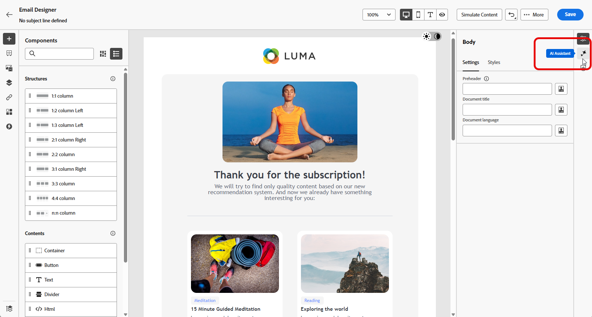
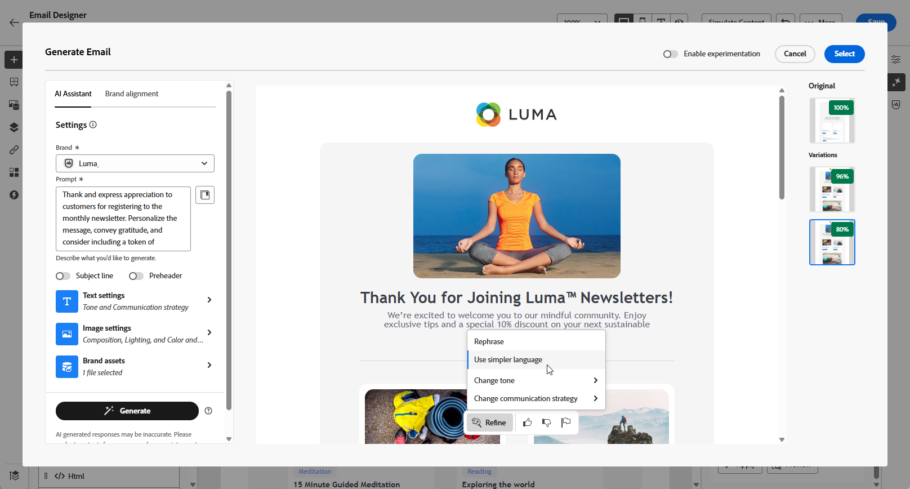
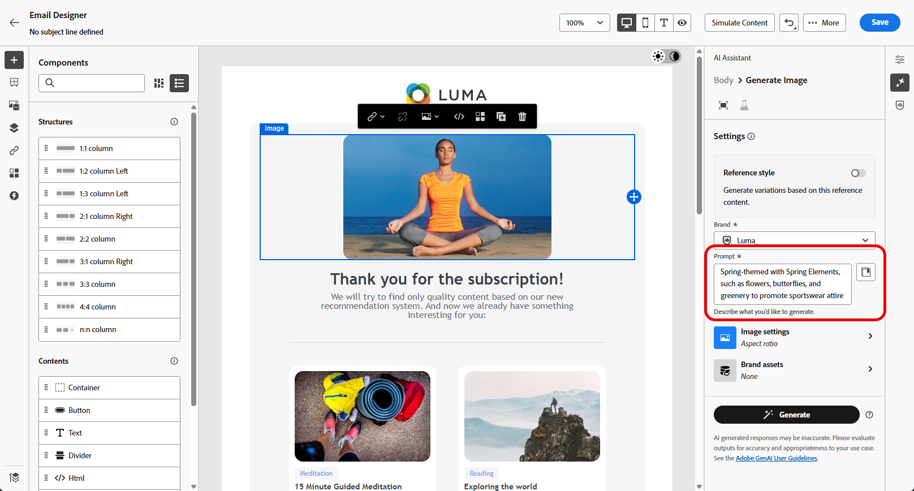

# 使用 AI 助手生成电子邮件 {#generative-email}

>[!BEGINSHADEBOX]

**目录**

* [AI 助手入门](gs-generative.md)
* **[使用AI助手生成电子邮件](generative-email.md)**
* [使用 AI 助手生成短信](generative-sms.md)
* [使用AI助手生成推送](generative-push.md)
* [使用AI助手进行内容试验](generative-experimentation.md)

>[!ENDSHADEBOX]

>[!NOTE]
>
>在开始使用此功能之前，请阅读相关内容 [护栏和限制](gs-generative.md#generative-guardrails).

在精心编制和自定义电子邮件后，利用Journey Optimizer中的AI助手在创作AI的推动下提升您的内容。

使用AI Assistant通过精心制作完整的电子邮件、量身定制的文本片段和自定义的图像（可直接与受众交谈）、促进参与和互动，来增强营销活动的有效性。

浏览以下选项卡，了解如何使用Journey Optimizer中的AI助手。

>[!BEGINTABS]

>[!TAB 完整电子邮件生成]

在以下示例中，我们将利用AI助手来优化现有电子邮件模板。

1. 创建和配置电子邮件营销活动后，单击 **[!UICONTROL 编辑内容]**.

   有关如何配置电子邮件促销活动的更多信息，请参阅 [此页面](../campaigns/create-campaign.md).

1. 根据需要个性化您的电子邮件并访问 **[!UICONTROL AI助手]** 菜单。

   {zoomable=&quot;yes&quot;}

1. 启用 **[!UICONTROL 使用原始内容]** AI助手选项，用于根据营销活动内容、名称和选定的受众来个性化新内容。

   您的提示必须始终与当前内容绑定。

1. 通过描述您要在 **[!UICONTROL 提示]** 字段。

   如果您在制作提示时需要帮助，请访问 **[!UICONTROL 提示库]** 其中提供了多种提示性想法来改进您的营销活动。

   {zoomable=&quot;yes&quot;}

1. 您可以切换 **[!UICONTROL 主题行]** 和 **[!UICONTROL 预编译标头]** 选项以将它们包含在变量生成中。

1. 单击 **[!UICONTROL 上传品牌资产]** 要添加包含可提供额外上下文的内容的任何品牌资产，AI助手或选择先前上传的品牌资产。

   {zoomable=&quot;yes&quot;}

1. 使用不同的选项定制提示：

   * **[!UICONTROL 沟通策略]**：为生成的文本选择最合适的通信样式。
   * **[!UICONTROL 语言]**：选择您希望生成内容的语言。
   * **[!UICONTROL 色调]**：电子邮件的基调应该会引起受众的共鸣。 无论您是要提供信息、好玩还是具有说服力，AI Assistant都可以相应地调整消息。

   {zoomable=&quot;yes&quot;}

1. 提示就绪后，单击 **[!UICONTROL 生成]**.

1. 浏览生成的页面 **[!UICONTROL 变体]** 并单击 **[!UICONTROL 预览]** 以查看所选变体的全屏版本。

1. 导航至 **[!UICONTROL 优化]** 内的选项 **[!UICONTROL 预览]** 用于访问其他自定义功能的窗口：

   * **[!UICONTROL 重新短语]**： AI助手可以通过不同的方式重新声明您的消息，以使您的撰写保持新鲜，并吸引各种受众。

   * **[!UICONTROL 使用更简单的语言]**：利用AI Assistant简化您的语言，确保为更广泛的受众提供清晰易用的功能。

   {zoomable=&quot;yes&quot;}

1. 单击 **[!UICONTROL 选择]** 找到相应的内容后。

   您还可以为内容启用试验。 [了解详情](generative-experimentation.md)

1. 插入个性化字段，以根据用户档案数据自定义电子邮件内容。 然后，单击 **[!UICONTROL 模拟内容]** 按钮来控制渲染，并使用测试用户档案检查个性化设置。 [了解详情](../personalization/personalize.md)

定义内容、受众和计划后，便可以准备电子邮件营销活动。 [了解详情](../campaigns/review-activate-campaign.md)

>[!TAB 文本生成]

在以下示例中，我们将利用AI助手来增强电子邮件的内容。

1. 创建和配置电子邮件营销活动后，单击 **[!UICONTROL 编辑内容]**.

   有关如何配置电子邮件促销活动的更多信息，请参阅 [此页面](../email/create-email.md).

1. 选择 **[!UICONTROL 文本组件]** 以仅定位特定内容。 并访问 **[!UICONTROL AI助手]** 菜单。

   {zoomable=&quot;yes&quot;}

1. 启用 **[!UICONTROL 使用原始内容]** AI助手选项，用于根据营销活动内容、名称和选定的受众来个性化新内容。

   您的提示必须始终与当前内容绑定。

1. 通过描述您要在 **[!UICONTROL 提示]** 字段。

   如果您在制作提示时需要帮助，请访问 **[!UICONTROL 提示库]** 其中提供了多种提示性想法来改进您的营销活动。

   {zoomable=&quot;yes&quot;}

1. 单击 **[!UICONTROL 上传品牌资产]** 添加任何品牌资产，其中包含可为AI助手提供其他上下文的内容。

   {zoomable=&quot;yes&quot;}

1. 使用不同的选项定制提示：

   * **[!UICONTROL 沟通策略]**：为生成的文本选择所需的通信方法。
   * **[!UICONTROL 语言]**：选择变体内容的语言。
   * **[!UICONTROL 色调]**：确保文本适合您的受众和用途。
   * **[!UICONTROL 长度]**：使用范围滑块选择内容的长度。

   {zoomable=&quot;yes&quot;}

1. 提示就绪后，单击 **[!UICONTROL 生成]**.

1. 浏览生成的页面 **[!UICONTROL 变体]** 并单击 **[!UICONTROL 预览]** 以查看所选变体的全屏版本。

1. 导航至 **[!UICONTROL 优化]** 内的选项 **[!UICONTROL 预览]** 用于访问其他自定义功能的窗口：

   * **[!UICONTROL 用作参考内容]**：所选变量将用作生成其他结果的参考内容。

   * **[!UICONTROL 详细]**：AI助手可以帮助您展开特定主题，提供其他详细信息以便更好地了解和参与。

   * **[!UICONTROL 总结]**：过长的信息可能会使电子邮件收件人过载。 使用AI Assistant将要点整合为清晰、简洁的摘要，以吸引注意并鼓励他们进一步阅读。

   * **[!UICONTROL 重新短语]**：AI Assistant可以通过不同的方式重新表述您的消息，保持您写作的新鲜度并吸引各种受众。

   * **[!UICONTROL 使用更简单的语言]**：利用AI Assistant简化您的语言，确保为更广泛的受众提供清晰易用的功能。

   {zoomable=&quot;yes&quot;}

1. 单击 **[!UICONTROL 选择]** 找到相应的内容后。

   您还可以为内容启用试验。 [了解详情](generative-experimentation.md)

1. 插入个性化字段，以根据用户档案数据自定义电子邮件内容。 然后，单击 **[!UICONTROL 模拟内容]** 按钮来控制渲染，并使用测试用户档案检查个性化设置。 [了解详情](../personalization/personalize.md)

定义内容、受众和计划后，便可以准备电子邮件营销活动。 [了解详情](../campaigns/review-activate-campaign.md)

>[!TAB 图像生成]

在下面的示例中，了解如何利用AI Assistant优化和改进资源，确保获得对用户更友好的体验。

1. 创建和配置电子邮件营销活动后，单击 **[!UICONTROL 编辑内容]**.

   有关如何配置电子邮件促销活动的更多信息，请参阅 [此页面](../email/create-email.md).

1. 填写 **[!UICONTROL 基本详细信息]** 您的营销活动。 完成后，单击 **[!UICONTROL 编辑电子邮件内容]**.

1. 选择要使用AI助手更改的资源。

1. 从右侧菜单中，选择 **[!UICONTROL AI助手]**.

   {zoomable=&quot;yes&quot;}

1. 启用 **[!UICONTROL 引用样式]** AI助手基于引用内容对新内容进行个性化的选项。 您还可以上传图像以将上下文添加到变体。

   您的提示必须始终与当前内容绑定。

1. 通过描述您要在 **[!UICONTROL 提示]** 字段。

   如果您在制作提示时需要帮助，请访问 **[!UICONTROL 提示库]** 其中提供了多种提示性想法来改进您的营销活动。

   {zoomable=&quot;yes&quot;}

1. 单击 **[!UICONTROL 上传品牌资产]** 添加任何品牌资产，其中包含可为AI助手提供其他上下文的内容。

1. 使用不同的选项定制提示：

   * **[!UICONTROL 宽高比]**：此值决定资源的宽度和高度。 您可以选择常用比率，如16:9、4:3、3:2或1:1，也可以输入自定义大小。
   * **[!UICONTROL 颜色和色调]**：图像内颜色的总体外观及其传达的气氛或氛围。
   * **[!UICONTROL 内容类型]**：用于对可视化元素的性质进行分类，区分照片、图形或艺术等可视化表示的不同形式。
   * **[!UICONTROL 照明]**：这是指图像中的闪电，闪电会塑造图像的大气并突出显示特定元素。
   * **[!UICONTROL 合成]**：这指的是图像框架中元素的排列

   {zoomable=&quot;yes&quot;}

1. 对提示配置感到满意后，单击 **[!UICONTROL 生成]**.

1. 浏览 **[!UICONTROL 变量建议]** 以查找所需的资产。

   单击 **[!UICONTROL 预览]** 以查看所选变体的全屏版本。

   {zoomable=&quot;yes&quot;}

1. 选择 **[!UICONTROL 显示类似项]** 如果您想查看与此变体相关的图像。

   {zoomable=&quot;yes&quot;}

1. 单击 **[!UICONTROL 选择]** 找到相应的内容后。

   您还可以为内容启用试验。 [了解详情](generative-experimentation.md)

1. 定义消息内容后，单击 **[!UICONTROL 模拟内容]** 按钮来控制渲染，并使用测试用户档案检查个性化设置。 [了解详情](../personalization/personalize.md)

1. 定义内容、受众和计划后，便可以准备电子邮件营销活动。 [了解详情](../campaigns/review-activate-campaign.md)

>[!ENDTABS]

## 操作方法视频 {#video}

了解如何使用AI助手生成完整电子邮件、文本或图像。

>[!VIDEO](https://video.tv.adobe.com/v/3428341)
