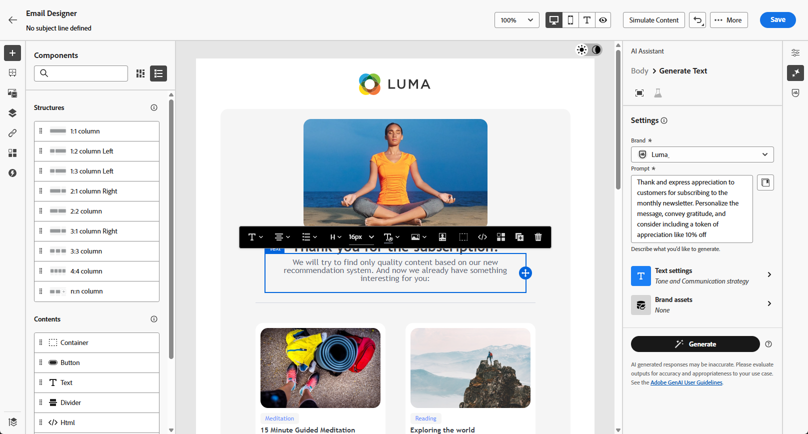

# 使用 AI 助手进行内容试验{#generative-experimentation}

>[!IMPORTANT]
>
>在开始使用此功能之前，请阅读相关的[护栏和限制](gs-generative.md#generative-guardrails)。
> 
>
>您必须同意[用户协议](https://www.adobe.com/legal/licenses-terms/adobe-dx-gen-ai-user-guidelines.html)，然后才能在Journey Optimizer中使用AI助手。 有关更多信息，请与您的 Adobe 代表联系。

准备好消息并对其进行个性化后，可使用Adobe Journey Optimizer中的AI助手（包括内容实验功能）提升您的内容。 此工具允许您定义多种交付处理方式（内容各异），以衡量目标受众的表现。

1. 创建活动并使用AI助手生成变体。

   在本例中，我们生成了包含促销代码的订阅确认电子邮件。

   

1. 浏览生成的&#x200B;**[!UICONTROL 变体]**&#x200B;并单击&#x200B;**[!UICONTROL 预览]**&#x200B;以查看所选变体的全屏版本。

   

1. 选择&#x200B;**[!UICONTROL 启用试验]**&#x200B;开始为您的试验创建&#x200B;**[!UICONTROL 处理]**。

1. 选择要包含在试验中的变体。

1. 单击&#x200B;**添加到试验**。

   

1. 从“内容试验”窗口中，访问&#x200B;**[!UICONTROL 试验设置]**&#x200B;按钮以配置试验。 [了解有关内容试验的更多信息](../content-management/content-experiment.md)

   

1. 内容试验准备就绪后，从营销活动摘要页面中，您可以单击&#x200B;**[!UICONTROL 查看以激活]**&#x200B;以显示营销活动摘要。 如果有任何参数不正确或缺失，将显示警报。 [了解详情](../content-management/content-experiment.md#treatment-experiment)

1. 在启动营销活动之前，请仔细检查所有配置是否正确，然后单击&#x200B;**[!UICONTROL 激活]**。

成功配置和个性化营销活动后，您可以在营销活动报告中跟踪您的营销活动。 [了解详情](../reports/campaign-global-report-cja.md)
