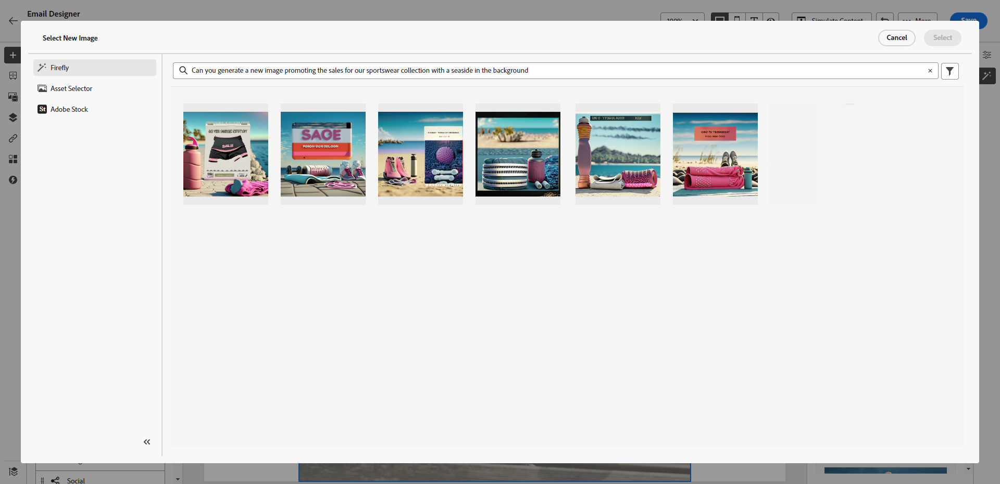

# 使用内容助手生成图像 {#image-content-assistant}

>[!BEGINSHADEBOX]

**目录**

* [内容助手入门](gs-generative.md)
* [使用内容助手生成文本](generative-content.md)
* **[使用内容助手生成图像](generative-image.md)**

>[!ENDSHADEBOX]

创建电子邮件或网页并使其个性化后，可使用内容助手将您的内容提升到新的水平。 这款强大的工具可让您轻松个性化并增强内容。

在下面的示例中，了解如何使用内容助手更新和改进您的资源以获得更好的用户体验。 执行以下步骤：

1. 创建和配置消息后，单击 **[!UICONTROL 创建内容]** 并根据需要进行个性化。

1. 选择要使用内容助手更改的资源。

1. 从右侧菜单中，选择 **[!UICONTROL 体验生成]**.

   

1. 添加提示以更好地优化结果，然后单击 **[!UICONTROL 生成]**.

   启用 **[!UICONTROL 使用当前内容进行增强]** 内容助手选项，用于根据消息、营销活动名称和选定受众来个性化新资产。

   

1. 浏览 **[!UICONTROL 变量建议]** 以查找所需的资产。

1. 一旦您选择您的 **[!UICONTROL 变量]**，访问选定资产的高级菜单。

   

1. 您可以选择 **[!UICONTROL 进行类似操作]** 以根据所选变体生成更多变体。

1. 单击 **[!UICONTROL 编辑图像]** 以访问 **[!UICONTROL 选择新图像]** 菜单。

1. 通过此菜单，您可以生成新资源或选择使用资源文件夹中的现有资源。

   

1. 单击 **[!UICONTROL 插入]** 以将生成的资源添加到您的内容。

   

1. 选择要将生成的资源保存到的文件夹，然后单击 **[!UICONTROL 导入]**.

   

1. 定义消息内容后，单击 **[!UICONTROL 模拟内容]** 按钮来控制渲染，并使用测试用户档案检查个性化设置。 [了解详情](../content-management/preview-test.md)

1. 消息就绪后，您可以在营销活动摘要页面中单击 **[!UICONTROL 审查以激活]** 以显示营销活动的摘要。 如果有任何参数不正确或缺失，将显示警报。

1. 在启动营销活动之前，请仔细检查所有配置是否正确，然后单击 **[!UICONTROL 激活]**.

成功配置试验性和营销活动后，您可以在营销活动报告中跟踪您的营销活动。 [了解详情](../reports/campaign-global-report.md#experimentation-report)
