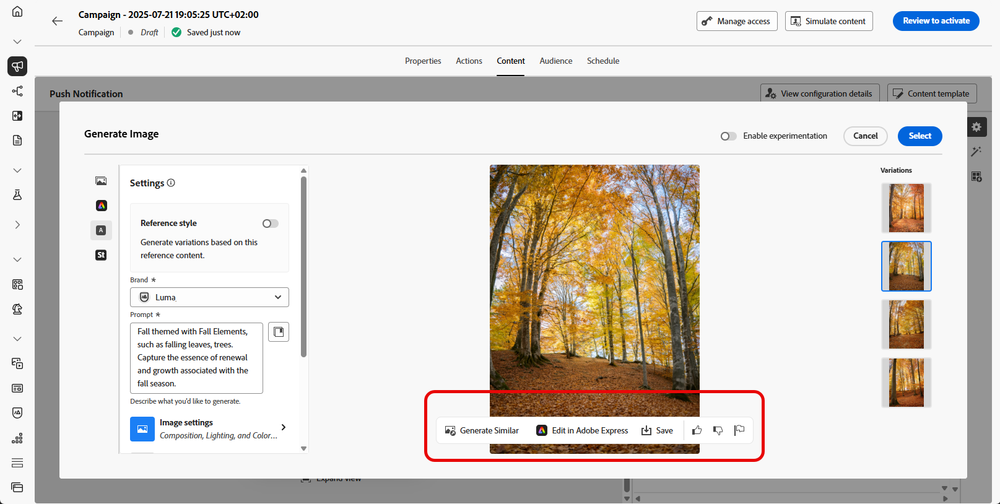

# 使用AI助手生成图像 {#generative-image}

>[!IMPORTANT]
>
>在开始使用此功能之前，请阅读相关的[护栏和限制](gs-generative.md#generative-guardrails)。
> 
>
>您必须同意[用户协议](https://www.adobe.com/cn/legal/licenses-terms/adobe-dx-gen-ai-user-guidelines.html)，然后才能在Journey Optimizer中使用AI助手。 有关更多信息，请与您的 Adobe 代表联系。

使用Journey Optimizer中的AI助手可生成引人注目的可视内容，从而在电子邮件、Web、登陆页和推送通知中增强您的消息。 AI Assistant可帮助您优化和改进资源，确保受众获得更用户友好且更具吸引力的体验。

## 用于电子邮件和Web渠道 {#email-web-channels}

AI助手可以为您的电子邮件营销活动、Web体验和登陆页生成完整的可视化体验。 此功能允许您制作品牌上吸引眼球的图像，从而在数字接触点上与受众产生共鸣。

### 访问和配置 {#access-configure}

要开始使用AI助手生成图像，请首先设置您的活动或历程并打开内容编辑器。 执行以下步骤以准备工作区并访问AI助手面板。

1. 创建和配置活动或历程：
   * **电子邮件**：创建和配置电子邮件促销活动后，单击&#x200B;**[!UICONTROL 编辑内容]**。 [了解详情](../email/create-email.md)
   * **网页**：创建和配置网页后，单击&#x200B;**[!UICONTROL 编辑网页]**。 [了解详情](../web/create-web.md)
   * **登陆页面**：创建和配置登陆页面后，单击&#x200B;**[!UICONTROL 编辑内容]**。 [了解详情](../landing-pages/create-lp.md)

1. 选择要使用AI助手更改的资源。

1. 从右侧菜单中选择&#x200B;**[!UICONTROL AI助手]**（或&#x200B;**[!UICONTROL 显示Web的AI助手]**）。

   {zoomable="yes"}

### 生成内容 {#generate-content}

了解如何使用AI Assistant制作有效提示并配置图像设置以生成引人注目视觉效果的图像。 自定义宽高比、视觉强度和光照等参数，以创建与您的品牌和促销活动目标一致的图像。

1. 为AI助手启用&#x200B;**[!UICONTROL 引用样式]**&#x200B;选项，以便根据引用内容对新内容进行个性化设置。 您还可以上传图像以将上下文添加到变体。

1. 选择您的&#x200B;**[!UICONTROL 品牌]**&#x200B;以确保AI生成的内容与您的品牌规格一致。 [了解有关Brands的更多信息](brands.md)。

1. 通过描述要在&#x200B;**[!UICONTROL 提示]**&#x200B;字段中生成的内容，优化内容。

   如果您在制作提示时寻求帮助，请访问&#x200B;**[!UICONTROL 提示库]**，该库提供了多种提示想法来改进促销活动。

   {zoomable="yes"}

1. 使用&#x200B;**[!UICONTROL 图像设置]**&#x200B;选项定制提示：

   * **[!UICONTROL 宽高比]**：这决定了资源的宽度和高度。 您可以选择通用比率，如16:9、4:3、3:2或1:1，也可以输入自定义大小。
   * **[!UICONTROL 内容类型]**：这将对可视化元素的性质进行分类，区分不同的可视化表示形式，如照片、图形或艺术品。
   * **[!UICONTROL 视觉强度]**：您可以通过调整图像的强度来控制其影响。 较低的设置(2)将产生更柔和、更克制的外观，而较高的设置(10)将使图像更生动、视觉更强大。
   * **[!UICONTROL 颜色和色调]**：图像内颜色的总体外观及其传达的情绪或气氛。
   * **[!UICONTROL 照明]**：这是指图像中的闪电，它塑造了大气层，突出了特定的元素。
   * **[!UICONTROL 合成]**：这指的是图像框架中元素的排列

   {zoomable="yes"}

1. 从&#x200B;**[!UICONTROL 品牌资产]**&#x200B;菜单中，单击&#x200B;**[!UICONTROL 上传品牌资产]**&#x200B;以添加任何品牌资产，这些品牌资产包含可以提供其他上下文AI助手的内容或选择以前上传的内容。

   以前上传的文件在&#x200B;**[!UICONTROL 已上传的品牌资产]**&#x200B;下拉菜单中可用。 只需切换您想要包含到层代中的资产。

1. 如果对提示配置满意，请单击&#x200B;**[!UICONTROL 生成]**。

1. 浏览&#x200B;**[!UICONTROL 变体建议]**&#x200B;以查找所需的资源。

   单击&#x200B;**[!UICONTROL 预览]**&#x200B;以查看所选变体的全屏版本，或单击&#x200B;**[!UICONTROL 应用]**&#x200B;以替换当前内容。

1. 单击百分比图标可查看您的&#x200B;**[!UICONTROL 品牌一致性得分]**&#x200B;并识别与您的品牌的所有不一致性。

   了解有关[品牌一致性分数](brands-score.md)的更多信息。

### 优化并完成 {#refine-finalize}

生成图像变体后，您可以查看结果、检查品牌对齐方式、在Adobe Express中编辑并为内容选择最佳选项。

1. 导航到&#x200B;**[!UICONTROL 预览]**&#x200B;窗口中的&#x200B;**[!UICONTROL 优化]**&#x200B;选项以访问其他自定义功能：

   * **[!UICONTROL 生成类似]**&#x200B;以查看与此变体相关的图像。
   * 在Adobe Express中&#x200B;**[!UICONTROL 编辑]**&#x200B;以进一步自定义您的资源。

[了解有关Adobe Express集成的更多信息](../integrations/express.md)

   * **[!UICONTROL 保存]**&#x200B;以存储资源以供以后访问。

   {zoomable="yes"}

1. 找到相应的内容后，单击&#x200B;**[!UICONTROL 选择]**。

   您还可以为内容启用试验。 [了解详情](generative-experimentation.md)

1. 定义消息内容后，单击&#x200B;**[!UICONTROL 模拟内容]**&#x200B;按钮以控制渲染，并使用测试用户档案检查个性化设置。 [了解详情](../personalization/personalize.md)

1. 查看并激活您的内容：
   * **电子邮件**：定义内容、受众和计划后，您就可以准备电子邮件促销活动。 [了解详情](../campaigns/review-activate-campaign.md)
   * **Web**：定义Web营销活动设置并根据需要编辑内容后，您可以查看和激活Web营销活动。 [了解详情](../web/create-web.md#activate-web-campaign)
   * **登陆页面**：登陆页面准备就绪后，您可以发布该登陆页面，以供在消息中使用。 [了解详情](../landing-pages/create-lp.md#publish-landing-page)

## 适用于移动渠道 {#mobile-channels}

AI Assistant使您能够生成用于推送通知的引人入胜的图像，帮助您创建吸引眼球并与受众引起共鸣的有视觉吸引力的移动通信。

### 访问和配置 {#mobile-access-configure}

要使用AI助手进行推送通知，您需要设置推送投放并导航到内容编辑器。 这些步骤将指导您创建投放和访问AI Assistant功能。

1. 创建和配置推送通知投放后，单击&#x200B;**[!UICONTROL 编辑内容]**。

   有关配置推送投放的详细信息，请参阅[此页面](../push/create-push.md)。

1. 根据需要个性化您的推送通知。 [了解详情](../push/design-push.md)

1. 访问&#x200B;**[!UICONTROL 显示AI助手]**&#x200B;菜单。

   {zoomable="yes"}

### 生成内容 {#mobile-generate-content}

在访问AI助手后，您可以调整生成设置以创建与您的品牌相一致的图像并支持您的推送通知目标。 配置提示和图像参数，以生成针对移动设备显示器优化的视觉效果。

1. 为AI助手启用&#x200B;**[!UICONTROL 引用样式]**&#x200B;选项，以便根据引用内容对新内容进行个性化设置。 您还可以上传图像以将上下文添加到变体。

1. 选择您的&#x200B;**[!UICONTROL 品牌]**&#x200B;以确保AI生成的内容与您的品牌规格一致。 [了解有关Brands的更多信息](brands.md)。

   请注意，品牌功能作为专用测试版发布，并将在未来版本中逐步向所有客户提供。

1. 通过描述要在&#x200B;**[!UICONTROL 提示]**&#x200B;字段中生成的内容，优化内容。

   如果您在制作提示时寻求帮助，请访问&#x200B;**[!UICONTROL 提示库]**，该库提供了多种提示想法来改进促销活动。

   为推送{zoomable="yes"}AI助手图像

1. 选择您的&#x200B;**[!UICONTROL 图像设置]**：

   * **[!UICONTROL 内容类型]**：这将对可视化元素的性质进行分类，区分不同的可视化表示形式，如照片、图形或艺术品。
   * **[!UICONTROL 视觉强度]**：您可以通过调整图像的强度来控制其影响。 较低的设置(2)将产生更柔和、更克制的外观，而较高的设置(10)将使图像更生动、视觉更强大。
   * **[!UICONTROL 颜色和色调]**：图像内颜色的总体外观及其传达的情绪或气氛。
   * **[!UICONTROL 照明]**：这是指图像中的闪电，它塑造了大气层，突出了特定的元素。
   * **[!UICONTROL 合成]**：这指的是图像框架中元素的排列

1. 从&#x200B;**[!UICONTROL 品牌资产]**&#x200B;菜单中，单击&#x200B;**[!UICONTROL 上传品牌资产]**&#x200B;以添加任何品牌资产，这些品牌资产包含可以提供其他上下文AI助手的内容或选择以前上传的内容。

   以前上传的文件在&#x200B;**[!UICONTROL 已上传的品牌资产]**&#x200B;下拉菜单中可用。 只需切换您想要包含到层代中的资产。

1. 提示就绪后，单击&#x200B;**[!UICONTROL 生成]**。

1. 浏览生成的&#x200B;**[!UICONTROL 变体]**。

1. 单击百分比图标可查看您的&#x200B;**[!UICONTROL 品牌一致性得分]**&#x200B;并识别与您的品牌的所有不一致性。

   了解有关[品牌一致性分数](brands-score.md)的更多信息。

### 优化并完成 {#mobile-refine-finalize}

在为推送通知生成图像变体后，您可以微调结果以确保它们符合您的确切要求。 审查品牌对齐方式，根据需要在Adobe Express中编辑，然后为您的移动营销活动选择最佳图像。

1. 导航到&#x200B;**[!UICONTROL 预览]**&#x200B;窗口中的&#x200B;**[!UICONTROL 优化]**&#x200B;选项以访问其他自定义功能：

   * **[!UICONTROL 生成类似]**&#x200B;以查看与此变体相关的图像。
   * 在Adobe Express中&#x200B;**[!UICONTROL 编辑]**&#x200B;以进一步自定义您的资源。

[了解有关Adobe Express集成的更多信息](../integrations/express.md)

   * **[!UICONTROL 保存]**&#x200B;以存储资源以供以后访问。

   {zoomable="yes"}

1. 打开&#x200B;**[!UICONTROL 品牌一致性]**&#x200B;选项卡，查看内容如何与[品牌指南](brands.md)保持一致。

1. 找到相应的内容后，单击&#x200B;**[!UICONTROL 选择]**。

   您还可以为内容启用试验。 [了解详情](generative-experimentation.md)

定义内容、受众和计划后，便可以准备推送营销活动。 [了解详情](../campaigns/review-activate-campaign.md)

