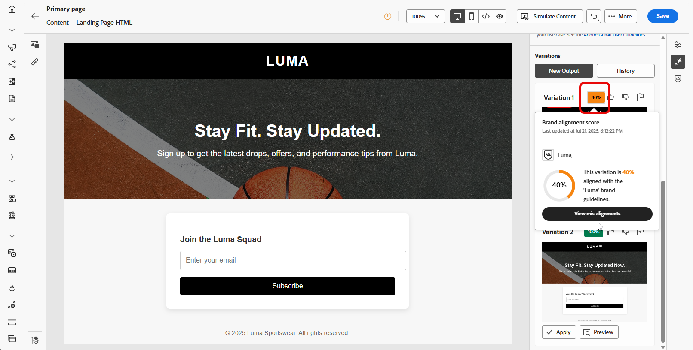
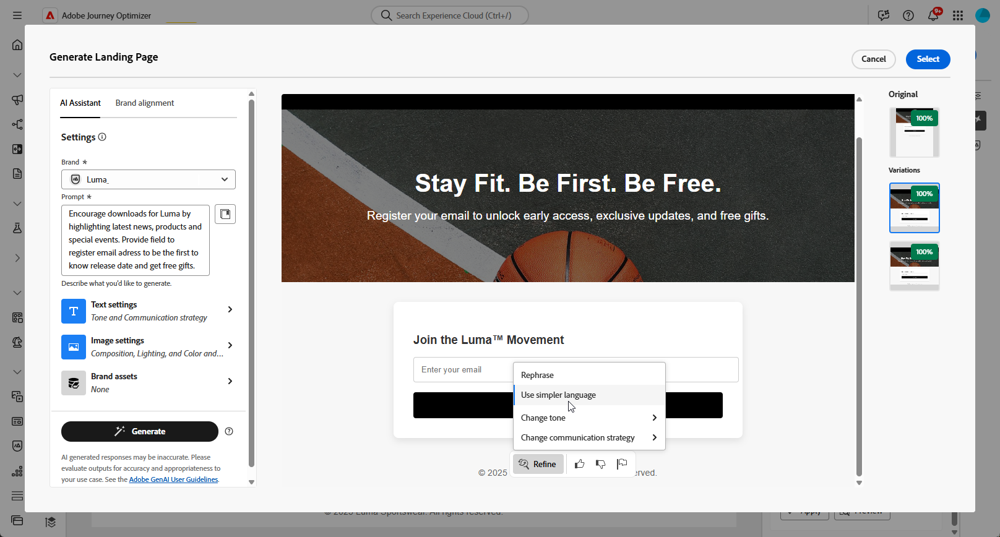

# 使用AI助手生成登陆页面 {#generative-lp}

>[!IMPORTANT]
>
>* 在开始使用此功能之前，请阅读相关的[护栏和限制](gs-generative.md#generative-guardrails)。
>
>
>* 您必须接受[用户协议](https://www.adobe.com/legal/licenses-terms/adobe-dx-gen-ai-user-guidelines.html)，然后才能在Journey Optimizer中使用AI助手。 有关更多信息，请与您的 Adobe 代表联系。

在Journey Optimizer中使用由创作AI提供支持的AI Assistant转换登陆页面。

轻松创建有影响力的内容，包括完整的页面、量身定制的文本片段以及可与受众引起共鸣的自定义视觉效果，从而促进参与和互动。

浏览以下选项卡，了解如何在Journey Optimizer中使用AI助手。

>[!BEGINTABS]

>[!TAB 生成完整登陆页面]

在以下示例中，我们将利用AI助手来优化现有的登陆页面模板。

1. 创建和配置登陆页面后，单击&#x200B;**[!UICONTROL 编辑内容]**。

   有关如何配置登陆页面的详细信息，请参阅[此页面](../landing-pages/create-lp.md)。

1. 根据需要个性化您的布局，并访问&#x200B;**[!UICONTROL AI助手]**&#x200B;菜单。

   {zoomable="yes"}

1. 为AI助手启用&#x200B;**[!UICONTROL 使用原始内容]**&#x200B;选项，以根据所选内容对新内容进行个性化设置。

1. 通过描述要在&#x200B;**[!UICONTROL 提示]**&#x200B;字段中生成的内容，优化内容。

   如果您正在寻求制作提示的帮助，请访问&#x200B;**[!UICONTROL 提示库]**，该库提供了多种提示想法来改进登陆页面。

   {zoomable="yes"}

1. 使用&#x200B;**[!UICONTROL 文本设置]**&#x200B;选项定制提示：

   * **[!UICONTROL 通信策略]**：为生成的文本选择最合适的通信样式。
   * **[!UICONTROL 语言]**：西班牙语、意大利语、瑞典语和挪威语语言选项已作为专用测试版发布，并将在未来版本中逐步向所有客户提供。
   * **[!UICONTROL 音调]**：登陆页面的音调应该会对您的受众产生共鸣。 无论您是要提供信息、好玩还是具有说服力，AI Assistant都可以相应地调整消息。

   {zoomable="yes"}

1. 选择您的&#x200B;**[!UICONTROL 图像设置]**：

   * **[!UICONTROL 内容类型]**：这将对可视化元素的性质进行分类，区分不同的可视化表示形式，如照片、图形或艺术品。
   * **[!UICONTROL 视觉强度]**：您可以通过调整图像的强度来控制其影响。 较低的设置(2)将产生更柔和、更克制的外观，而较高的设置(10)将使图像更生动、视觉更强大。
   * **[!UICONTROL 颜色和色调]**：图像内颜色的总体外观及其传达的情绪或气氛。
   * **[!UICONTROL 照明]**：这是指图像中的闪电，它塑造了大气层，突出了特定的元素。
   * **[!UICONTROL 合成]**：这指的是图像框架中元素的排列

   {zoomable="yes"}

1. 从&#x200B;**[!UICONTROL 品牌资产]**&#x200B;菜单中，单击&#x200B;**[!UICONTROL 上传品牌资产]**&#x200B;以添加任何品牌资产，这些品牌资产包含可以提供其他上下文AI助手的内容或选择以前上传的内容。

   以前上传的文件在&#x200B;**[!UICONTROL 已上传的品牌资产]**&#x200B;下拉菜单中可用。 只需切换您想要包含到层代中的资产。

   {zoomable="yes"}

1. 提示就绪后，单击&#x200B;**[!UICONTROL 生成]**。

1. 浏览生成的&#x200B;**[!UICONTROL 变体]**&#x200B;并单击&#x200B;**[!UICONTROL 预览]**&#x200B;以查看所选变体的全屏版本。

1. 导航到&#x200B;**[!UICONTROL 预览]**&#x200B;窗口中的&#x200B;**[!UICONTROL 优化]**&#x200B;选项以访问其他自定义功能：

   * **[!UICONTROL 改写]**： AI助手可以通过不同方式改写您的消息，使您的写作保持新鲜，并吸引各种受众。

   * **[!UICONTROL 使用更简单的语言]**：利用AI Assistant简化您的语言，确保为更广泛的受众提供清晰易懂的语言。

   您还可以更改文本的&#x200B;**[!UICONTROL 音调]**&#x200B;和&#x200B;**[!UICONTROL 通信策略]**。

   {zoomable="yes"}

1. 找到相应的内容后，单击&#x200B;**[!UICONTROL 选择]**。

1. 插入个性化字段，以根据用户档案数据自定义登陆页面内容。 然后，单击&#x200B;**[!UICONTROL 模拟内容]**&#x200B;按钮以控制渲染，并使用测试配置文件检查个性化设置。 [了解详情](../personalization/personalize.md)

准备登陆页面后，即可发布该页面，以供在消息中使用。 [了解详情](../landing-pages/create-lp.md#publish-landing-page)

>[!TAB 纯文本生成]

在以下示例中，我们将利用AI助手来增强登陆页面的内容。

1. 创建和配置登陆页面后，单击&#x200B;**[!UICONTROL 编辑内容]**。

   有关如何配置登陆页面的详细信息，请参阅[此页面](../landing-pages/create-lp.md)。

1. 选择&#x200B;**[!UICONTROL 文本组件]**&#x200B;以仅定向特定内容。 并访问&#x200B;**[!UICONTROL AI助手]**&#x200B;菜单。

   {zoomable="yes"}

1. 为AI助手启用&#x200B;**[!UICONTROL 使用原始内容]**&#x200B;选项，以根据所选内容对新内容进行个性化设置。

1. 通过描述要在&#x200B;**[!UICONTROL 提示]**&#x200B;字段中生成的内容，优化内容。

   如果您正在寻求制作提示的帮助，请访问&#x200B;**[!UICONTROL 提示库]**，该库提供了多种提示想法来改进登陆页面。

   {zoomable="yes"}

1. 使用&#x200B;**[!UICONTROL 文本设置]**&#x200B;选项定制提示：

   * **[!UICONTROL 通信策略]**：为生成的文本选择最合适的通信样式。
   * **[!UICONTROL 语言]**：西班牙语、意大利语、瑞典语和挪威语语言选项已作为专用测试版发布，并将在未来版本中逐步向所有客户提供。
   * **[!UICONTROL 音调]**：登陆页面的音调应该会对您的受众产生共鸣。 无论您是要提供信息、好玩还是具有说服力，AI Assistant都可以相应地调整消息。
   * **文本长度**：使用滑块选择所需文本长度。

   {zoomable="yes"}

1. 从&#x200B;**[!UICONTROL 品牌资产]**&#x200B;菜单中，单击&#x200B;**[!UICONTROL 上传品牌资产]**&#x200B;以添加任何品牌资产，这些品牌资产包含可以提供其他上下文AI助手的内容或选择以前上传的内容。

   以前上传的文件在&#x200B;**[!UICONTROL 已上传的品牌资产]**&#x200B;下拉菜单中可用。 只需切换您想要包含到层代中的资产。

   {zoomable="yes"}

1. 提示就绪后，单击&#x200B;**[!UICONTROL 生成]**。

1. 浏览生成的&#x200B;**[!UICONTROL 变体]**&#x200B;并单击&#x200B;**[!UICONTROL 预览]**&#x200B;以查看所选变体的全屏版本。

1. 导航到&#x200B;**[!UICONTROL 预览]**&#x200B;窗口中的&#x200B;**[!UICONTROL 优化]**&#x200B;选项以访问其他自定义功能：

   * **[!UICONTROL 用作引用内容]**：所选变量将用作用于生成其他结果的引用内容。

   * **[!UICONTROL 阐述]**：AI助手可以帮助您展开特定主题，提供其他详细信息以便更好地了解和参与。

   * **[!UICONTROL 摘要]**：过长的信息可能会使登陆页面收件人过载。 使用AI Assistant将关键点浓缩为清晰、简洁的摘要，以吸引注意并鼓励他们进一步阅读。

   * **[!UICONTROL 重述]**：AI助手可以通过不同的方式重述您的消息，使您的写作保持新鲜，并吸引各种受众。

   * **[!UICONTROL 使用更简单的语言]**：利用AI Assistant简化您的语言，确保为更广泛的受众提供清晰易懂的语言。

   您还可以更改文本的&#x200B;**[!UICONTROL 音调]**&#x200B;和&#x200B;**[!UICONTROL 通信策略]**。

   {zoomable="yes"}

1. 找到相应的内容后，单击&#x200B;**[!UICONTROL 选择]**。

1. 插入个性化字段，以根据用户档案数据自定义登陆页面内容。 然后，单击&#x200B;**[!UICONTROL 模拟内容]**&#x200B;按钮以控制渲染，并使用测试配置文件检查个性化设置。 [了解详情](../personalization/personalize.md)

准备登陆页面后，即可发布该页面，以供在消息中使用。 [了解详情](../landing-pages/create-lp.md#publish-landing-page)

>[!TAB 纯图像生成]

在下面的示例中，了解如何利用AI Assistant优化和改进资源，确保获得对用户更友好的体验。

1. 创建和配置登陆页面后，单击&#x200B;**[!UICONTROL 编辑内容]**。

   有关如何配置登陆页面的详细信息，请参阅[此页面](../landing-pages/create-lp.md)。

1. 选择要使用AI助手更改的资源。

1. 从右侧菜单中选择&#x200B;**[!UICONTROL AI助手]**。

   {zoomable="yes"}

1. 为AI助手启用&#x200B;**[!UICONTROL 引用样式]**&#x200B;选项，以便根据引用内容对新内容进行个性化设置。 您还可以上传图像以将上下文添加到变体。

1. 通过描述要在&#x200B;**[!UICONTROL 提示]**&#x200B;字段中生成的内容，优化内容。

   如果您正在寻求制作提示的帮助，请访问&#x200B;**[!UICONTROL 提示库]**，该库提供了多种提示想法来改进登陆页面。

   {zoomable="yes"}

1. 使用&#x200B;**[!UICONTROL 图像设置]**&#x200B;选项定制提示：

   * **[!UICONTROL 宽高比]**：这决定了资源的宽度和高度。 您可以选择常用比率，如16:9、4:3、3:2或1:1，也可以输入自定义大小。
   * **[!UICONTROL 内容类型]**：这将对可视化元素的性质进行分类，区分不同的可视化表示形式，如照片、图形或艺术品。
   * **[!UICONTROL 视觉强度]**：您可以通过调整图像的强度来控制其影响。 较低的设置(2)将产生更柔和、更克制的外观，而较高的设置(10)将使图像更生动、视觉更强大。
   * **[!UICONTROL 颜色和色调]**：图像内颜色的总体外观及其传达的情绪或气氛。
   * **[!UICONTROL 照明]**：这是指图像中的闪电，它塑造了大气层，突出了特定的元素。
   * **[!UICONTROL 合成]**：这指的是图像框架中元素的排列

   {zoomable="yes"}

1. 从&#x200B;**[!UICONTROL 品牌资产]**&#x200B;菜单中，单击&#x200B;**[!UICONTROL 上传品牌资产]**&#x200B;以添加任何品牌资产，这些品牌资产包含可以提供其他上下文AI助手的内容或选择以前上传的内容。

   以前上传的文件在&#x200B;**[!UICONTROL 已上传的品牌资产]**&#x200B;下拉菜单中可用。 只需切换您想要包含到层代中的资产。

1. 如果对提示配置满意，请单击&#x200B;**[!UICONTROL 生成]**。

1. 浏览&#x200B;**[!UICONTROL 变体建议]**&#x200B;以查找所需的资源。

   单击&#x200B;**[!UICONTROL 预览]**&#x200B;以查看所选变体的全屏版本。

1. 如果要查看与此变体相关的图像，请选择&#x200B;**[!UICONTROL 生成类似项]**。

   {zoomable="yes"}

1. 找到相应的内容后，单击&#x200B;**[!UICONTROL 选择]**。

1. 定义消息内容后，单击&#x200B;**[!UICONTROL 模拟内容]**&#x200B;按钮以控制渲染，并使用测试用户档案检查个性化设置。 [了解详情](../personalization/personalize.md)

准备登陆页面后，即可发布该页面，以供在消息中使用。 [了解详情](../landing-pages/create-lp.md#publish-landing-page)

>[!ENDTABS]
