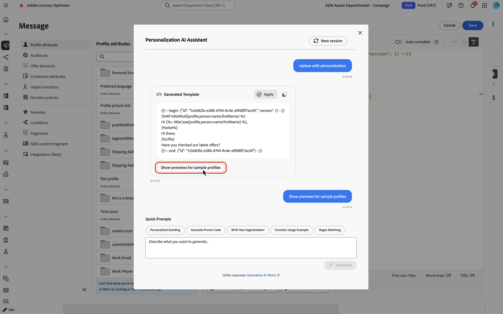
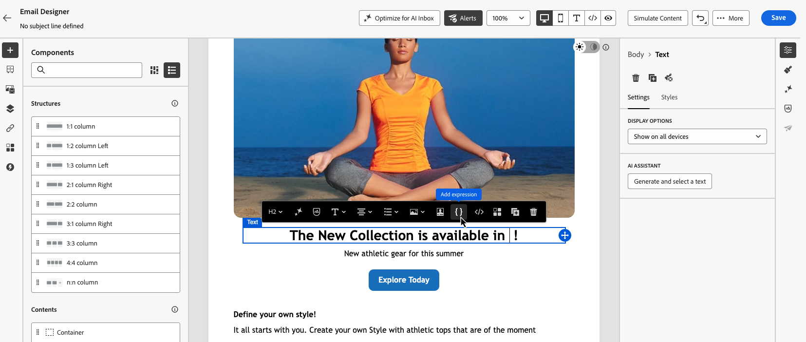

# 个性化表达式的AI助手{#generative-personalization-expressions}

>[!IMPORTANT]
>
>在开始使用此功能之前，请阅读相关的[护栏和限制](gs-generative.md#generative-guardrails)。
> 
>
>您必须同意[用户协议](https://www.adobe.com/cn/legal/licenses-terms/adobe-dx-gen-ai-user-guidelines.html)，然后才能在Journey Optimizer中使用AI助手。 有关更多信息，请与您的 Adobe 代表联系。

## 概述 {#where-available}

[!UICONTROL AI助手]可帮助您从纯语言生成新的个性化，解释现有表达式的功能，并修复所选代码中的问题，从而减少在语法和手动字段发现上花费的时间。 您也可以对选定内容进行迭代，或在对话中要求进行其他更改。 它有两种可用方式：

* **[!UICONTROL Personalization编辑器]** — 无论何处可用编辑器（主题行、正文和打开该编辑器的其他字段）。 有关打开编辑器的位置和方式，请参阅[添加个性化](../personalization/personalization-build-expressions.md#where)。
* **向Designer发送电子邮件** — 选择某个组件时，在上下文工具栏中使用&#x200B;**[!UICONTROL 添加表达式]**&#x200B;在工具箱中打开该助手。 请参阅[从电子邮件Designer](#generate-email-designer)生成。

有关更广泛的AI助手设置和语言，请参阅[AI助手入门](gs-generative.md)。 有关个性化概念，请参阅[个性化入门](../personalization/personalize.md)。 有关提示性想法，请参阅[AI提示性最佳实践](ai-assistant-prompting-guide.md)。

根据您的促销活动或历程上下文，助手可以使用数据并构造已公开的[!UICONTROL Personalization编辑器]，例如配置文件属性、区段成员资格、帮助程序函数和相关个性化源。

>[!NOTE]
>
>仅当[!UICONTROL AI助手]在该会话中保持打开状态时，该助手才会阻止提示中的上下文。 关闭助理或编辑者将清除对话；下次打开助理时，将开始新对话。

## 生成个性化表达式 {#generate}

这些步骤包括从头开始生成个性化表达式。 若要使用编辑器中已存在的代码，请参阅[编辑、修复或解释现有代码](#edit-existing)。

1. 在您的消息或内容中，打开&#x200B;**[!UICONTROL Personalization编辑器]**。

1. 将光标放在要插入生成的个性化代码的编辑器中，然后单击&#x200B;**[!UICONTROL AI助手]**&#x200B;按钮。

   

1. 在文本字段中，以纯语言描述所需的个性化表达式 — 例如所需的配置文件属性、区段或逻辑，然后单击&#x200B;**[!UICONTROL 生成]**。

   您还可以使用&#x200B;**[!UICONTROL 快速提示]**&#x200B;部分中的现成提示，如个性化问候语、促销代码生成等。

   

   >[!NOTE]
   >
   >任何不相关的提示或问题会返回范围外错误。 调整您的提示并询问有关所需个性化设置的相关问题。

1. 您可以在多轮对话中与助理继续讨论：它会保留提示中的上下文，以便您可以逐步优化同一表达式。 若要重新开始，请单击&#x200B;**[!UICONTROL 新建会话]**&#x200B;按钮。

   

1. 生成表达式后，单击&#x200B;**[!UICONTROL 显示样本配置文件的预览]**&#x200B;以查看表达式如何使用样本数据进行计算，并以JSON格式查看关联的有效负载。 对于此检查，该助理会生成一组有限的合成示例用户档案；这些用户档案不会保存或存储在您的组织中。

   如果需要自定义或额外的示例用户档案，请向助理描述您在讨论中需要的内容，并在提示中包含关键字&#x200B;**preview**，以便能为您的支票生成正确的预览用户档案。

   

   +++预览示例

   

   >[!NOTE]
   >
   >其他预览用于竞价测试。 该助理经过调谐，大约可生成一到五个用户档案，如果要求提供非常多的用户档案，可能会导致请求失败。

   +++

   >[!NOTE]
   >
   >此控件用于在编辑器中快速检查个性化代码，而不是预览内容的完整消息。 要完全验证体验，请使用常规模拟流程。 [了解如何预览和测试您的内容](../content-management/preview-test.md)

1. 要在个性化表达式中实现输出，请单击&#x200B;**[!UICONTROL 应用]**。 助理输出插入到个性化编辑器中的光标位置。 要替换已存在的代码，请先在编辑器中选择该代码，然后使用&#x200B;**[!UICONTROL 使用AI助手编辑]**（请参阅[编辑、修复或解释现有代码](#edit-existing)）。

   您还可以使用图标复制输出并将其粘贴到所需的位置。

## 编辑、修复或解释现有代码 {#edit-existing}

您可以选择现有的个性化表达式，并使用AI Assistant修复个性化问题、解释代码的用途或要求进行其他更改。

1. 在编辑器中选择现有的个性化代码。

1. 右键单击所选内容，然后选择&#x200B;**[!UICONTROL 使用AI助手编辑]**，以便该助手将您的选择用作上下文。

   

1. **[!UICONTROL AI助手]**&#x200B;打开。 在&#x200B;**[!UICONTROL 快速命令]**&#x200B;中，单击&#x200B;**[!UICONTROL 解释]**&#x200B;或&#x200B;**[!UICONTROL 修复]**，或者使用文本字段请求其他更改并开始对话。

   

1. 使用&#x200B;**[!UICONTROL 修复]**&#x200B;时，单击讨论中的&#x200B;**[!UICONTROL 显示修复详细信息]**&#x200B;以显示修复的说明以及预览前后的一行一行。

   

1. 与生成个性化表达式时一样，单击&#x200B;**[!UICONTROL 应用]**&#x200B;以实施助理输出。 它替换您在个性化编辑器中选择的代码。 例如，如果您要求您解释代码，则应用将在表达式中添加注释来说明代码的作用。

## 从电子邮件Designer工具栏生成 {#generate-email-designer}

在Email Designer中，您可以从上下文工具栏为个性化表达式使用[!UICONTROL AI助手]，而无需先打开完整的[!UICONTROL Personalization编辑器]。

1. 在电子邮件Designer中，选择要个性化的组件，然后单击要插入表达式的位置。

1. 在上下文工具栏中，单击&#x200B;**[!UICONTROL 添加表达式]**。

   

1. 将打开一个工具箱，您可以在其中提示AI助手进行个性化。 用纯语言键入所需的内容，该助理会推荐与您的提示匹配的配置文件字段和其他属性，以便您更快地构建表达式。

1. 助理生成表达式。

   

   您可以：

   * 使用示例值验证表达式输出 — 使用&#x200B;**[!UICONTROL 预览]**&#x200B;选项卡。
   * 从同一提示生成另一个建议 — 使用&#x200B;**[!UICONTROL 重新生成]**。
   * 清除讨论并重新开始 — 使用&#x200B;**[!UICONTROL 重置]**。
   * 在完整编辑器中优化表达式 — 单击图标以打开&#x200B;**[!UICONTROL Personalization编辑器]**。

1. 如果对结果满意，请单击&#x200B;**[!UICONTROL 插入]**&#x200B;以将表达式添加到您的内容中。
