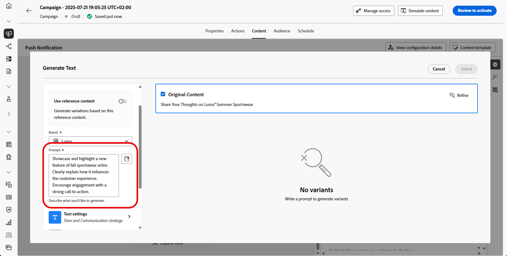
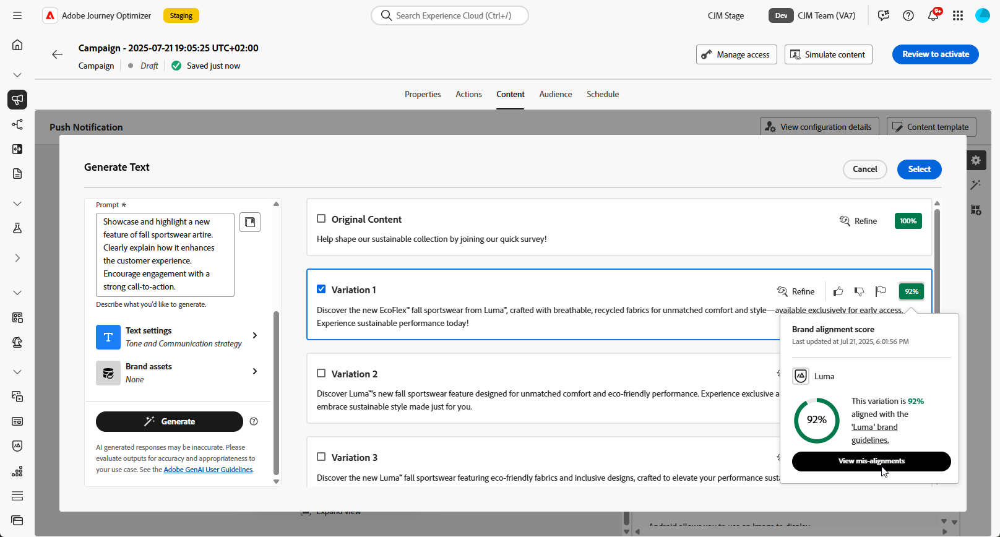

# 使用 AI 助手进行推送生成 {#generative-push}

>[!BEGINSHADEBOX]

**目录**

* [AI 助手入门](gs-generative.md)
* [使用 AI 助手生成电子邮件](generative-email.md)
* [使用 AI 助手生成短信](generative-sms.md)
* 使用 AI 助手进行推送生成
* [使用 AI 助手进行内容试验](generative-experimentation.md)

>[!ENDSHADEBOX]

>[!NOTE]
>
>在开始使用此功能之前，请阅读相关的[护栏和限制](gs-generative.md#generative-guardrails)。

创建消息并对消息进行个性化后，使用Adobe Journey Optimizer中的AI助手将推送通知内容提升到新的水平。

浏览以下选项卡，了解如何使用Journey Optimizer中的AI助手。

>[!BEGINTABS]

>[!TAB 生成完全推送]

在此特定示例中，了解如何使用AI Assistant发送吸引人的推送通知。

执行以下步骤：

1. 创建和配置推送通知营销活动后，单击&#x200B;**[!UICONTROL 编辑内容]**。

   有关如何配置推送通知促销活动的详细信息，请参阅[此页面](../push/create-push.md)。

1. 填写营销活动的&#x200B;**[!UICONTROL 基本详细信息]**。 完成后，单击&#x200B;**[!UICONTROL 编辑内容]**。

1. 根据需要个性化您的推送通知。 [了解详情](../push/design-push.md)

1. 访问&#x200B;**[!UICONTROL 显示AI助手]**&#x200B;菜单。

   {zoomable="yes"}

1. 为AI助手启用&#x200B;**[!UICONTROL 使用原始内容]**&#x200B;选项，以根据您的营销活动内容、名称和所选受众来个性化新内容。

   您的提示必须始终与特定上下文关联。

1. 通过描述要在&#x200B;**[!UICONTROL 提示]**&#x200B;字段中生成的内容，优化内容。

   如果您在制作提示时寻求帮助，请访问&#x200B;**[!UICONTROL 提示库]**，该库提供了多种提示想法来改进促销活动。

   {zoomable="yes"}

1. 选择&#x200B;**[!UICONTROL 上载品牌资产]**&#x200B;可添加任何包含可为AI助手提供其他上下文的内容的品牌资产。

1. 选择要生成的字段：**[!UICONTROL 标题]**&#x200B;和/或&#x200B;**[!UICONTROL 消息]**。

1. 使用不同的选项定制提示：

   * **[!UICONTROL 通信策略]**：为生成的文本选择最合适的通信样式。
   * **[!UICONTROL 语言]**：选择您希望生成内容的语言。
   * **[!UICONTROL 音调]**：您电子邮件的音调应该引起您的听众的共鸣。 无论您是要提供信息、好玩还是具有说服力，AI Assistant都可以相应地调整消息。

   {zoomable="yes"}

1. 提示就绪后，单击&#x200B;**[!UICONTROL 生成]**。

1. 浏览生成的&#x200B;**[!UICONTROL 变体]**&#x200B;并单击&#x200B;**[!UICONTROL 预览]**&#x200B;以查看所选变体的全屏版本。

1. 导航到&#x200B;**[!UICONTROL 预览]**&#x200B;窗口中的&#x200B;**[!UICONTROL 优化]**&#x200B;选项以访问其他自定义功能：

   * **[!UICONTROL 用作引用内容]**：所选变量将用作用于生成其他结果的引用内容。

   * **[!UICONTROL 改写]**： AI助手可以通过不同方式改写您的消息，使您的写作保持新鲜，并吸引各种受众。

   * **[!UICONTROL 使用简单语言]**：利用AI助手简化您的语言，确保更广大的受众能够清晰地访问到内容。

   {zoomable="yes"}

1. 找到相应的内容后，单击&#x200B;**[!UICONTROL 选择]**。

   您还可以为内容启用试验。 [了解详情](generative-experimentation.md)

1. 插入个性化字段，以根据用户档案数据自定义电子邮件内容。 然后，单击&#x200B;**[!UICONTROL 模拟内容]**&#x200B;按钮以控制渲染，并使用测试配置文件检查个性化设置。 [了解详情](../personalization/personalize.md)

定义内容、受众和计划后，便可以准备推送营销活动。 [了解详情](../campaigns/review-activate-campaign.md)

>[!TAB 文本生成]

在此特定示例中，了解如何将AI助手用于特定内容。 执行以下步骤：

1. 创建和配置推送通知营销活动后，单击&#x200B;**[!UICONTROL 编辑内容]**。

   有关如何配置推送活动的详细信息，请参阅[此页面](../push/create-push.md)。

1. 填写营销活动的&#x200B;**[!UICONTROL 基本详细信息]**。 完成后，单击&#x200B;**[!UICONTROL 编辑内容]**。

1. 根据需要个性化您的推送通知。 [了解详情](../push/design-push.md)

1. 访问&#x200B;**[!UICONTROL 标题]**&#x200B;或&#x200B;**[!UICONTROL 消息]**&#x200B;字段旁边的&#x200B;**[!UICONTROL 显示AI助手]**&#x200B;菜单。

   {zoomable="yes"}

1. 为AI助手启用&#x200B;**[!UICONTROL 使用引用内容]**&#x200B;选项，以根据您的营销活动内容、名称和所选受众来个性化新内容。

   您的提示必须始终与特定上下文关联。

1. 通过描述要在&#x200B;**[!UICONTROL 提示]**&#x200B;字段中生成的内容，优化内容。

   如果您在制作提示时寻求帮助，请访问&#x200B;**[!UICONTROL 提示库]**，该库提供了多种提示想法来改进促销活动。

   {zoomable="yes"}

1. 选择&#x200B;**[!UICONTROL 上载品牌资产]**&#x200B;可添加任何包含可为AI助手提供其他上下文的内容的品牌资产。

   {zoomable="yes"}

1. 使用不同的选项定制提示：

   * **[!UICONTROL 通信策略]**：为生成的文本选择最合适的通信样式。
   * **[!UICONTROL 语言]**：选择您希望生成内容的语言。
   * **[!UICONTROL 音调]**：您电子邮件的音调应该引起您的听众的共鸣。 无论您是要提供信息、好玩还是具有说服力，AI Assistant都可以相应地调整消息。
   * **[!UICONTROL 长度]**：使用范围滑块选择内容的长度。

   {zoomable="yes"}

1. 提示就绪后，单击&#x200B;**[!UICONTROL 生成]**。

1. 浏览生成的&#x200B;**[!UICONTROL 变体]**&#x200B;并单击&#x200B;**[!UICONTROL 预览]**&#x200B;以查看所选变体的全屏版本。

1. 导航到&#x200B;**[!UICONTROL 预览]**&#x200B;窗口中的&#x200B;**[!UICONTROL 优化]**&#x200B;选项以访问其他自定义功能：

   * **[!UICONTROL 用作引用内容]**：所选变量将用作用于生成其他结果的引用内容。

   * **[!UICONTROL 阐述]**：AI助手可以帮助您展开特定主题，提供其他详细信息以便更好地了解和参与。

   * **[!UICONTROL 摘要]**：过长的信息可能会使电子邮件收件人过载。 使用AI Assistant将要点整合为清晰、简洁的摘要，以吸引注意并鼓励他们进一步阅读。

   * **[!UICONTROL 重述]**：AI助手可以通过不同的方式重述您的消息，使您的写作保持新鲜，并吸引各种受众。

   * **[!UICONTROL 使用更简单的语言]**：利用AI Assistant简化您的语言，确保更广大的受众拥有清晰易懂的语言。

   {zoomable="yes"}

1. 找到相应的内容后，单击&#x200B;**[!UICONTROL 选择]**。

   您还可以为内容启用试验。 [了解详情](generative-experimentation.md)

1. 插入个性化字段，以根据用户档案数据自定义电子邮件内容。 然后，单击&#x200B;**[!UICONTROL 模拟内容]**&#x200B;按钮以控制渲染，并使用测试配置文件检查个性化设置。 [了解详情](../personalization/personalize.md)

定义内容、受众和计划后，便可以准备推送营销活动。 [了解详情](../campaigns/review-activate-campaign.md)

>[!ENDTABS]
