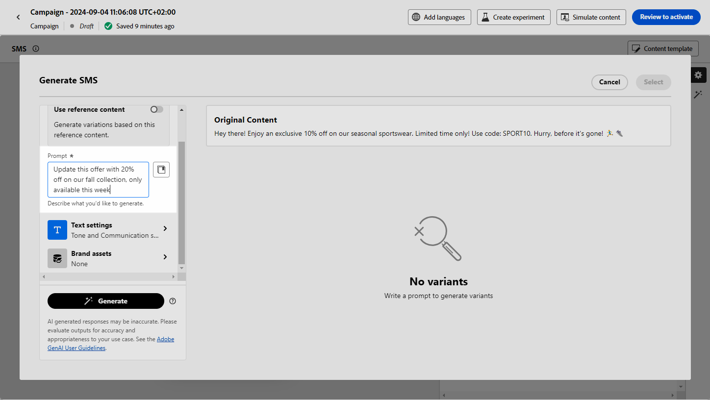

# 使用Journey Optimizer中的AI助手生成短信 {#generative-sms}

>[!IMPORTANT]
>
>在开始使用此功能之前，请阅读相关的[护栏和限制](gs-generative.md#generative-guardrails)。
> 
>
>您必须同意[用户协议](https://www.adobe.com/legal/licenses-terms/adobe-dx-gen-ai-user-guidelines.html)，然后才能在Journey Optimizer中使用AI助手。 有关更多信息，请与您的 Adobe 代表联系。

根据受众的偏好对短信消息进行精心设计和定制后，可在Journey Optimizer中提升与AI助理的通信。

此资源提供了有见地的建议，可优化您的内容，帮助您的消息引起共鸣并促进最大程度的参与。

浏览以下选项卡，了解如何使用Journey Optimizer中的AI助手。

>[!BEGINTABS]

>[!TAB 完整短信生成]

1. 创建和配置短信营销活动后，单击&#x200B;**[!UICONTROL 编辑内容]**。

   有关如何配置短信促销活动的详细信息，请参阅[此页面](../sms/create-sms.md)。

1. 填写营销活动的&#x200B;**[!UICONTROL 基本详细信息]**。 完成后，单击&#x200B;**[!UICONTROL 编辑内容]**。

1. 根据需要个性化短信消息。 [了解详情](../sms/create-sms.md)

1. 访问&#x200B;**[!UICONTROL 显示AI助手]**&#x200B;菜单。

   {zoomable="yes"}

1. 通过描述要在&#x200B;**[!UICONTROL 提示]**&#x200B;字段中生成的内容，优化内容。

   如果您在制作提示时寻求帮助，请访问&#x200B;**[!UICONTROL 提示库]**，该库提供了多种提示想法来改进促销活动。

   {zoomable="yes"}

1. 使用&#x200B;**[!UICONTROL 文本设置]**&#x200B;选项定制提示：

   * **[!UICONTROL 通信策略]**：为生成的文本选择所需的通信方法。
   * **[!UICONTROL 语言]**：选择变体内容的语言。
   * **[!UICONTROL 色调]**：确保文本适合您的受众和用途。
   * **[!UICONTROL 长度]**：使用范围滑块选择内容的长度。

   {zoomable="yes"}

1. 从&#x200B;**[!UICONTROL 品牌资产]**&#x200B;菜单中，单击&#x200B;**[!UICONTROL 上传品牌资产]**&#x200B;以添加任何品牌资产，这些品牌资产包含可为AI助手提供其他上下文的内容或选择以前上传的内容。

   以前上传的文件在&#x200B;**[!UICONTROL 已上传的品牌资产]**&#x200B;下拉菜单中可用。 只需切换您想要包含到层代中的资产。

1. 提示就绪后，单击&#x200B;**[!UICONTROL 生成]**。

1. 浏览生成的&#x200B;**[!UICONTROL 变体]**。

1. 导航到&#x200B;**[!UICONTROL 预览]**&#x200B;窗口中的&#x200B;**[!UICONTROL 优化]**&#x200B;选项以访问其他自定义功能并微调您的首选项变量：

   * **[!UICONTROL 用作引用内容]**：所选变量将用作用于生成其他结果的引用内容。

   * **[!UICONTROL 重述]**：AI助手可以通过不同的方式重述您的消息，使您的写作保持新鲜，并吸引各种受众。

   * **[!UICONTROL 使用更简单的语言]**：利用AI Assistant简化您的语言，确保更广大的受众拥有清晰易懂的语言。

   您还可以更改文本的&#x200B;**[!UICONTROL 音调]**&#x200B;和&#x200B;**[!UICONTROL 通信策略]**。

   {zoomable="yes"}

1. 找到相应的内容后，单击&#x200B;**[!UICONTROL 选择]**。

   您还可以为内容启用试验。 [了解详情](generative-experimentation.md)

1. 插入个性化字段，以根据用户档案数据自定义短信内容。 [详细了解内容个性化](../personalization/personalize.md)

1. 定义消息内容后，单击&#x200B;**[!UICONTROL 模拟内容]**&#x200B;按钮以控制渲染，并使用测试用户档案检查个性化设置。 [了解详情](../personalization/personalize.md)

定义内容、受众和计划后，便可以准备短信营销活动。 [了解详情](../campaigns/review-activate-campaign.md)

>[!TAB 纯文本生成]

1. 创建和配置短信营销活动后，单击&#x200B;**[!UICONTROL 编辑内容]**。

   有关如何配置短信促销活动的详细信息，请参阅[此页面](../sms/create-sms.md)。

1. 填写营销活动的&#x200B;**[!UICONTROL 基本详细信息]**。 完成后，单击&#x200B;**[!UICONTROL 编辑内容]**。

1. 根据需要个性化短信消息。 [了解详情](../sms/create-sms.md)

1. 访问&#x200B;**[!UICONTROL 消息]**&#x200B;字段旁边的&#x200B;**[!UICONTROL 使用AI助手编辑文本]**&#x200B;菜单。

   {zoomable="yes"}

1. 为AI助手启用&#x200B;**[!UICONTROL 使用引用内容]**&#x200B;选项，以根据所选内容对新内容进行个性化设置。

1. 通过描述要在&#x200B;**[!UICONTROL 提示]**&#x200B;字段中生成的内容，优化内容。

   如果您在制作提示时寻求帮助，请访问&#x200B;**[!UICONTROL 提示库]**，该库提供了多种提示想法来改进促销活动。

   {zoomable="yes"}

1. 使用&#x200B;**[!UICONTROL 文本设置]**&#x200B;选项定制提示：

   * **[!UICONTROL 通信策略]**：为生成的文本选择所需的通信方法。
   * **[!UICONTROL 语言]**：选择变体内容的语言。
   * **[!UICONTROL 色调]**：确保文本适合您的受众和用途。
   * **[!UICONTROL 长度]**：使用范围滑块选择内容的长度。

   {zoomable="yes"}

1. 从&#x200B;**[!UICONTROL 品牌资产]**&#x200B;菜单中，单击&#x200B;**[!UICONTROL 上传品牌资产]**&#x200B;以添加任何品牌资产，这些品牌资产包含可为AI助手提供其他上下文的内容或选择以前上传的内容。

   以前上传的文件在&#x200B;**[!UICONTROL 已上传的品牌资产]**&#x200B;下拉菜单中可用。 只需切换您想要包含到层代中的资产。

1. 提示就绪后，单击&#x200B;**[!UICONTROL 生成]**。

1. 浏览生成的&#x200B;**[!UICONTROL 变体]**&#x200B;并单击&#x200B;**[!UICONTROL 预览]**&#x200B;以查看所选变体的全屏版本。

1. 导航到&#x200B;**[!UICONTROL 预览]**&#x200B;窗口中的&#x200B;**[!UICONTROL 优化]**&#x200B;选项以访问其他自定义功能并微调您的首选项变量：

   * **[!UICONTROL 用作引用内容]**：所选变量将用作用于生成其他结果的引用内容。

   * **[!UICONTROL 重述]**：AI助手可以通过不同的方式重述您的消息，使您的写作保持新鲜，并吸引各种受众。

   * **[!UICONTROL 使用更简单的语言]**：利用AI Assistant简化您的语言，确保更广大的受众拥有清晰易懂的语言。

   {zoomable="yes"}

1. 找到相应的内容后，单击&#x200B;**[!UICONTROL 选择]**。

   您还可以为内容启用试验。 [了解详情](generative-experimentation.md)

1. 插入个性化字段，以根据用户档案数据自定义短信内容。 [详细了解内容个性化](../personalization/personalize.md)

1. 定义消息内容后，单击&#x200B;**[!UICONTROL 模拟内容]**&#x200B;按钮以控制渲染，并使用测试用户档案检查个性化设置。

定义内容、受众和计划后，便可以准备短信营销活动。 [了解详情](../campaigns/review-activate-campaign.md)

>[!ENDTABS]
