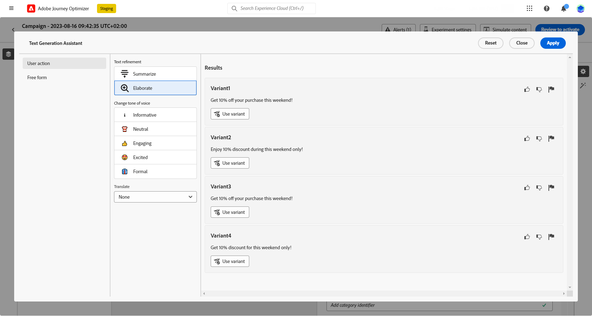

# 使用内容助手生成标题 {#title-content-assistant}

>[!BEGINSHADEBOX]

**目录**

* [内容助手入门](gs-generative.md)
* **[使用内容助手生成文本](generative-title.md)**
* [使用内容助手生成图像](generative-image.md)

>[!ENDSHADEBOX]

创建消息并个性化消息后，使用内容助手将您的内容提升到新的级别。

利用内容助手，您可以通过试验不同的主要标题来优化消息的影响。 每个变体都被视为独特的处理方式，以便衡量和比较哪个标题有效地生成更多点击次数。

在此特定示例中，了解如何使用内容实验发送吸引人的推送通知。 执行以下步骤：

1. 创建消息并添加内容试验。 在中了解有关内容试验的更多信息 [本节](../campaigns/content-experiment.md)

1. 配置活动和试验后，单击 **[!UICONTROL 创建内容]** 并根据需要个性化您的消息内容。

1. 您的第二个 **[!UICONTROL 处理]**，使用生成助手更改标题。

   在您的 **[!UICONTROL 页眉]** 字段，请单击 **[!UICONTROL 使用文本生成助理进行编辑]**.

   

1. 从 **[!UICONTROL 用户操作]** 菜单，选择 **[!UICONTROL 文本细化]**：

   * **[!UICONTROL 总结]**：使用此选项可缩短文本并保留基本文本。

   * **[!UICONTROL 详细]**：使用此选项可通过内容助手中的其他创意变体展开您的内容。

   

1. 选择您的变体的语调 **[!UICONTROL 更改语调]** 菜单。

1. 从 **[!UICONTROL 自由格式]** 菜单下，您还可以选择提供提示以更好地优化结果。

   

1. 找到相应的变体后，单击 **[!UICONTROL 用户变量]** 则 **[!UICONTROL 应用]**.

   

1. 定义消息内容后，单击 **[!UICONTROL 模拟内容]** 按钮来控制渲染，并使用测试用户档案检查个性化设置。 [了解详情](../email/preview.md)

1. 当内容试验准备就绪时，您可以从营销活动摘要页面单击 **[!UICONTROL 审查以激活]** 以显示营销活动的摘要。 如果有任何参数不正确或缺失，将显示警报。

1. 在启动营销活动之前，请仔细检查所有配置是否正确，然后单击 **[!UICONTROL 激活]**.

成功配置试验性和营销活动后，您可以在营销活动报告中跟踪您的营销活动。 [了解详情](../reports/campaign-global-report.md#experimentation-report)
