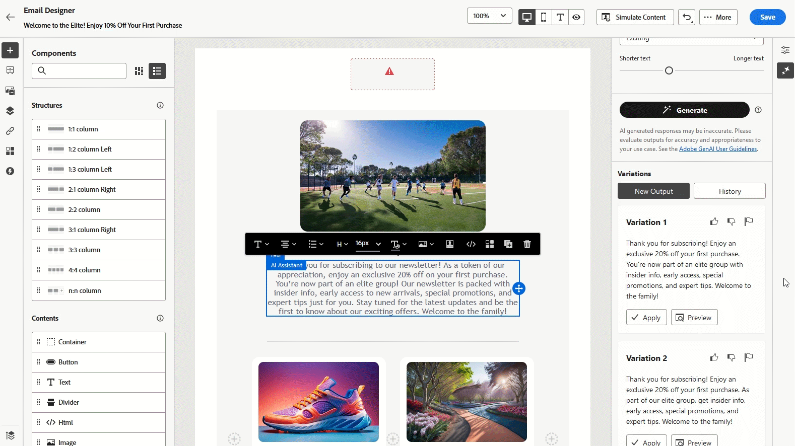

# AI 助手用例 {#generative-uc}

>[!NOTE]
>
>在开始使用此功能之前，请阅读相关的[护栏和限制](gs-generative.md#generative-guardrails)。

## 使用现有内容

1. 设置营销活动后，选择&#x200B;**[!UICONTROL 编辑内容]**。

1. 打开&#x200B;**[!UICONTROL AI助手]**&#x200B;部分。

1. 打开AI助手中的&#x200B;**[!UICONTROL 使用原始内容]**&#x200B;功能，根据营销活动详细信息（包括营销活动名称和目标受众）定制新内容。

1. 通过在&#x200B;**[!UICONTROL 提示]**&#x200B;框中指定您的请求来调整内容，并根据需要自定义设置。

1. 如果对提示感到满意，请单击&#x200B;**[!UICONTROL 生成]**。

1. 浏览可用的&#x200B;**[!UICONTROL 变体]**&#x200B;并单击&#x200B;**[!UICONTROL 预览]**&#x200B;全屏查看所选变体。

定义内容、受众和计划后，便可以准备电子邮件营销活动。 [了解详情](../campaigns/review-activate-campaign.md)

## 优化变量

1. 设置并配置营销活动后，单击&#x200B;**[!UICONTROL 编辑内容]**。

1. 打开&#x200B;**[!UICONTROL AI助手]**&#x200B;菜单。

1. 在&#x200B;**[!UICONTROL 提示]**&#x200B;框中输入所需请求并修改设置，以调整内容。

1. 准备就绪后，单击&#x200B;**[!UICONTROL 生成]**。

1. 查看生成的&#x200B;**[!UICONTROL 变体]**&#x200B;并选择&#x200B;**[!UICONTROL 预览]**&#x200B;以查看所选选项的全屏视图。

1. 在&#x200B;**[!UICONTROL 预览]**&#x200B;窗口中，转到&#x200B;**[!UICONTROL 优化]**&#x200B;选项以进行进一步自定义，包括：

   * **[!UICONTROL 用作引用内容]**：所选变量将用作引用以生成更多内容。

   * **[!UICONTROL 细节]**：让AI助手在某些点上扩展，提供更深入和详细的信息，以提高参与度。

   * **[!UICONTROL 摘要]**：如需较长的信息，请使用AI助手创建电子邮件收件人更容易理解的简要摘要。

   * **[!UICONTROL 改写]**： AI助手可以通过不同方式呈现您的消息，帮助各种受众保持内容新鲜。

   * **[!UICONTROL 使用更简单的语言]**：使用AI Assistant简化语言，以确保消息清晰且所有读者都可以访问。

   此外，您可以调整内容的&#x200B;**[!UICONTROL 音调]**&#x200B;和&#x200B;**[!UICONTROL 通信策略]**。

1. 找到正确的内容后，单击&#x200B;**[!UICONTROL 选择]**。

## 生成类似图像

1. 设置营销活动后，选择&#x200B;**[!UICONTROL 编辑内容]**。

1. 打开&#x200B;**[!UICONTROL AI助手]**&#x200B;部分。

1. 通过在&#x200B;**[!UICONTROL 提示]**&#x200B;框中指定您的请求来调整内容，并根据需要自定义设置。

1. 如果对提示感到满意，请单击&#x200B;**[!UICONTROL 生成]**。

1. 浏览&#x200B;**[!UICONTROL 变体建议]**&#x200B;以查找所需的资源。

   单击&#x200B;**[!UICONTROL 预览]**&#x200B;以查看所选变体的全屏版本。

1. 选择&#x200B;**[!UICONTROL 生成类似项]**&#x200B;以探索与当前选项非常相似的图像变体，提供具有类似主题的替代设计。

1. 找到相应的内容后，单击&#x200B;**[!UICONTROL 选择]**。

## 上载样式引用

1. 设置和配置电子邮件促销活动后，单击&#x200B;**[!UICONTROL 编辑内容]**。

1. 使用AI助手选择要修改的资源。

1. 从右窗格菜单中选择&#x200B;**[!UICONTROL AI助手]**。

1. 打开&#x200B;**[!UICONTROL 引用样式]**&#x200B;选项，以便AI助手可以使用引用材料生成新内容。

1. 单击&#x200B;**[!UICONTROL 上传图像]**&#x200B;以包含将上下文添加到变体的图像。

1. 通过指定要在&#x200B;**[!UICONTROL 提示]**&#x200B;框中生成的内容来优化内容，并根据需要调整设置。

1. 如果对提示感到满意，请单击&#x200B;**[!UICONTROL 生成]**。

1. 查看&#x200B;**[!UICONTROL 变体建议]**&#x200B;以找到您喜欢的资源。

1. 选择&#x200B;**[!UICONTROL 预览]**&#x200B;以全屏查看所选变量。

1. 找到合适的内容后，单击&#x200B;**[!UICONTROL 选择]**。
