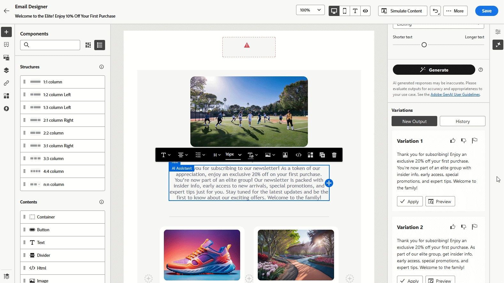

# AI 助手用例 {#generative-uc}

>[!NOTE]
>
>在开始使用此功能之前，请阅读相关的[护栏和限制](gs-generative.md#generative-guardrails)。

## 使用现有内容

从营销活动中已有的内容和上下文生成变体，以便与消息和受众保持一致。

1. 设置营销活动后，选择&#x200B;**[!UICONTROL 编辑内容]**。

1. 打开&#x200B;**[!UICONTROL AI助手]**&#x200B;部分。

1. 打开AI助手中的&#x200B;**[!UICONTROL 使用原始内容]**&#x200B;功能，根据营销活动详细信息（包括营销活动名称和目标受众）定制新内容。

1. 通过在&#x200B;**[!UICONTROL 提示]**&#x200B;框中指定您的请求来调整内容，并根据需要自定义设置。

1. 如果对提示感到满意，请单击&#x200B;**[!UICONTROL 生成]**。

1. 浏览可用的&#x200B;**[!UICONTROL 变体]**&#x200B;并单击&#x200B;**[!UICONTROL 预览]**&#x200B;全屏查看所选变体。

定义内容、受众和计划后，便可以准备电子邮件营销活动。 [了解详情](../campaigns/review-activate-campaign.md)

## 优化变量 {#refine}

在选择最终文本之前，请就地调整AI生成的变体、色调、长度、措辞和策略。

1. 设置并配置营销活动后，单击&#x200B;**[!UICONTROL 编辑内容]**。

1. 打开&#x200B;**[!UICONTROL AI助手]**&#x200B;菜单。

1. 在&#x200B;**[!UICONTROL 提示]**&#x200B;框中输入所需请求并修改设置，以调整内容。

1. 准备就绪后，单击&#x200B;**[!UICONTROL 生成]**。

1. 查看生成的&#x200B;**[!UICONTROL 变体]**&#x200B;并选择&#x200B;**[!UICONTROL 预览]**&#x200B;以查看所选选项的全屏视图。

1. 在&#x200B;**[!UICONTROL 预览]**&#x200B;窗口中，转到&#x200B;**[!UICONTROL 优化]**&#x200B;选项以进行进一步自定义，包括：

   * **[!UICONTROL 用作引用内容]**：所选变量将用作引用以生成更多内容。

   * **[!UICONTROL 细节]**：让AI助手扩展某些点，提供更深入和详细的信息，以提高参与度。

   * **[!UICONTROL 摘要]**：为了获取较长的信息，请使用AI助手创建电子邮件收件人更容易理解的简要摘要。

   * **[!UICONTROL 改写]**： AI助手可以通过不同方式呈现您的消息，帮助各种受众保持内容新鲜。

   * **[!UICONTROL 使用更简单的语言]**：使用AI Assistant简化语言，以确保消息清晰且可供所有读者访问。

   此外，您可以调整内容的&#x200B;**[!UICONTROL 音调]**&#x200B;和&#x200B;**[!UICONTROL 通信策略]**。

1. 找到正确的内容后，单击&#x200B;**[!UICONTROL 选择]**。

## 生成类似图像

当图像几乎合适时，可生成保留相同整体外观和主题的附加选项。

1. 设置营销活动后，选择&#x200B;**[!UICONTROL 编辑内容]**。

1. 打开&#x200B;**[!UICONTROL AI助手]**&#x200B;部分。

1. 通过在&#x200B;**[!UICONTROL 提示]**&#x200B;框中指定您的请求来调整内容，并根据需要自定义设置。

1. 如果对提示感到满意，请单击&#x200B;**[!UICONTROL 生成]**。

1. 浏览&#x200B;**[!UICONTROL 变体建议]**&#x200B;以查找所需的资源。

   单击&#x200B;**[!UICONTROL 预览]**&#x200B;以查看所选变体的全屏版本。

1. 选择&#x200B;**[!UICONTROL 生成类似项]**&#x200B;以探索与当前选项非常相似的图像变体，提供具有类似主题的替代设计。

1. 找到相应的内容后，单击&#x200B;**[!UICONTROL 选择]**。

## 上载样式引用

上载参考图像，使新视觉对象遵循所需的样式、调色板或合成。

1. 设置和配置电子邮件促销活动后，单击&#x200B;**[!UICONTROL 编辑内容]**。

1. 选择要使用AI助手修改的资源。

1. 从右窗格菜单中选择&#x200B;**[!UICONTROL AI助手]**。

1. 打开&#x200B;**[!UICONTROL 引用样式]**&#x200B;选项，以便AI助手可以使用引用材料生成新内容。

1. 单击&#x200B;**[!UICONTROL 上传图像]**&#x200B;以包含将上下文添加到变体的图像。

1. 通过指定要在&#x200B;**[!UICONTROL 提示]**&#x200B;框中生成的内容来优化内容，并根据需要调整设置。

1. 如果对提示感到满意，请单击&#x200B;**[!UICONTROL 生成]**。

1. 查看&#x200B;**[!UICONTROL 变体建议]**&#x200B;以找到您喜欢的资源。

1. 选择&#x200B;**[!UICONTROL 预览]**&#x200B;以全屏查看所选变量。

1. 找到合适的内容后，单击&#x200B;**[!UICONTROL 选择]**。

## 跨支持的语言生成内容{#languages}

通过将您的提示与显式语言设置相结合，以AI助手支持的语言生成文本。

1. 设置并配置营销活动后，单击&#x200B;**[!UICONTROL 编辑内容]**。

1. 打开&#x200B;**[!UICONTROL AI助手]**&#x200B;菜单。

1. 在&#x200B;**[!UICONTROL 提示]**&#x200B;框中用法语、西班牙语、德语、意大利语、日语、瑞典语、荷兰语或挪威语输入所需的请求来调整内容。

1. 使用&#x200B;**[!UICONTROL 文本设置]**&#x200B;选项定制提示，并为生成的内容选择所需的&#x200B;**[!UICONTROL 语言]**。

1. 根据需要进一步个性化您的提示，然后单击&#x200B;**[!UICONTROL 生成]**。

1. 以您选择的语言查看&#x200B;**[!UICONTROL 变体建议]**。

1. 找到合适的内容后，单击&#x200B;**[!UICONTROL 选择]**。

## 使用参考内容进行生成

您可以通过添加&#x200B;**参考内容**、网页或上传的文件来为AI助手提供更多上下文，以便生成的副本和建议更接近您的源资料。

1. 活动就绪后，单击&#x200B;**[!UICONTROL 编辑内容]**。

1. 打开&#x200B;**[!UICONTROL AI助手]**。

1. 在&#x200B;**[!UICONTROL 提示]**&#x200B;字段中描述所需的内容。

1. 在&#x200B;**[!UICONTROL 引用内容]**&#x200B;中，输入页面URL和标识它的名称。

1. 单击以提取页面，并将其添加为参考内容以供生成。

1. 若要改用文件，请选择&#x200B;**[!UICONTROL 上载文件选项]**&#x200B;并选择您的文档。 支持的格式包括.pdf、.png、.jpg、.jpeg、.zip、.md、.doc、.txt和.docx。

1. 在&#x200B;**[!UICONTROL 上载的引用内容]**&#x200B;中，启用或禁用单个引用，或删除您不再需要的引用。

1. 根据需要调整提示，然后单击&#x200B;**[!UICONTROL 生成]**。

1. 查看&#x200B;**[!UICONTROL 变量建议]**&#x200B;并单击要使用的变量上的&#x200B;**[!UICONTROL 选择]**。

## 使用生成模型 {#generative-model}

注册自定义生成模型，并从AI Assistant中通过该模型路由图像生成。

1. 从&#x200B;**[!UICONTROL 品牌]**&#x200B;菜单中，打开&#x200B;**[!UICONTROL 生成模型]**&#x200B;选项卡，然后单击&#x200B;**[!UICONTROL 添加模型]**。

1. 输入模型的&#x200B;**[!UICONTROL Name]**&#x200B;和&#x200B;**[!UICONTROL 模型ID]**。

1. （可选）输入&#x200B;**[!UICONTROL 描述]**&#x200B;以区分列表中的此模型。

1. 单击&#x200B;**[!UICONTROL 测试连接]**&#x200B;以验证模型配置，然后单击&#x200B;**[!UICONTROL 保存]**。 模型即被添加到模型列表中。

1. 在营销活动中，单击&#x200B;**[!UICONTROL 编辑内容]**。

1. 选择要使用AI助手修改的资产，然后打开&#x200B;**[!UICONTROL AI助手]**。

1. 在&#x200B;**[!UICONTROL 提示]**&#x200B;字段中指定您的请求，并根据需要调整其余设置。

1. 打开&#x200B;**[!UICONTROL 图像设置]**&#x200B;并选择您之前配置的&#x200B;**[!UICONTROL 生成模型]**。

1. 根据需要调整提示，然后单击&#x200B;**[!UICONTROL 生成]**。

1. 查看所选语言的&#x200B;**[!UICONTROL 变体建议]**，并在识别出合适的变体后单击&#x200B;**[!UICONTROL 选择]**。

## 使用Gemini作为文本叠加图像的生成模型

选择&#x200B;**Gemini 2.5**&#x200B;作为生成模型后，您可以在AI Assistant中生成图像变体，从URL、文件或AI生成的提示添加文本叠加，然后在应用最终变体之前定位叠加。

1. 活动就绪后，单击&#x200B;**[!UICONTROL 编辑内容]**。

1. 选择要用作基本图像的资产，然后打开&#x200B;**[!UICONTROL AI助手]**。

1. 单击&#x200B;**[!UICONTROL 打开设置]**&#x200B;可调整图像生成选项。

1. 在&#x200B;**[!UICONTROL 生成模型]**&#x200B;下，选择&#x200B;**Gemini 2.5 (nano-banana)**。

1. 在&#x200B;**[!UICONTROL 提示]**&#x200B;字段中输入您的请求。

1. 选择所需的变体数量，然后单击&#x200B;**[!UICONTROL 生成]**。

1. 在生成之后，预览变体或优化设置以进行再生。 从高级菜单中，您还可以：

   * **[!UICONTROL 创建图像叠加]**
   * **[!UICONTROL 生成类似项]**
   * **[!UICONTROL 裁切图像]**
   * **[!UICONTROL 保存到AEM资源]**
   * **[!UICONTROL 删除]**

1. 选择&#x200B;**[!UICONTROL 创建图像叠加]**。 从URL添加叠加、上载文件或使用&#x200B;**[!UICONTROL 通过AI生成文本叠加]**，并在&#x200B;**[!UICONTROL 提示]**&#x200B;中描述该叠加。

1. 单击&#x200B;**[!UICONTROL 生成]**。

1. 审核&#x200B;**[!UICONTROL 覆盖变体]**&#x200B;并单击&#x200B;**[!UICONTROL 应用]**。

1. 根据需要将叠加图放置在图像上。 从高级菜单中，您可以：

   * **[!UICONTROL 删除叠加]**
   * **[!UICONTROL 前进]**
   * **[!UICONTROL 向后移动]**
   * **[!UICONTROL 重复]**

1. 当文本覆盖看起来正确时，单击&#x200B;**[!UICONTROL 保存]**，然后单击要使用的变量上的&#x200B;**[!UICONTROL 应用]**。

