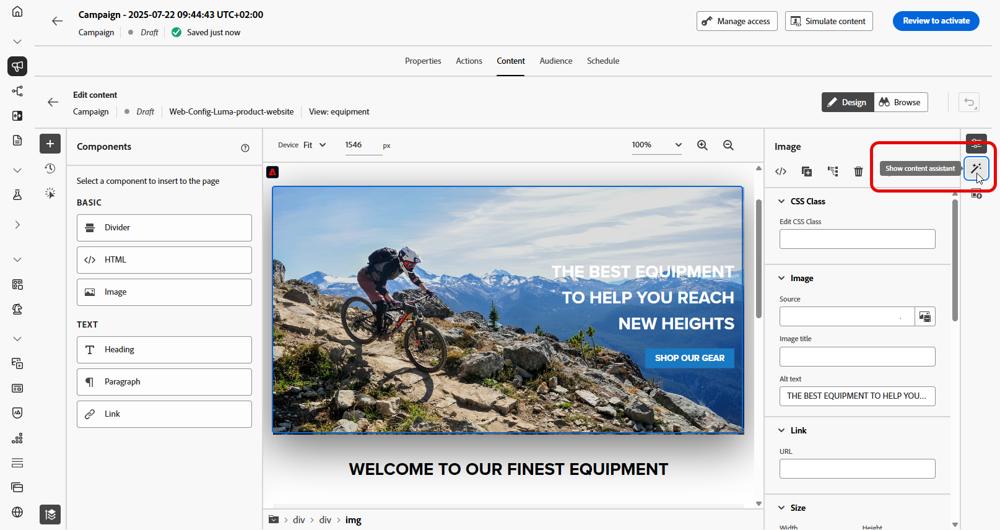
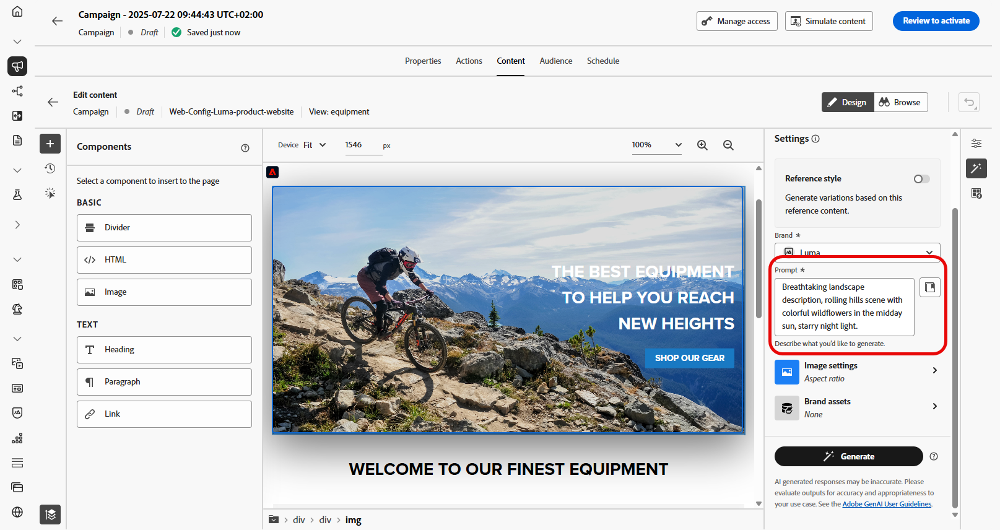

# 使用AI Assistant生成网页 — 内容加速器 {#generative-web}

>[!IMPORTANT]
>
>在开始使用此功能之前，请阅读相关的[护栏和限制](gs-generative.md#generative-guardrails)。
> 
>
>您必须同意[用户协议](https://www.adobe.com/legal/licenses-terms/adobe-dx-gen-ai-user-guidelines.html)，然后才能在Journey Optimizer中使用AI助手进行内容加速。 有关更多信息，请与您的 Adobe 代表联系。

创建并个性化您的网页后，使用由创作AI提供支持的Journey Optimizer内容加速的AI助手将您的内容提升到新的水平。

Journey Optimizer中用于Content Acceleration的AI助手可以通过建议更可能引起受众共鸣的其他内容来帮助您优化投放的影响。

>[!BEGINTABS]

>[!TAB 网页文本生成]

1. 创建和配置网页后，单击&#x200B;**[!UICONTROL 编辑网页]**。

   有关如何配置网页的详细信息，请参阅[此页面](../web/create-web.md)。

1. 选择&#x200B;**[!UICONTROL 文本组件]**&#x200B;以仅定向特定内容。 并访问&#x200B;**[!UICONTROL 显示AI助手]**&#x200B;菜单。

   {zoomable="yes"}

1. 为用于内容加速的AI助手启用&#x200B;**[!UICONTROL 使用原始内容]**&#x200B;选项，以根据所选内容对新内容进行个性化设置。

1. 通过描述要在&#x200B;**[!UICONTROL 提示]**&#x200B;字段中生成的内容，优化内容。

   如果您在制作提示时寻求帮助，请访问&#x200B;**[!UICONTROL 提示库]**，该库提供了多种提示想法来改进促销活动。

   {zoomable="yes"}

1. 使用&#x200B;**[!UICONTROL 文本设置]**&#x200B;选项定制提示：

   * **[!UICONTROL 通信策略]**：为生成的文本选择最合适的通信样式。
   * **[!UICONTROL 音调]**：网页的音调应该会对您的受众产生共鸣。 无论您是要提供信息、好玩还是具有说服力，AI Assistant都可以相应地调整消息。
   * **文本长度**：使用滑块选择所需文本长度。

   {zoomable="yes"}

1. 从&#x200B;**[!UICONTROL 品牌资产]**&#x200B;菜单中，单击&#x200B;**[!UICONTROL 上传品牌资产]**&#x200B;以添加任何品牌资产，这些品牌资产包含可为AI助手提供其他上下文的内容或选择以前上传的内容。

   以前上传的文件在&#x200B;**[!UICONTROL 已上传的品牌资产]**&#x200B;下拉菜单中可用。 只需切换您想要包含到层代中的资产。

1. 提示就绪后，单击&#x200B;**[!UICONTROL 生成]**。

1. 浏览生成的&#x200B;**[!UICONTROL 变体]**&#x200B;并单击&#x200B;**[!UICONTROL 预览]**&#x200B;以查看所选变体的全屏版本。

1. 导航到&#x200B;**[!UICONTROL 预览]**&#x200B;窗口中的&#x200B;**[!UICONTROL 优化]**&#x200B;选项以访问其他自定义功能：

   * **[!UICONTROL 用作引用内容]**：所选变量将用作用于生成其他结果的引用内容。

   * **[!UICONTROL 阐述]**：AI助手可以帮助您展开特定主题，提供其他详细信息以便更好地了解和参与。

   * **[!UICONTROL 摘要]**：过长的信息可能会使收件人过载。 使用AI Assistant将要点整合为清晰、简洁的摘要，以吸引注意并鼓励他们进一步阅读。

   * **[!UICONTROL 重述]**：AI助手可以通过不同的方式重述您的消息，使您的写作保持新鲜，并吸引各种受众。

   * **[!UICONTROL 使用更简单的语言]**：利用AI Assistant简化您的语言，确保更广大的受众拥有清晰易懂的语言。

   您还可以更改文本的&#x200B;**[!UICONTROL 音调]**&#x200B;和&#x200B;**[!UICONTROL 通信策略]**。

   {zoomable="yes"}

1. 找到相应的内容后，单击&#x200B;**[!UICONTROL 选择]**。

   您还可以为内容启用试验。 [了解详情](generative-experimentation.md)

定义Web营销活动设置并根据需要使用Web设计器编辑内容后，即可查看和激活Web营销活动。 [了解详情](../web/create-web.md#activate-web-campaign)

>[!TAB 网页图像生成]

在下面的示例中，了解如何利用Journey Optimizer中的AI助手进行内容加速，以优化和改进您的资源，从而确保获得对用户更友好的体验。

1. 创建和配置网页后，单击&#x200B;**[!UICONTROL 编辑网页]**。

   有关如何配置网页的详细信息，请参阅[此页面](../web/create-web.md)。

1. 选择要使用用于内容加速的AI助手更改的资产。

1. 从右侧菜单中选择&#x200B;**[!UICONTROL 显示AI助手]**。

   {zoomable="yes"}

1. 为内容加速的AI助手启用&#x200B;**[!UICONTROL 引用样式]**&#x200B;选项，以根据引用内容对新内容进行个性化设置。 您还可以上传图像以将上下文添加到变体。

1. 通过描述要在&#x200B;**[!UICONTROL 提示]**&#x200B;字段中生成的内容，优化内容。

   如果您在制作提示时寻求帮助，请访问&#x200B;**[!UICONTROL 提示库]**，该库提供了多种提示想法来改进促销活动。

   {zoomable="yes"}

1. 使用&#x200B;**[!UICONTROL 图像设置]**&#x200B;选项定制提示：

   * **[!UICONTROL 宽高比]**：这决定了资源的宽度和高度。 您可以选择常用比率，如16:9、4:3、3:2或1:1，也可以输入自定义大小。
   * **[!UICONTROL 内容类型]**：这将对可视化元素的性质进行分类，区分不同的可视化表示形式，如照片、图形或艺术品。
   * **[!UICONTROL 视觉强度]**：您可以通过调整图像的强度来控制其影响。 较低的设置(2)将产生更柔和、更克制的外观，而较高的设置(10)将使图像更生动、视觉更强大。
   * **[!UICONTROL 颜色和色调]**：图像内颜色的总体外观及其传达的情绪或气氛。
   * **[!UICONTROL 照明]**：这是指图像中的闪电，它塑造了大气层，突出了特定的元素。
   * **[!UICONTROL 合成]**：这指的是图像框架中元素的排列

   {zoomable="yes"}

1. 从&#x200B;**[!UICONTROL 品牌资产]**&#x200B;菜单中，单击&#x200B;**[!UICONTROL 上传品牌资产]**&#x200B;以添加任何品牌资产，这些品牌资产包含可为AI助手提供其他上下文的内容或选择以前上传的内容。

   以前上传的文件在&#x200B;**[!UICONTROL 已上传的品牌资产]**&#x200B;下拉菜单中可用。 只需切换您想要包含到层代中的资产。

1. 如果对提示配置满意，请单击&#x200B;**[!UICONTROL 生成]**。

1. 浏览&#x200B;**[!UICONTROL 变体建议]**&#x200B;以查找所需的资源。

   单击&#x200B;**[!UICONTROL 预览]**&#x200B;以查看所选变体的全屏版本。

   {zoomable="yes"}

1. 如果要查看与此变体相关的图像，请选择&#x200B;**[!UICONTROL 生成类似项]**。

   {zoomable="yes"}

1. 找到相应的内容后，单击&#x200B;**[!UICONTROL 选择]**。

   您还可以为内容启用试验。 [了解详情](generative-experimentation.md)

定义Web营销活动设置并根据需要使用Web设计器编辑内容后，即可查看和激活Web营销活动。 [了解详情](../web/create-web.md#activate-web-campaign)

>[!ENDTABS]

