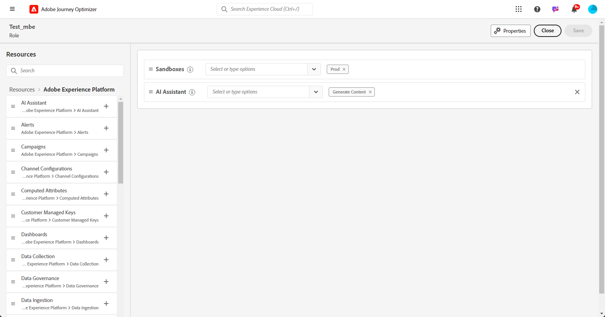

# AI 助手内容加速器入门 {#gs-content-assistant}

>[!CONTEXTUALHELP]
>id="ajo_ai_generation_settings"
>title="Journey Optimizer 中 的 AI 助手内容加速器"
>abstract="在精心设计并个性化您的交付后，您可使用 Journey Optimizer 中的 AI 助手内容加速器来增强您的内容。借助此功能，您可以描述要生成的内容来进行微调，从而简化个性化和内容改进的过程。"

>[!CONTEXTUALHELP]
>id="ajo_ai_generation_context"
>title="上传品牌资源"
>abstract="通过“上传品牌资源”菜单，您可以添加任何包含内容的品牌资源，这些内容可以为 Journey Optimizer 内容加速器中的 AI 助手提供额外上下文信息，或者选择之前上传的资源。此选项确保 AI 助手能够获取所有必要材料，以加强其功能和相关性。"

>[!CONTEXTUALHELP]
>id="ajo_ai_generation_start"
>title="Adobe 生成式 AI 术语"
>abstract="是否能访问此功能取决于您是否同意遵守 Adobe Experience Cloud 生成式 AI 用户指南。请检查此功能产生的任何输出是否准确，并确保它适合您的用例。"
>additional-url="https://www.adobe.com/legal/licenses-terms/adobe-dx-gen-ai-user-guidelines.html" text="Adobe 生成式 AI 用户指南"

>[!INFO]
>
>通过[我们的实时功能预览](https://experienceleague.adobe.com/zh-hans/apps/journey-optimizer/ai-assistant-content-accelerator){target="_blank"}获得亲身体验，该预览旨在让您亲自探索其功能并充分了解其能力。

Adobe Journey Optimizer中的AI助手内容加速器由Microsoft Azure OpenAI和Adobe Firefly提供支持，为文本和图像提供主动内容变体建议。 这可用于电子邮件、推送和短信渠道。这项新功能可用于快速的文本和图像生成。通过 Adobe Firefly 管理图像生成。

使用Adobe Journey Optimizer中的AI Assistant内容加速器，通过尝试使用不同的主标题和图像来优化消息的影响。 生成多个变体并构建试验，从而进行比较。利用 Journey Optimizer 内容试验，您可以定义多种消息处理方式，以衡量哪种方式最适合您的目标受众。您可以选择更改投放内容或主题。消息受众将随机分配给每个处理方式，以确定在指定的量度下哪个处理效果最佳。在[此部分](../content-management/content-experiment.md)中详细了解内容试验。

>[!IMPORTANT]
>
>* 在开始使用此功能之前，请阅读相关的[护栏和限制](#generative-guardrails)。
>
>
>* 您必须同意[用户协议](https://www.adobe.com/legal/licenses-terms/adobe-dx-gen-ai-user-guidelines.html){target="_blank"}，然后才能在Adobe Journey Optimizer中使用AI Assistant内容加速器。 有关更多信息，请与您的 Adobe 代表联系。

## 访问 AI 助手内容加速器 {#generative-access}

要访问Adobe Journey Optimizer中的AI助手内容加速器功能，需要向用户授予&#x200B;**生成内容**&#x200B;权限。 [了解详情](../administration/permissions.md)

+++  了解如何分配与内容生成相关的权限

1. 在&#x200B;**权限**&#x200B;产品中，转到&#x200B;**角色**&#x200B;选项卡并选择所需的&#x200B;**角色**。

1. 单击&#x200B;**编辑**，修改权限。

1. 添加&#x200B;**AI助手**&#x200B;资源，然后从下拉菜单中选择&#x200B;**生成内容**。

   {zoomable="yes"}

1. 单击&#x200B;**保存**&#x200B;以应用更改。

   任何已分配此角色的用户的权限都将自动更新。

1. 要将此角色分配给新用户，请导航到&#x200B;**角色**&#x200B;仪表板中的&#x200B;**用户**&#x200B;选项卡，然后单击&#x200B;**添加用户**。

1. 输入用户名、电子邮件地址或从列表中选择，然后单击&#x200B;**保存**。

1. 如果之前没有创建用户，请参阅[此文档](https://experienceleague.adobe.com/zh-hans/docs/experience-platform/access-control/abac/permissions-ui/users)。

用户将收到一封电子邮件，其中包含访问实例的说明。

+++

## 护栏和限制 {#generative-guardrails}

下面列出了在Adobe Journey Optimizer中使用AI助理内容加速器生成电子邮件的一般准则：

* 生成的内容的质量在很大程度上受您定义的营销目标/提示的影响。使用为 GenAI 模型明确定义的提示以准确解释。 
* 上传品牌资源以提供准确的品牌相关内容。否则，内容基于公开可用的信息。上传的内容可以是以下格式：PDF、JPEG、PNG 或 ZIP 文件（具有支持的文件格式）。
* 上传的品牌资源的最大大小为 50 MB。可以上传较大的文件或大量的图像，但处理时间会增加。
* 使用特定于品牌或自定义的模板，在Adobe Journey Optimizer中使用AI Assistant Content Accelerator创建电子邮件内容。 建议使用最多包含 8 至 10 张图像的电子邮件模板。
* 选择变体时，请确保使用拇指竖起、拇指朝下或标记图标报告任何有问题的输出。
* 您对AI助手的使用受Adobe Experience Cloud创作AI用户指南的约束。 [了解详情](https://www.adobe.com/legal/licenses-terms/adobe-dx-gen-ai-user-guidelines.html)
* 作为 Adobe 致力于促进媒体创作中生成式 AI 工具使用透明度的工作的一部分，Adobe 将在下载或导出包含 Firefly 生成资源的内容或项目时应用内容凭证。[了解详情](https://helpx.adobe.com/cn/firefly/using/content-credentials.html)

以下限制适用于Adobe Journey Optimizer中的AI Assistant内容加速器：

* 支持的语言只有英语。非英文输入内容可能会产生不一致或错误的结果。非英文答复引起的问题目前不予处理或改进。
* 仅适用于电子邮件、推送、Web 和短信渠道。
* GenAI 内容可能并不总是准确的：请分享您的反馈，以便我们的工程师可以优化模型。
* 您可以上传多个品牌资源，但对于每个具体的生成操作仅可使用一个资源。

## AI 助手内容生成功能 {#generative-features}

<table style="table-layout:fixed"><tr style="border: 0;">
<td>

<a href="generative-email.md"><strong>电子邮件生成</strong></a>

</td>
<td>

<a href="generative-sms.md"><strong>短信生成</strong>

</td>
<td>

<a href="generative-push.md"><strong>推送通知生成</strong></a>

</td>
<td>

<a href="generative-web.md"><strong>网页生成</strong>

</td>
</tr></table>
