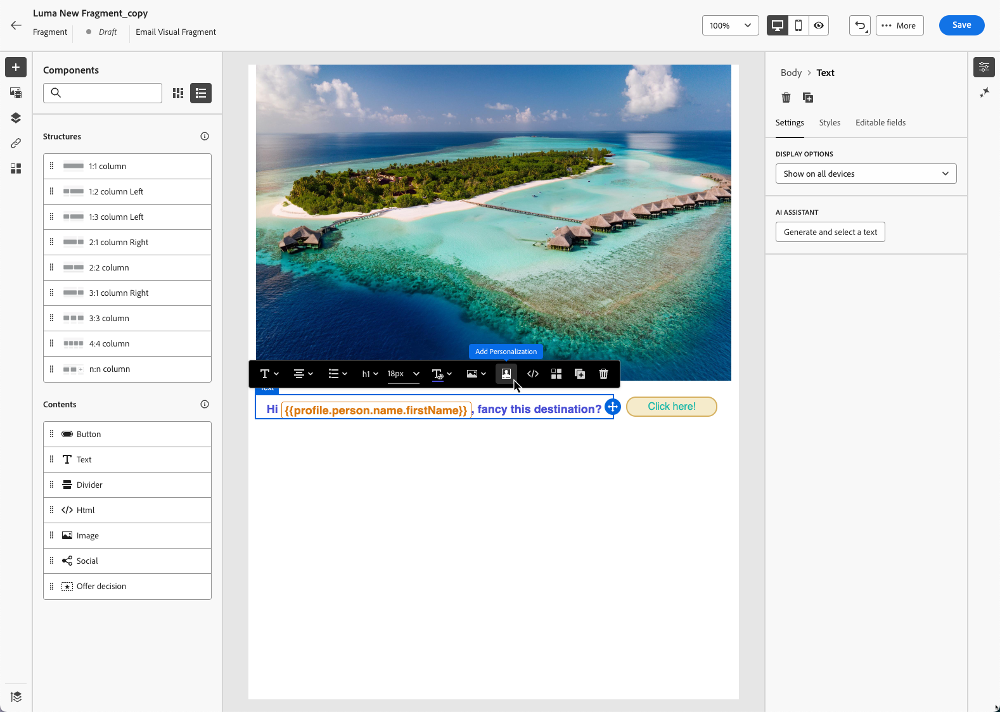

# 管理片段 {#manage-fragments}

## 访问片段 {#access-fragments}

要管理您的片段，请从左侧菜单&#x200B;**[!UICONTROL 内容管理]** > **[!UICONTROL 片段]**&#x200B;访问片段列表。

显示在当前沙盒上创建的所有片段 — 使用[另存为片段](#save-as-fragment)选项从&#x200B;**[!UICONTROL 片段]**&#x200B;菜单[&#128279;](#create-fragments)中创建的。

利用左侧的窗格，可将片段整理到文件夹中。 默认情况下，将显示所有片段。 选择文件夹时，仅显示选定文件夹中包含的片段和文件夹。 [了解详情](#folders)

要查找特定项目，请在搜索字段中开始键入名称。 选择[文件夹](#folders)后，搜索将应用于该文件夹<!--(not nested items)-->层次结构第一级中的所有片段或文件夹。

您可以按以下项筛选片段：

* 状态（草稿或实时）
* 类型（可视化或表达式）
* 创建或修改日期
* 状态（已存档或未存档）
* 标记

{width="90%" align="left"}

您还可以选择显示所有片段，或仅显示当前用户创建或修改的项目。

通过每个片段旁边的&#x200B;**[!UICONTROL 更多操作]**&#x200B;按钮，您可以：

* 将其添加到资源包以供导出。 [了解详情](#export)
* 如果正在编辑实时片段，请打开此片段的草稿版本。 [了解详情](#edit-fragments)
* 复制片段。
* 使用&#x200B;**[!UICONTROL 浏览引用]**&#x200B;选项可查看使用它的历程、营销活动或模板。 [了解详情](#explore-references)
* 将片段存档。 [了解详情](#archive-fragments)
* 编辑片段的标记。 [了解如何使用统一标记](../start/search-filter-categorize.md#tags)
* 将片段移动到文件夹。 [了解详情](#folders)

## 使用文件夹管理片段 {#folders}

>[!CONTEXTUALHELP]
>id="ajo_fragments_folders"
>title="将片段整理到文件夹中"
>abstract="根据您的组织需求，使用文件夹对片段进行分类和管理。"

要轻松导航片段，您可以使用文件夹更高效地将其整理到结构化层次结构中。 这使您能够根据组织需求对项目进行分类和管理。

1. 单击“**[!UICONTROL 所有片段]**”按钮以显示之前创建的所有项，而不进行文件夹分组。

1. 单击&#x200B;**[!UICONTROL 根]**&#x200B;文件夹以显示创建的所有文件夹。

   >[!NOTE]
   >
   >如果尚未创建文件夹，则会显示所有片段。

1. 单击&#x200B;**[!UICONTROL 根]**&#x200B;文件夹中的任意文件夹以显示其内容。

1. 单击&#x200B;**[!UICONTROL 根]**&#x200B;文件夹或任何其他文件夹后，将显示&#x200B;**[!DNL Create folder]**&#x200B;按钮。 选择它。

   

1. 键入新文件夹的名称，然后单击&#x200B;**[!UICONTROL 保存]**。 新文件夹显示在&#x200B;**[!UICONTROL 根]**&#x200B;文件夹内的片段列表顶部，或显示在当前选定的文件夹内。

1. 您可以单击&#x200B;**[!UICONTROL 更多操作]**&#x200B;按钮以重命名或删除文件夹。

   

1. 使用&#x200B;**[!UICONTROL 更多操作]**&#x200B;按钮，您还可以将片段移动到另一个现有文件夹。

   <!---->

1. 现在，您可以导航到之前创建的文件夹。 您[从此处](create-fragments.md)创建的每个新片段都保存到当前文件夹中。

   

## 片段状态 {#fragments-statuses}

>[!CONTEXTUALHELP]
>id="ajo_fragment_statuses"
>title="新的片段状态"
>abstract="由于在 Journey Optimizer 6 月版中引入了&#x200B;**草稿**&#x200B;和&#x200B;**实时**&#x200B;状态，因此在此版本之前创建的所有片段都具有&#x200B;**草稿**&#x200B;状态，即使它们用于历程或活动中。如果您对这些片段进行任何更改，则需要发布片段以使其成为&#x200B;**实时**&#x200B;片段，并将更改传播到相关的活动和历程。您还需要创建一个新的历程/活动版本并发布它。 发布需要<a href="https://experienceleague.adobe.com/zh-hans/docs/journey-optimizer/using/access-control/privacy/ootb-product-profiles#content-library-manage">发布片段</a>用户权限。"
>additional-url="https://experienceleague.adobe.com/zh-hans/docs/journey-optimizer/using/access-control/privacy/ootb-product-profiles#content-library-manager" text="详细了解内容片段权限"

片段可以具有多种状态：

* **[!UICONTROL 草稿]**：片段正在编辑且尚未获得批准。

* **[!UICONTROL 实时]**：片段已批准且实时。 [了解如何发布片段](../content-management/create-fragments.md#publish)

  在编辑实时片段时，其状态旁边会显示一个特定图标。 单击此图标可打开片段的草稿版本。

* **[!UICONTROL 发布]**：片段已获得批准且正在发布。
* **[!UICONTROL 已存档]**：片段已存档。 [了解如何存档片段](#archive-fragments)

>[!CAUTION]
>
>由于在 Journey Optimizer 6 月版中引入了&#x200B;**草稿**&#x200B;和&#x200B;**实时**&#x200B;状态，因此在此版本之前创建的所有片段都具有&#x200B;**草稿**&#x200B;状态，即使它们用于历程或活动中。如果您对这些片段进行任何更改，则需要发布片段以使其成为&#x200B;**实时**&#x200B;片段，并将更改传播到相关的活动和历程。您还需要创建一个新的历程/活动版本并发布它。发布需要[发布片段](../administration/ootb-product-profiles.md#content-library-manager)用户权限。

## 编辑片段 {#edit-fragments}

>[!CONTEXTUALHELP]
>id="ajo_fragments_update_campaigns"
>title="片段更新活动"
>abstract="如果您发布对相关片段的更改，则此活动将不会更新。它需要发布新版本以便可以支持片段更新功能。"

>[!CONTEXTUALHELP]
>id="ajo_fragments_update_journeys"
>title="历程中的片段更新"
>abstract="如果您发布对相关片段的更改，则此历程将不会更新。它需要发布新版本以便可以支持片段更新功能。"

要编辑片段，请执行以下步骤。

1. 从&#x200B;**[!UICONTROL 片段]**&#x200B;列表中单击所需的片段。 片段属性屏幕打开，并预览其内容。

1. 您可以检查当前正在使用片段的历程、营销活动和内容模板的列表。 为此，请从“更多操作”按钮中选择&#x200B;**[!UICONTROL 浏览引用]**&#x200B;选项。 [了解详情](#explore-references)

1. 如果正在编辑的片段具有&#x200B;**[!UICONTROL 实时]**&#x200B;状态，请单击&#x200B;**[!UICONTROL 修改]**&#x200B;按钮以创建片段的草稿版本。 单击&#x200B;**[!UICONTROL 确认]**。

   {width="70%" align="left"}

   >[!NOTE]
   >
   >片段的当前版本将继续处于活动状态，直到您发布新的更新版本。

1. 如果需要，对片段详细信息进行所需的更改。

1. 要修改片段的内容，请单击&#x200B;**[!UICONTROL 编辑]**&#x200B;按钮并更新您的内容，就像从头开始创建片段时所做的那样。 [了解如何创建片段](create-fragments.md#content)

   {width="70%" align="left"}

   >[!NOTE]
   >
   >编辑已发布的片段时，您可以移除任何个性化字段，但无法向片段内容添加新个性化字段。 如果要添加个性化属性，必须复制片段。 [了解详情](#adding-new-attributes)

1. 准备好更改后，保存它们并单击&#x200B;**[!UICONTROL 发布]**&#x200B;按钮以使修改生效。 [了解详情](create-fragments.md#publish)

在编辑片段时，更改会自动传播到该片段的所有内容，包括实时历程和营销活动，但您中断了原始片段的继承的内容除外。

>[!NOTE]
>
>了解如何在[将可视化片段添加到您的电子邮件](../email/use-visual-fragments.md#break-inheritance)和[利用表达式片段](../personalization/use-expression-fragments.md#break-inheritance)部分中中断继承。

### 向实时片段添加新属性 {#adding-new-attributes}

>[!WARNING]
>
>不支持向实时片段添加新的[个性化属性](../personalization/personalization-build-expressions.md)。

发布片段后，将为引用该片段的所有营销活动和历程锁定个性化或上下文属性集。

要将其他属性合并到活动片段，请执行以下步骤。

1. 使用&#x200B;**[!UICONTROL 更多操作]**&#x200B;按钮复制现有片段。

   {width="70%" align="left"}

1. 选择要打开的重复片段，然后单击&#x200B;**[!UICONTROL 编辑]**&#x200B;按钮。

1. [将所需的新属性](../personalization/personalization-build-expressions.md#add)添加到重复的片段，如个性化字段。

   {width="70%" align="left"}

1. 保存更改并发布新片段。 [了解如何操作](create-fragments.md#publish)

1. 更新任何营销活动或历程，以引用添加了新属性的更新片段。

   * [了解如何使用可视化片段](../email/use-visual-fragments.md)
   * [了解如何使用表达式片段](../personalization/use-expression-fragments.md)

## 探索引用 {#explore-references}

您可以显示当前使用片段的历程、营销活动和内容模板列表。 为此，请在片段列表或片段属性屏幕中从&#x200B;**[!UICONTROL 更多操作]**&#x200B;菜单中选择&#x200B;**[!UICONTROL 浏览引用]**。

{width="70%" align="left"}

选择一个选项卡，可在历程、营销活动、模板和片段之间切换。 您可以查看其状态，然后单击名称以重定向到引用片段的相应项目。

{width="70%" align="left"}

>[!NOTE]
>
>如果片段用在历程、营销策划或模板中，且标签阻止您访问片段，您将在选定选项卡顶部看到一条警报消息。 [了解有关对象级访问控制(OLAC)的更多信息](../administration/object-based-access.md)

## 存档片段 {#archive-fragments}

您可以从不再与您的品牌相关的项目中清理片段列表。

为此，请单击所需片段旁边的&#x200B;**[!UICONTROL 更多操作]**&#x200B;按钮，然后选择&#x200B;**[!UICONTROL 存档]**。 它会从片段列表中消失，从而阻止用户在未来电子邮件或模板中使用它。

{width="70%" align="left"}

>[!NOTE]
>
>如果存档在内容中使用的片段，<!--it will remain in the email or template, but you won't be able to select it from the fragment list to edit it-->该内容将不会受到影响。

要取消存档片段，请筛选&#x200B;**[!UICONTROL 已存档]**&#x200B;项目，然后从&#x200B;**[!UICONTROL 更多操作]**&#x200B;菜单中选择&#x200B;**[!UICONTROL 取消存档]**。 现在可以再次从片段列表中访问，并可用于任何电子邮件或模板。

{width="70%" align="left"}

## 将片段导出到另一个沙盒 {#export}

Journey Optimizer允许您将片段从一个沙盒复制到另一个沙盒。 例如，您可以将片段从暂存沙盒环境复制到生产沙盒。

复制过程通过源沙盒和目标沙盒之间的&#x200B;**包导出和导入**&#x200B;进行。 有关如何导出对象并将其导入目标沙盒的详细信息，请参阅此部分： [将对象复制到另一个沙盒](../configuration/copy-objects-to-sandbox.md)。
