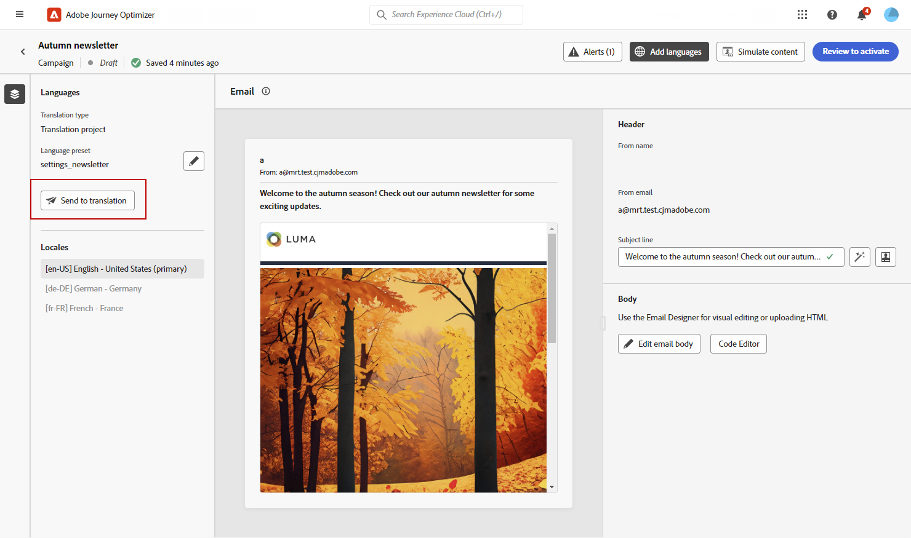
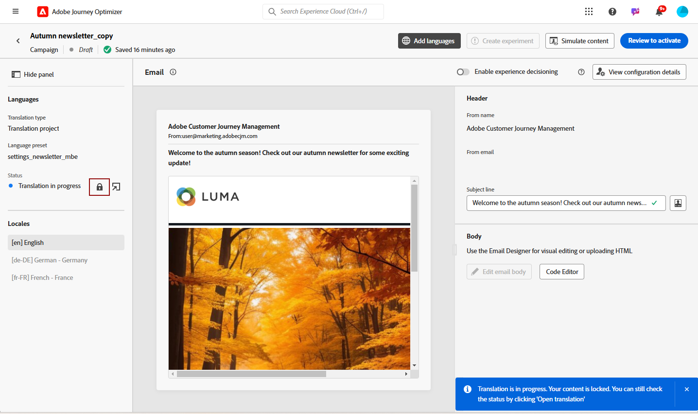
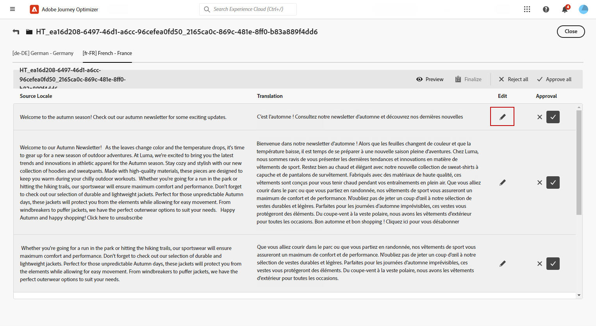

# 使用自动翻译创建多语言内容 {#multilingual-automated}

>[!BEGINSHADEBOX]

**目录**

* [多语言内容入门](multilingual-gs.md)
* [使用手动翻译创建多语言内容](multilingual-manual.md)
* **[通过自动翻译创建多语言内容](multilingual-automated.md)**
* [多语言营销活动报告](multilingual-report.md)

>[!ENDSHADEBOX]

使用自动流程，您只需选择目标语言和语言提供商即可。 然后，您的内容将直接发送到翻译，准备完成后进行最终审阅。

请按照以下步骤使用自动翻译创建多语言内容：

1. [创建您的区域设置](#create-locale).

1. [创建语言项目](#create-translation-project).

1. [创建语言设置](#create-language-settings).

1. [创建多语言营销活动](#create-a-multilingual-campaign).

1. [查看您的翻译任务（可选）](#review-translation-project).

## 创建区域设置 {#create-locale}

配置语言设置时，如 [创建语言设置](#language-settings) 部分，如果特定区域设置对于多语言内容不可用，您可以使用灵活地创建所需数量的新区域设置， **[!UICONTROL 翻译]** 菜单。

1. 从 **[!UICONTROL 管理]** 菜单，访问 **[!UICONTROL 渠道]**.

   利用翻译菜单，可访问激活的区域设置列表。

1. 从 **[!UICONTROL 区域设置词典]** 选项卡，单击 **[!UICONTROL 添加区域设置]**.

   

1. 从中选择您的区域设置代码 **[!UICONTROL 语言]** 列表和相关联的 **[!UICONTROL 区域]**.

1. 单击 **[!UICONTROL 保存]** 以创建您的区域设置。

   

## 创建翻译项目 {#translation-project}

通过指定Target区域设置来启动翻译项目，并指示内容的特定语言或区域。 然后，您可以选择您的翻译提供商。

1. 从 **[!UICONTROL 翻译项目]** 下的菜单 **[!UICONTROL 内容管理]**，单击 **[!UICONTROL 创建项目]**.

   

1. 键入 **[!UICONTROL 名称]** 和 **[!UICONTROL 描述]**.

1. 选择 **[!UICONTROL 源区域设置]**.

   

1. 选择是否要启用以下选项：

   * **[!UICONTROL 自动发布已批准的翻译]**：一旦翻译获得批准，它们就会自动集成到营销活动中，无需手动干预。
   * **[!UICONTROL 启用审阅工作流]**：仅适用于人工翻译的语言环境。 这允许内部审阅者有效地评估并批准或拒绝翻译的内容。 [了解详情](#review-translation-project)

1. 单击 **[!UICONTROL 添加区域设置]** 以访问菜单并定义翻译项目的语言。

   如果 **[!UICONTROL 区域设置]** 缺失，您可以提前从 **[!UICONTROL 翻译]** 菜单或按API。 请参阅 [创建新区域设置](#create-locale).

   

1. 从列表中选择您的 **[!UICONTROL 目标区域设置]** 并选择哪个 **[!UICONTROL 翻译提供商]** 要用于每个区域设置。

   **[!UICONTROL 翻译提供商]** 可以从以下位置访问设置： **[!UICONTROL 翻译]** 中的菜单 **[!UICONTROL 管理]** 菜单部分。

   >[!NOTE]
   >
   >与翻译提供商的合同管理不在此功能范围内。 请确保您与指定的翻译合作伙伴签订了有效且有效的合同。
   >
   > 翻译提供商拥有已翻译内容质量的所有权。

1. 单击 **[!UICONTROL 添加区域设置]** 完成将Target区域设置与正确的翻译提供商链接后。 然后，单击 **[!UICONTROL 保存]**.

   请注意，如果某个提供程序在目标区域设置中显示为灰色，则表示该提供程序不支持该特定区域设置。

   

1. 单击 **[!UICONTROL 保存]** 配置翻译项目后。

您的翻译项目现已创建并可用于多语言营销活动。

## 创建语言设置 {#language-settings}

在此部分中，您可以设置管理多语言内容的主要语言及其关联的区域设置。 您还可以选择要用于查找与配置文件语言相关的信息的属性。

1. 从 **[!UICONTROL 管理]** 菜单，访问 **[!UICONTROL 渠道]**.

1. 在 **[!UICONTROL 语言设置]** 菜单，单击 **[!UICONTROL 创建语言设置]**.

   

1. 键入您的名称 **[!UICONTROL 语言设置]**.

1. 选择 **[!UICONTROL 翻译项目]** 选项。

1. 从 **[!UICONTROL 翻译项目]** 字段，请单击 **[!UICONTROL 编辑]** 并选择您之前创建的 **[!UICONTROL 翻译项目]**.

   您之前配置的区域设置会自动导入。

   

1. 从 **[!UICONTROL 发送首选项]** 菜单，选择要查找的属性以查找有关配置文件语言的信息。

1. 单击 **[!UICONTROL 编辑]** 在您的 **[!UICONTROL 区域设置]** 以进一步对其进行个性化设置并添加 **[!UICONTROL 配置文件首选项]**.

   

1. 如果您的 **[!UICONTROL 翻译项目]** 已更新，请单击 **[!UICONTROL 刷新]** 以反映这些更改 **[!UICONTROL 语言设置]**.

   

1. 单击 **[!UICONTROL 提交]** 创建您的 **[!UICONTROL 语言设置]**.

<!--
1. Access the **[!UICONTROL Channel surfaces]** menu and create a new channel surface or select an existing one.

1. In the **[!UICONTROL Header parameters]** section, select the **[!UICONTROL Enable multilingual]** option.

1. Select your **[!UICONTROL Locales dictionary]** and add as many as needed.
-->

## 创建多语言营销活动 {#create-multilingual-campaign}

在设置翻译项目和语言设置后，您便可以创建营销活动并针对不同的区域设置自定义内容。

1. 首先根据您的要求创建和配置电子邮件、短信或推送通知营销活动。 [了解详情](../campaigns/create-campaign.md)

1. 创建主要内容后，单击 **[!UICONTROL 保存]** 并返回到campaign配置屏幕。

1. 单击 **[!UICONTROL 添加语言]**.  [了解详情](#create-language-settings)

   

1. 选择您之前创建的 **[!UICONTROL 语言设置]**.

   

1. 现在，您的区域设置已导入，请单击 **[!UICONTROL 发送以进行翻译]** 以将您的内容转发到之前选定的翻译提供商。

   

1. 在发送内容以进行翻译后，该内容不再可编辑。 要对原始内容进行更改，请单击锁定图标。

   请注意，如果您希望对此内容进行任何更改，则需要创建新翻译项目并重新发送以进行翻译。

   

1. 单击 **[!UICONTROL 打开翻译]** 以访问并查看您的翻译项目。

   

1. 在此页面中，遵循翻译项目的状态：

   * **[!UICONTROL 正在进行翻译]**：您的服务提供商正在积极处理翻译工作。

     如果您选择了 **内部翻译** 配置时 **语言设置**&#x200B;中，您可以直接在翻译项目中翻译内容。 [了解详情](#manage-ht-project)

   * **[!UICONTROL 准备好审查]**：审核流程已准备就绪，可让您访问翻译并拒绝或批准翻译。

     如果您选择了 **[!UICONTROL 启用审核工作流]** 在您的 **[!UICONTROL 翻译项目]**&#x200B;之后，您可以在Journey Optimizer中直接查看翻译。 [了解详情](#review-translation-project)

   * **[!UICONTROL 已审核]**：翻译已获批准，可随时发布并发送到营销活动。

   * **[!UICONTROL 准备发布]**：机器翻译已完成，现在可发送到您的营销活动。

   * **[!UICONTROL 已完成]**：现在可在营销活动中提供翻译。

   

1. 完成翻译后，即可发送多语言内容。

   

1. 单击 **[!UICONTROL 审查以激活]** 以显示营销活动的摘要。

   利用该摘要，可根据需要修改营销策划，并检查参数是否不正确或缺失。

1. 浏览多语言内容以查看每种语言的渲染方式。

   

1. 检查营销活动是否正确配置，然后单击 **[!UICONTROL 激活]**.

您的营销活动现已激活。 在营销活动中配置的消息将立即发送，或在指定日期发送。 请注意，活动一旦上线，就无法修改。 要重用内容，您可以复制Campaign。

发送后，您可以在促销活动报表中衡量促销活动的影响。

## 管理内部翻译项目 {#manage-ht-project}

如果在配置语言设置时选择了内部翻译，则可以在翻译项目中直接翻译内容。

1. 来自您的 **[!UICONTROL 翻译项目]**，访问 **[!UICONTROL 更多操作]** 菜单并选择 **[!UICONTROL 内部翻译]**.

   

1. 您可以使用外部翻译软件导出CSV文件以进行翻译。 或者，您可以通过单击 **[!UICONTROL 导入CSV]** 按钮。

   

1. 单击 **[!UICONTROL 编辑]** 以添加您的翻译内容。

   

1. 如果您已准备好发布已翻译文本，请单击 **[!UICONTROL 完成]**.

## 查看您的翻译项目 {#review-translation-project}

如果您选择了 **[!UICONTROL 启用审核工作流]** 在您的 **[!UICONTROL 翻译项目]**&#x200B;之后，您可以在Journey Optimizer中直接查看翻译。

请注意，如果禁用此选项，则提供商完成翻译后，翻译任务状态将自动设置为 **[!UICONTROL 已审核]**，允许您通过单击 **[!UICONTROL Publish]**.

1. 在服务提供商处完成翻译后，您即可访问翻译以供审阅 **[!UICONTROL 翻译项目]** 或直接从您的 **[!UICONTROL 营销活动]**.

   从 **[!UICONTROL 更多操作]** 菜单，单击 **[!UICONTROL 审核]**.

   

1. 在“审阅”窗口中，浏览已翻译内容并接受或拒绝每个翻译字符串。

   

1. 单击 **[!UICONTROL 编辑]** 以更改翻译字符串的内容。

   

1. 输入已更新的翻译并单击 **[!UICONTROL 确认]** 完成后。

   

1. 您还可以选择 **[!UICONTROL 全部拒绝]** 或 **[!UICONTROL 全部批准]** 直接。

   选择时 **[!UICONTROL 全部拒绝]**，添加评论并单击 **[!UICONTROL 拒绝]**.

1. 单击 **[!UICONTROL 预览]** 检查每种语言翻译内容的呈现方式。

1. 如果您已准备好发布已翻译文本，请单击 **[!UICONTROL 完成]**.

   

1. 来自您的 **[!UICONTROL 翻译项目]**，选择某个项目以访问更多详细信息。 如果您拒绝翻译，则可以选择将其发送回翻译。

   

1. 一旦您的 **[!UICONTROL 翻译项目]** 状态设置为“已审核”，您可以将其发送到您的营销策划。

   从 **[!UICONTROL 更多操作]** 菜单，单击 **[!UICONTROL Publish]**.

   

1. 在您的营销活动中，检查您的翻译状态是否已更改为 **[!UICONTROL 翻译完成]**. 您现在可以发送多语言内容，请参阅中的步骤10 [本节](#create-multilingual-campaign).

   

<!--
# Create a multilingual journey {#create-multilingual-journey}

1. Create your journey with a Delivery and personalize your content as needed.
1. From your delivery action, click Edit content.
1. Click Add languages.

-->
