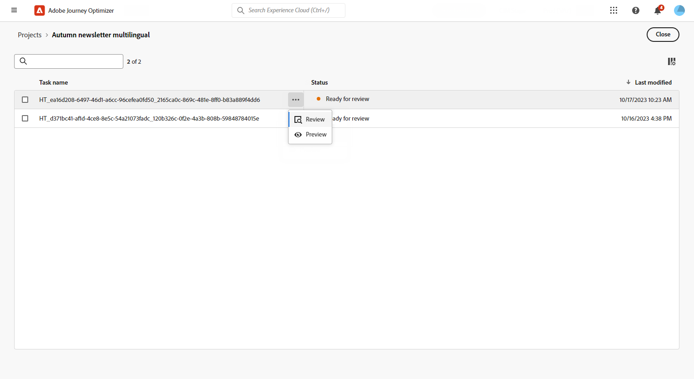
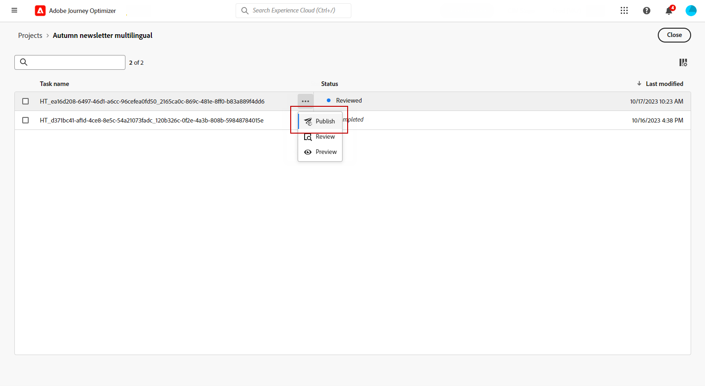

# 使用自动翻译创建多语言内容 {#multilingual-automated}

>[!CONTEXTUALHELP]
>id="ajo_multi_add_provider"
>title="添加提供商"
>abstract="根据需要添加翻译提供商和语言环境。这有助于您管理哪些提供商和语言环境对您的项目有效，以便您可以根据当前需求和项目范围灵活地调整资源和目标受众。"

>[!CONTEXTUALHELP]
>id="ajo_multi_edit_provider"
>title="编辑提供商"
>abstract="修改现有的翻译提供商并根据需要添加语言环境。您使用此功能可以控制哪些提供商和语言环境对您的项目有效，使您能够根据当前需求和项目目标灵活地调整资源并瞄准特定受众。"

>[!IMPORTANT]
>
>对于自动流，用户需要与&#x200B;**[!UICONTROL 翻译服务]**&#x200B;功能相关的权限。 [了解有关权限的更多信息](../administration/permissions.md)

使用自动流程，您只需选择目标语言和语言提供商即可。 然后，您的内容将直接发送到翻译，准备完成后进行最终审阅。

请按照以下步骤使用自动翻译创建多语言内容：

1. [添加您的提供商](multilingual-provider.md)

1. [添加区域设置（可选）](multilingual-locale.md)

1. [创建语言项目](#create-translation-project)

1. [创建语言设置](#create-language-settings)

1. [创建多语言内容](#create-a-multilingual-campaign)

1. [查看您的翻译任务（可选）](#review-translation-project)

## 创建翻译项目 {#translation-project}

>[!CONTEXTUALHELP]
>id="ajo_multi_create_project"
>title="创建项目"
>abstract="要开始创建多语言内容，请通过确定目标语言环境、为您的受众选择合适的语言或方言来启动您的翻译项目。之后，选择符合您项目需求的翻译提供商。"

>[!CONTEXTUALHELP]
>id="ajo_multi_edit_project"
>title="编辑项目"
>abstract="更新您的翻译项目，以纳入更多语言环境，从而让您能够扩展内容并覆盖更广泛的受众。"

通过指定Target区域设置来启动翻译项目，并指示内容的特定语言或区域。 然后，您可以选择您的翻译提供商。

1. 从&#x200B;**[!UICONTROL 内容管理]**&#x200B;下的&#x200B;**[!UICONTROL 翻译]**&#x200B;菜单中，在&#x200B;**[!UICONTROL 项目]**&#x200B;选项卡中单击&#x200B;**[!UICONTROL 创建项目]**。

   

1. 键入&#x200B;**[!UICONTROL 名称]**&#x200B;和&#x200B;**[!UICONTROL 描述]**。

1. 选择&#x200B;**[!UICONTROL Source区域设置]**。

   

1. 选择是否要启用以下选项：

   * **[!UICONTROL 自动发布批准的翻译]**：一旦批准翻译，这些翻译将自动集成到营销活动中，无需手动干预。
   * **[!UICONTROL 启用审阅工作流]**：仅适用于人工翻译的区域设置。 这允许内部审阅者有效地评估并批准或拒绝翻译的内容。 [了解详情](#review-translation-project)

1. 单击&#x200B;**[!UICONTROL 添加区域设置]**&#x200B;以访问菜单并定义翻译项目的语言。

   如果缺少&#x200B;**[!UICONTROL 区域设置]**，您可以预先从&#x200B;**[!UICONTROL 翻译]**&#x200B;菜单或通过API手动创建它。 请参阅[创建新区域设置](#create-locale)。

   

1. 从列表中选择您的&#x200B;**[!UICONTROL Target区域设置]**，然后选择要用于每个区域设置的&#x200B;**[!UICONTROL 翻译提供程序]**。

   可以从&#x200B;**[!UICONTROL 管理]**&#x200B;菜单部分的&#x200B;**[!UICONTROL 翻译]**&#x200B;菜单访问&#x200B;**[!UICONTROL 翻译提供程序]**&#x200B;设置。

   >[!NOTE]
   >
   >与翻译提供商的合同管理不在此功能范围内。 请确保您与指定的翻译合作伙伴签订了有效且有效的合同。
   >
   ></br>翻译提供商拥有已翻译内容质量的所有权。

1. 将Target区域设置与正确的翻译提供商链接完成后，单击&#x200B;**[!UICONTROL 添加区域设置]**。 然后，单击&#x200B;**[!UICONTROL 保存]**。

   请注意，如果某个提供程序在目标区域设置中显示为灰色，则表示该提供程序不支持该特定区域设置。

   

1. 配置翻译项目后，单击&#x200B;**[!UICONTROL 保存]**。

您的翻译项目现已创建并可用于多语言营销活动。

## 创建语言设置 {#language-settings}

>[!CONTEXTUALHELP]
>id="ajo_multi_custom_conditional"
>title="自定义条件设置"
>abstract="自定义条件设置是规则集，用于根据特定条件确定显示内容的区域设置。 利用这些设置，可根据用户位置、语言首选项或其他上下文元素等因素控制内容显示。"

>[!CONTEXTUALHELP]
>id="ajo_multi_fallback"
>title="后备首选项"
>abstract="选择后备偏好设置对于改善用户体验至关重要。 如果未选择回退，并且配置文件无法满足必要的要求，则不会交付内容。 通过选择适当的回退，即使用户档案与初始条件不匹配，也可以确保内容投放的一致性。"

在此部分中，您可以设置不同的区域设置来管理多语言内容。 您还可以选择要用于查找与配置文件语言相关的信息的属性。

1. 从&#x200B;**[!UICONTROL 管理]**&#x200B;菜单中，访问&#x200B;**[!UICONTROL 渠道]** > **[!UICONTROL 常规设置]**。

1. 在&#x200B;**[!UICONTROL 语言设置]**&#x200B;菜单中，单击&#x200B;**[!UICONTROL 创建语言设置]**。

   

1. 键入&#x200B;**[!UICONTROL 语言设置]**&#x200B;的名称，然后选择&#x200B;**[!UICONTROL 翻译项目]**。

1. 从&#x200B;**[!UICONTROL 翻译项目]**&#x200B;字段中，单击&#x200B;**[!UICONTROL 编辑]**&#x200B;并选择您之前创建的&#x200B;**[!UICONTROL 翻译项目]**。

   您之前配置的&#x200B;**[!UICONTROL 区域设置]**&#x200B;将自动导入。

1. 选择一个&#x200B;**[!UICONTROL 回退首选项]**&#x200B;以定义备份选项，用于当用户档案不符合内容交付的必要条件时。

   请注意，如果未选择回退选项，则不会发送营销活动或历程。

   

1. 从以下选项中选择发送首选项：

   * **[!UICONTROL 选择配置文件语言首选项属性]**
   * **[!UICONTROL 创建自定义条件规则]**

1. 如果选择&#x200B;**[!UICONTROL 选择配置文件语言首选项属性]**，请从&#x200B;**[!UICONTROL 配置文件语言首选项属性]**&#x200B;菜单中选择相关属性以查找配置文件语言信息。

   

1. 如果选择&#x200B;**[!UICONTROL 创建自定义条件规则]**，请选择要为其创建条件的区域设置。 然后，根据用户位置、语言偏好设置或其他上下文元素等因素构建规则。

   

1. 通过添加属性、事件或受众以定义目标组来开始创建条件。

   >[!IMPORTANT]
   >
   >上下文数据仅可用于Web、应用程序内、基于代码的体验和内容卡渠道。 如果用于电子邮件、短信、推送通知或直邮渠道，并且没有其他属性，则将使用列表中第一个选项的语言发送营销活动或历程。

   

   +++在条件中使用上下文事件的先决条件

   当用户显示您的内容时，个性化请求将随体验事件一起发送。 要在您的条件下利用上下文数据，您必须将其他数据附加到个性化请求有效负载。 要实现此目的，您需要在Adobe Experience Platform数据收集中创建一个规则以指定：如果发送了个性化请求，则向请求附加额外数据，定义属性以与架构中的语言字段匹配。

   >[!NOTE]
   >
   >仅应用程序内和内容卡渠道需要这些先决条件。

   1. 在Adobe Experience Platform数据收集中，访问&#x200B;**[!UICONTROL 规则]**&#x200B;菜单并创建新规则。 有关如何创建规则的详细信息，请参阅[!DNL Adobe Experience Platform] [数据收集文档](https://experienceleague.adobe.com/en/docs/experience-platform/collection/e2e#create-a-rule){target="_blank"}

   2. 在规则的&#x200B;**[!UICONTROL IF]**&#x200B;部分中，添加如下配置的事件：

      

      * 选择您正在使用的&#x200B;**[!UICONTROL 扩展]**。
      * 在&#x200B;**[!UICONTROL 事件类型]**&#x200B;字段中，选择“AEP请求事件”。
      * 在右侧窗格中，选择“XDM事件类型等于personalization.request”
      * 单击&#x200B;**[!UICONTROL Keep changes]**&#x200B;按钮确认。

   3. 在规则的&#x200B;**[!UICONTROL THEN]**&#x200B;部分中，添加如下配置的操作：

      

      * 选择您正在使用的&#x200B;**[!UICONTROL 扩展]**。
      * 在&#x200B;**[!UICONTROL 操作类型]**&#x200B;字段中，选择“附加数据”。
      * 在JSON有效负载部分中，确保用于检索要使用的语言的属性（在以下示例中为“language”）与数据收集数据流流入的架构中指定的属性的名称匹配。

        ```JSON
        {
            "xdm":{
                "application":{
                    "_dc":{
                        "language":"{%%Language%%}"
                    }
                }
            }
        }
        ```

      * 单击&#x200B;**[!UICONTROL Keep changes]**&#x200B;按钮确认并保存您的规则。

+++

1. 拖放区域设置以对其进行重新排序并在列表中管理其优先级。

1. 单击&#x200B;**[!UICONTROL 提交]**&#x200B;以创建您的&#x200B;**[!UICONTROL 语言设置]**。

请注意，设置语言首选项后，您将无法再选择编辑它们。

<!--
1. Access the **[!UICONTROL channel configurations]** menu and create a new channel configuration or select an existing one.

1. In the **[!UICONTROL Header parameters]** section, select the **[!UICONTROL Enable multilingual]** option.


1. Select your **[!UICONTROL Locales dictionary]** and add as many as needed.
-->

## 创建多语言内容 {#create-multilingual-campaign}

>[!AVAILABILITY]
>
> 基于代码的体验和内容卡内容的预览当前不适用于自动流程。

在设置翻译项目和语言设置后，您便可以创建活动或历程，并针对不同的区域设置自定义内容。

1. 首先根据您的要求创建和配置电子邮件、短信或推送通知[营销活动](../campaigns/create-campaign.md)或[历程](../building-journeys/journeys-message.md)。

1. 创建主要内容后，单击&#x200B;**[!UICONTROL 保存]**&#x200B;并返回营销活动配置屏幕。

1. 单击&#x200B;**[!UICONTROL 添加语言]**。  [了解详情](#create-language-settings)

   

1. 选择您之前创建的&#x200B;**[!UICONTROL 语言设置]**。

   

1. 现在，您的区域设置已导入，请单击&#x200B;**[!UICONTROL 发送以进行翻译]**，将您的内容转发给之前选择的翻译提供商。

   

1. 在发送内容以进行翻译后，该内容不再可编辑。 要对原始内容进行更改，请单击锁定图标。

   请注意，如果您希望对此内容进行任何更改，则需要创建新翻译项目并重新发送以进行翻译。

   

1. 单击&#x200B;**[!UICONTROL 打开翻译]**&#x200B;以访问您的翻译项目并查看它。

   

1. 在此页面中，遵循翻译项目的状态：

   * **[!UICONTROL 正在进行翻译]**：您的服务提供商正在处理翻译。

     如果在配置&#x200B;**语言设置**&#x200B;时选择了&#x200B;**内包**，则可以在翻译项目中直接翻译内容。 [了解详情](#manage-ht-project)

   * **[!UICONTROL 准备好审查]**：审查过程已准备就绪，允许您访问翻译并拒绝或批准翻译。

     如果您在您的&#x200B;**[!UICONTROL 翻译项目]**&#x200B;中选择了&#x200B;**[!UICONTROL 启用审阅工作流]**，则在所选翻译提供商完成之后，您可以在Journey Optimizer中直接审阅该翻译。 [了解详情](#review-translation-project)

   * **[!UICONTROL 已审核]**：翻译已获得批准，准备发布并发送到营销活动。

   * **[!UICONTROL 准备发布]**：机器翻译已完成，现在可以发送到您的营销活动。

   * **[!UICONTROL 已完成]**：您的营销活动中现在提供了翻译。

   

1. 完成翻译后，即可发送多语言内容。

   

1. 单击&#x200B;**[!UICONTROL 查看以激活]**&#x200B;以显示营销活动摘要。

   利用该摘要，可根据需要修改营销策划，并检查参数是否不正确或缺失。

1. 浏览多语言内容以查看每种语言的渲染方式。

   

1. 检查营销活动是否正确配置，然后单击&#x200B;**[!UICONTROL 激活]**。

   >[!IMPORTANT]
   >
   > 如果您的营销活动受批准政策的约束，则需要请求批准才能发送多语言营销活动。 [了解详情](../test-approve/gs-approval.md)

您现在可以激活营销活动或历程。 发送后，您可以在报表中衡量多语言历程或活动的影响。

## 管理内部承包翻译项目 {#manage-ht-project}

>[!CONTEXTUALHELP]
>id="ajo_multi_insourcing_project"
>title="内部承包翻译项目"
>abstract="内部承包翻译项目允许您直接在翻译项目中管理和执行翻译，从而简化流程并更好地控制翻译质量和一致性。"

如果在配置语言设置时选择了内包，则可以在翻译项目中直接翻译内容。

1. 从您的&#x200B;**[!UICONTROL 翻译项目]**，访问&#x200B;**[!UICONTROL 更多操作]**&#x200B;菜单并选择&#x200B;**[!UICONTROL 内源]**。

   

1. 您可以使用外部翻译软件导出CSV文件以进行翻译。 或者，您可以通过单击&#x200B;**[!UICONTROL 导入CSV]**&#x200B;按钮，将CSV文件导入回翻译项目。

   

1. 单击&#x200B;**[!UICONTROL 编辑]**&#x200B;以添加您的翻译内容。

   

1. 如果准备发布已翻译文本，请单击&#x200B;**[!UICONTROL 完成]**。

## 审查您的翻译项目 {#review-translation-project}

>[!CONTEXTUALHELP]
>id="ajo_multi_review_project"
>title="审查您的翻译项目"
>abstract="在您选择的翻译提供商完成翻译后，您就可以直接在 Journey Optimizer 中查看结果。这有助于您评估翻译的准确性和质量，确保在最终定稿之前，它符合您的期望和项目要求。"

>[!CONTEXTUALHELP]
>id="ajo_multi_preview_project"
>title="预览您的翻译项目"
>abstract="通过预览窗口可以查看翻译内容在每种语言中的显示方式。此功能可帮助您检查渲染效果，并确保相关内容在所有选定的语言中正确有效地显示。"

如果您在您的&#x200B;**[!UICONTROL 翻译项目]**&#x200B;中选择了&#x200B;**[!UICONTROL 启用审阅工作流]**，则在所选翻译提供商完成之后，您可以在Journey Optimizer中直接审阅该翻译。

请注意，如果禁用此选项，则当提供商完成翻译后，翻译任务状态将自动设置为&#x200B;**[!UICONTROL 已审核]**，允许您单击&#x200B;**[!UICONTROL Publish]**&#x200B;快速继续。

1. 在服务提供商的翻译完成后，您可以从&#x200B;**[!UICONTROL 翻译项目]**&#x200B;或直接从&#x200B;**[!UICONTROL 营销活动]**&#x200B;访问翻译以供审阅。

   从&#x200B;**[!UICONTROL 更多操作]**&#x200B;菜单中，单击&#x200B;**[!UICONTROL 审阅]**。

   

1. 在“审阅”窗口中，浏览已翻译内容并接受或拒绝每个翻译字符串。

   

1. 单击&#x200B;**[!UICONTROL 编辑]**&#x200B;以更改翻译字符串的内容。

   

1. 输入已更新的翻译，完成后，单击&#x200B;**[!UICONTROL 确认]**。

   

1. 您还可以选择直接&#x200B;**[!UICONTROL 拒绝所有]**&#x200B;或批准所有&#x200B;]**。**[!UICONTROL 

   选择&#x200B;**[!UICONTROL 全部拒绝]**&#x200B;时，添加评论并单击&#x200B;**[!UICONTROL 拒绝]**。

1. 单击&#x200B;**[!UICONTROL 预览]**&#x200B;以检查每种语言的翻译内容的呈现方式。

1. 如果准备发布已翻译文本，请单击&#x200B;**[!UICONTROL 完成]**。

   

1. 从您的&#x200B;**[!UICONTROL 翻译项目]**&#x200B;中，选择一个项目以访问更多详细信息。 如果您拒绝翻译，则可以选择将其发送回翻译。

   

1. 将&#x200B;**[!UICONTROL 翻译项目]**&#x200B;状态设置为“已审核”后，即可将其发送到营销活动。

   从&#x200B;**[!UICONTROL 更多操作]**&#x200B;菜单中，单击&#x200B;**[!UICONTROL Publish]**。

   

1. 在您的营销活动中，检查您的翻译状态是否已更改为&#x200B;**[!UICONTROL 翻译完成]**。 您现在可以发送多语言内容，请参阅[此部分](#create-multilingual-campaign)中的步骤10。

   

<!--
# Create a multilingual journey {#create-multilingual-journey}

1. Create your journey with a Delivery and personalize your content as needed.
1. From your delivery action, click Edit content.
1. Click Add languages.


-->
