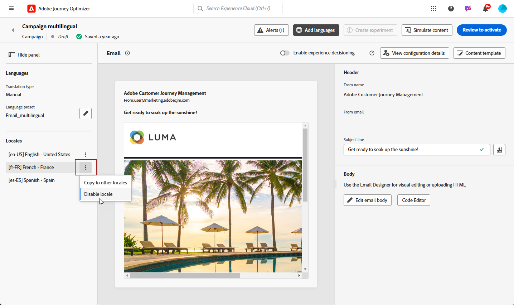

# 使用手动翻译创建多语言内容 {#multilingual-manual}

>[!IMPORTANT]
>
>对于手动流程，需要向用户授予&#x200B;**[!UICONTROL 管理语言设置]**&#x200B;权限。

使用手动流程，您可以轻松地直接在营销活动和历程中翻译内容，并为多语言消息提供精确的控制和自定义选项。 此外，您还可以使用“导入HTML”选项轻松导入预先存在的多语言内容。

请按照以下步骤使用手动翻译创建多语言内容：

1. [添加您的提供商（可选）](multilingual-provider.md)

1. [添加区域设置（可选）](multilingual-locale.md)

1. [创建语言设置](#create-language-settings)

1. [创建多语言内容](#create-a-multilingual-campaign)

## 创建语言设置 {#language-settings}

在此部分中，您可以设置不同的区域设置来管理多语言内容。 您还可以选择要用于查找与配置文件语言相关的信息的属性

1. 从&#x200B;**[!UICONTROL 管理]**&#x200B;菜单中，访问&#x200B;**[!UICONTROL 渠道]** > **[!UICONTROL 常规设置]**。

1. 在&#x200B;**[!UICONTROL 语言设置]**&#x200B;菜单中，单击&#x200B;**[!UICONTROL 创建语言设置]**。

   

1. 键入&#x200B;**[!UICONTROL 语言设置]**&#x200B;的名称，然后选择&#x200B;**[!UICONTROL 手动翻译]**。

1. 选择与此设置关联的&#x200B;**[!UICONTROL 区域设置]**。 您最多可以添加50个区域设置。

   如果缺少&#x200B;**[!UICONTROL 区域设置]**，您可以预先从&#x200B;**[!UICONTROL 翻译]**&#x200B;菜单或通过API手动创建它。 请参阅[创建新区域设置](#create-locale)。

   

1. 选择一个&#x200B;**[!UICONTROL 回退首选项]**&#x200B;以定义备份选项，用于当用户档案不符合内容交付的必要条件时。

   请注意，如果未选择回退选项，则不会发送营销活动或历程。

1. 从以下选项中选择发送首选项：

   * **[!UICONTROL 选择配置文件语言首选项属性]**
   * **[!UICONTROL 创建自定义条件规则]**

1. 如果选择&#x200B;**[!UICONTROL 选择配置文件语言首选项属性]**，请从&#x200B;**[!UICONTROL 配置文件语言首选项属性]**&#x200B;菜单中选择相关属性以查找配置文件语言信息。

   

1. 如果选择&#x200B;**[!UICONTROL 创建自定义条件规则]**，请选择要为其创建条件的区域设置。 然后，根据用户位置、语言偏好设置或其他上下文元素等因素构建规则。

   

1. 通过添加属性、事件或受众以定义目标组来开始创建条件。

   >[!IMPORTANT]
   >
   >上下文数据仅可用于Web、应用程序内、基于代码的体验和内容卡渠道。 如果用于电子邮件、短信、推送通知或直邮渠道，并且没有其他属性，则将使用列表中第一个选项的语言发送营销活动或历程。

   

   +++在条件中使用上下文事件的先决条件

   当用户显示您的内容时，个性化请求将随体验事件一起发送。 要在您的条件下利用上下文数据，您必须将其他数据附加到个性化请求有效负载。 要实现此目的，您需要在Adobe Experience Platform数据收集中创建一个规则以指定：如果发送了个性化请求，则向请求附加额外数据，定义属性以与架构中的语言字段匹配。

   >[!NOTE]
   >
   >仅应用程序内和内容卡渠道需要这些先决条件。

   1. 在Adobe Experience Platform数据收集中，访问&#x200B;**[!UICONTROL 规则]**&#x200B;菜单并创建新规则。 有关如何创建规则的详细信息，请参阅[!DNL Adobe Experience Platform] [数据收集文档](https://experienceleague.adobe.com/en/docs/experience-platform/collection/e2e#create-a-rule){target="_blank"}

   2. 在规则的&#x200B;**[!UICONTROL IF]**&#x200B;部分中，添加如下配置的事件：

      

      * 选择您正在使用的&#x200B;**[!UICONTROL 扩展]**。
      * 在&#x200B;**[!UICONTROL 事件类型]**&#x200B;字段中，选择“AEP请求事件”。
      * 在右侧窗格中，选择“XDM事件类型等于personalization.request”
      * 单击&#x200B;**[!UICONTROL Keep changes]**&#x200B;按钮确认。

   3. 在规则的&#x200B;**[!UICONTROL THEN]**&#x200B;部分中，添加如下配置的操作：

      

      * 选择您正在使用的&#x200B;**[!UICONTROL 扩展]**。
      * 在&#x200B;**[!UICONTROL 操作类型]**&#x200B;字段中，选择“附加数据”。
      * 在JSON有效负载部分中，确保用于检索要使用的语言的属性（在以下示例中为“language”）与数据收集数据流流入的架构中指定的属性的名称匹配。

        ```JSON
        {
            "xdm":{
                "application":{
                    "_dc":{
                        "language":"{%%Language%%}"
                    }
                }
            }
        }
        ```

      * 单击&#x200B;**[!UICONTROL Keep changes]**&#x200B;按钮确认并保存您的规则。

+++

1. 拖放区域设置以对其进行重新排序并在列表中管理其优先级。

1. 要删除区域设置，请单击bin图标。

   

1. 单击&#x200B;**[!UICONTROL 提交]**&#x200B;以创建您的&#x200B;**[!UICONTROL 语言设置]**。

请注意，设置语言首选项后，您将无法再选择编辑它们。

<!--
1. Access the **[!UICONTROL channel configurations]** menu and create a new channel configuration or select an existing one.


1. In the **[!UICONTROL Header parameters]** section, select the **[!UICONTROL Enable multilingual]** option.

1. Select your **[!UICONTROL Locales dictionary]** and add as many as needed.
-->

## 创建多语言内容 {#create-multilingual-campaign}

在设置多语言内容后，您可以制作活动或历程并自定义每个选定区域设置的内容。

1. 首先根据您的要求创建和配置电子邮件、短信或推送通知[营销活动](../campaigns/create-campaign.md)或[历程](../building-journeys/journeys-message.md)。

   >[!IMPORTANT]
   >
   >我们建议每个历程仅包含一个翻译项目。

1. 创建或导入原始内容，并根据需要对其进行个性化。

1. 创建内容后，单击&#x200B;**[!UICONTROL 保存]**&#x200B;并返回营销活动配置屏幕。

   

1. 单击&#x200B;**[!UICONTROL 添加语言]**&#x200B;并选择您之前创建的&#x200B;**[!UICONTROL 语言设置]**。 [了解详情](#create-language-settings)

   

1. 从下拉菜单中选择所需的区域设置，以应用于现有的创作内容。

1. 访问&#x200B;**[!UICONTROL 区域设置]**&#x200B;菜单的高级设置并选择&#x200B;**[!UICONTROL 复制到所有区域设置]**。

   

1. 现在，您的内容在选定&#x200B;**[!UICONTROL 区域设置]**&#x200B;中重复，请访问每个区域设置并单击&#x200B;**[!UICONTROL 编辑电子邮件正文]**&#x200B;以翻译您的内容。

   

1. 您可以通过所选区域设置的&#x200B;**[!UICONTROL 更多操作]**&#x200B;菜单选择禁用或启用区域设置。

   

1. 要停用您的多语言配置，请单击&#x200B;**[!UICONTROL 添加语言]**，然后选择要保留为本地语言的语言。

   

1. 单击&#x200B;**[!UICONTROL 查看以激活]**&#x200B;以显示营销活动摘要。

   利用该摘要，可根据需要修改营销策划，并检查参数是否不正确或缺失。

1. 浏览多语言内容以查看每种语言的渲染方式。

   

您现在可以激活营销活动或历程。 发送后，您可以在报表中衡量多语言历程或活动的影响。

>[!IMPORTANT]
>
> 如果您的营销活动受批准政策的约束，则需要请求批准才能发送多语言营销活动或历程。 [了解详情](../test-approve/gs-approval.md)

<!--
# Create a multilingual journey {#create-multilingual-journey}

1. Create your journey with a Delivery and personalize your content as needed.
1. From your delivery action, click Edit content.
1. Click Add languages.

-->
