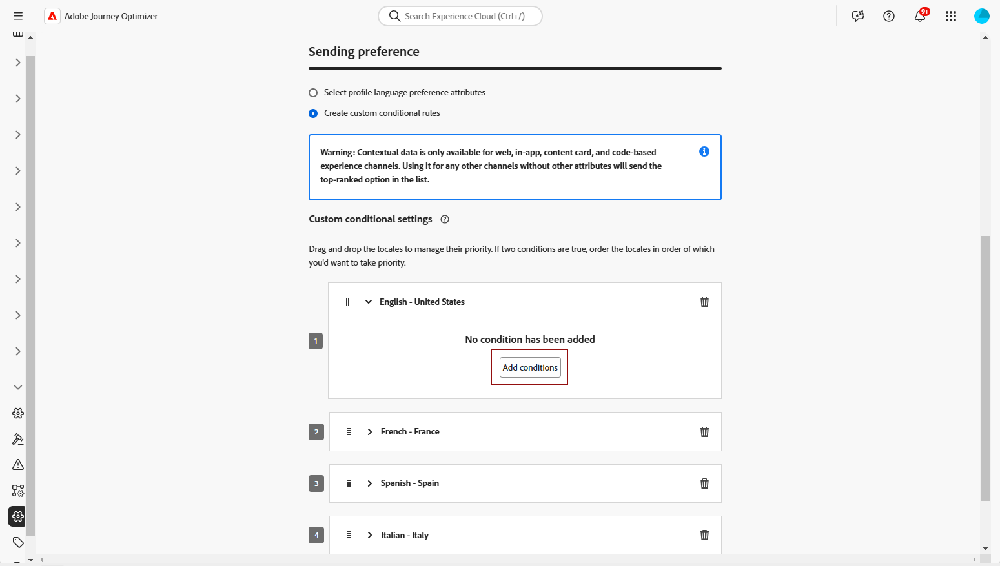

# 使用手动翻译创建多语言内容 {#multilingual-manual}

>[!BEGINSHADEBOX]

**目录**

* [多语言内容入门](multilingual-gs.md)
* **[使用手动翻译创建多语言内容](multilingual-manual.md)**
* [通过自动翻译创建多语言内容](multilingual-automated.md)
* [多语言营销活动报告](multilingual-report.md)

>[!ENDSHADEBOX]

使用手动流程，您可以轻松地直接在电子邮件、推送通知或短信营销活动中翻译内容，从而为多语言消息提供精确的控制和自定义选项。 此外，您还可以使用“导入HTML”选项轻松导入预先存在的多语言内容。

请按照以下步骤使用手动翻译创建多语言内容：

1. [创建您的区域设置](#create-locale).

1. [创建语言设置](#create-language-settings).

1. [创建多语言营销活动](#create-a-multilingual-campaign).

## 创建区域设置 {#create-locale}

配置语言设置时，如 [创建语言设置](#language-settings) 部分，如果特定区域设置对于多语言内容不可用，您可以使用灵活地创建所需数量的新区域设置， **[!UICONTROL 翻译]** 菜单。

1. 从 **[!UICONTROL 管理]** 菜单，访问 **[!UICONTROL 渠道]**.

   利用翻译菜单，可访问激活的区域设置列表。

1. 从 **[!UICONTROL 区域设置词典]** 选项卡，单击 **[!UICONTROL 添加区域设置]**.

   

1. 从中选择您的区域设置代码 **[!UICONTROL 语言]** 列表和相关联的 **[!UICONTROL 区域]**.

1. 单击 **[!UICONTROL 保存]** 以创建您的区域设置。

   

## 创建语言设置 {#language-settings}

在此部分中，您可以设置管理多语言内容的主要语言及其关联的区域设置。 您还可以选择要用于查找与配置文件语言相关的信息的属性

1. 从 **[!UICONTROL 管理]** 菜单，访问 **[!UICONTROL 渠道]**.

1. 在 **[!UICONTROL 语言设置]** 菜单，单击 **[!UICONTROL 创建语言设置]**.

   

1. 键入您的名称 **[!UICONTROL 语言设置]**.

1. 选择 **[!UICONTROL 区域设置]** 关联到此设置。 您最多可以添加50个区域设置。

   如果 **[!UICONTROL 区域设置]** 缺失，您可以提前从 **[!UICONTROL 翻译]** 菜单或按API。 请参阅 [创建新区域设置](#create-locale).

   

1. 从 **[!UICONTROL 发送首选项]** 菜单，选择要查找的属性以查找有关配置文件语言的信息。

   

1. 单击 **[!UICONTROL 编辑]** 在您的 **[!UICONTROL 区域设置]** 以进一步对其进行个性化设置并添加 **[!UICONTROL 配置文件首选项]**.

   

1. 选择其他 **[!UICONTROL 区域设置]** 从“配置文件首选项”下拉列表中，单击 **[!UICONTROL 添加用户档案]**.

1. 访问高级菜单 **[!UICONTROL 区域设置]** 以定义 **[!UICONTROL 主要区域设置]**，即如果未指定配置文件属性时的默认语言。

   您还可以从此高级菜单删除区域设置。

   

1. 单击 **[!UICONTROL 提交]** 创建您的 **[!UICONTROL 语言设置]**.

<!--
1. Access the **[!UICONTROL Channel surfaces]** menu and create a new channel surface or select an existing one.

1. In the **[!UICONTROL Header parameters]** section, select the **[!UICONTROL Enable multilingual]** option.

1. Select your **[!UICONTROL Locales dictionary]** and add as many as needed.
-->

## 创建多语言营销活动 {#create-multilingual-campaign}

在设置多语言内容后，您可以制作活动并针对每个所选区域设置自定义内容。

1. 首先根据您的要求创建和配置电子邮件、短信或推送通知营销活动。 [了解详情](../campaigns/create-campaign.md)

1. 导航至 **[!UICONTROL 操作]** 菜单，然后选择 **[!UICONTROL 编辑内容]**.

   

1. 创建或导入原始内容，并根据需要对其进行个性化。

1. 创建主要内容后，单击 **[!UICONTROL 保存]** 并返回到campaign配置屏幕。

   

1. 单击 **[!UICONTROL 添加语言]** 并选择您之前创建的 **[!UICONTROL 语言设置]**. [了解详情](#create-language-settings)

   

1. 访问 **[!UICONTROL 区域设置]** 菜单并选择 **[!UICONTROL 将主要区域复制到所有区域设置]**.

   

1. 现在，您的主要内容已在所选内容中重复  **[!UICONTROL 区域设置]**，访问每个区域设置，然后单击 **[!UICONTROL 编辑电子邮件正文]** 以翻译您的内容。

   

1. 您可以选择禁用或启用区域设置，使用 **[!UICONTROL 更多操作]** 选定区域设置的菜单。

   

1. 要停用多语言配置，请单击 **[!UICONTROL 添加语言]** 并选择要保留为本地语言的语言。

   

1. 单击 **[!UICONTROL 审查以激活]** 以显示营销活动的摘要。

   利用该摘要，可根据需要修改营销策划，并检查参数是否不正确或缺失。

1. 浏览多语言内容以查看每种语言的渲染方式。

   

1. 检查营销活动是否正确配置，然后单击 **[!UICONTROL 激活]**.

您的营销活动现已激活。 在营销活动中配置的消息将立即发送，或在指定日期发送。 请注意，活动一旦上线，就无法修改。 要重用内容，您可以复制Campaign。

发送后，您可以在促销活动报表中衡量促销活动的影响。

<!--
# Create a multilingual journey {#create-multilingual-journey}

1. Create your journey with a Delivery and personalize your content as needed.
1. From your delivery action, click Edit content.
1. Click Add languages.

-->
