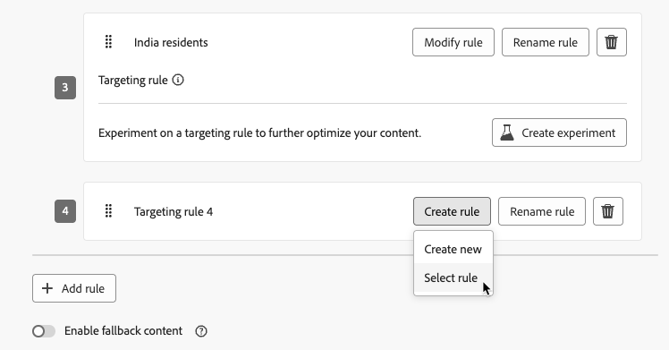

# 使用定位 {#targeting}

>[!CONTEXTUALHELP]
>id="ajo_content_targeting_fallback"
>title="什么是后备内容？"
>abstract="在不符合任何目标选择规则的情况下，后备内容允许您的受众收到默认内容。 如果您不选择此选项，任何不符合上文定义的目标选择规则的受众都不会收到任何内容。"

定位根据用户配置文件属性或上下文属性为特定受众区段提供个性化内容。

与试验（随机分配消息内容）不同，定位是确定性的，可以将内容交付给合适的受众。

通过定位，可以根据以下内容定义特定规则：

* **用户配置文件属性**，如位置(如 地理定位)、年龄或偏好设置。 例如，美国用户看到“金门”促销活动，而法国用户看到“埃菲尔铁塔”促销活动。

* **上下文数据**，如设备类型(如 device-targeting)、时间或会话详细信息。 例如，桌面用户接收桌面优化内容，而移动设备用户接收移动设备优化内容。

* **受众**，可用于包含或排除具有特定受众成员资格的用户档案。

要设置定位，请执行以下步骤。

1. 创建[历程](../building-journeys/journey-gs.md#jo-build)或[营销活动](../campaigns/create-campaign.md)。

   >[!NOTE]
   >
   >如果您在历程中，请添加&#x200B;**[!UICONTROL 操作]**&#x200B;活动，选择一个渠道活动，然后选择&#x200B;**[!UICONTROL 配置操作]**。 [了解详情](../building-journeys/journey-action.md#add-action)

1. 从&#x200B;**[!UICONTROL 操作]**&#x200B;选项卡中，至少选择一个操作。

1. 在&#x200B;**[!UICONTROL 优化]**&#x200B;部分中，选择&#x200B;**[!UICONTROL 创建定位规则]**。

   {width=85%}

1. 单击&#x200B;**[!UICONTROL 创建规则]** > **[!UICONTROL 新建]**，然后使用规则生成器定义您的标准。

   {width=100%}

   例如，为美国居民制定规则，为法国居民制定规则，为印度居民制定规则。

   {width=85%}

1. 您还可以单击&#x200B;**[!UICONTROL 创建规则]** > **[!UICONTROL 选择规则]**&#x200B;以选择从&#x200B;**[!UICONTROL 规则]**&#x200B;菜单创建的现有定位规则。 [了解详情](../experience-decisioning/rules.md)

   {width=70%}

   在这种情况下，组成规则的公式将简单地复制到历程或营销策划中。 从&#x200B;**[!UICONTROL 规则]**&#x200B;菜单对该规则进行的任何后续更改将不会影响历程或营销活动副本。

   >[!AVAILABILITY]
   >
   >[通过专用](../experience-decisioning/rules.md#create)菜单创建定位规则[!DNL Journey Optimizer]目前可供已购买Decisioning附加产品的组织使用，其他组织也可应要求使用这些规则（限量发布）。
   >
   >此容量将逐步推广到所有客户。 在此期间，请联系您的Adobe代表以获取访问权限。

1. 添加规则后，您仍可以对其进行修改。 选择&#x200B;**[!UICONTROL 编辑内联]**&#x200B;以使用规则生成器随时更新它，或选择&#x200B;**[!UICONTROL 选择规则]**&#x200B;以选取其他现有规则。

   {width=100%}

   >[!NOTE]
   >
   >编辑内联规则不会影响其源自的现有规则。

1. 根据需要选择&#x200B;**[!UICONTROL 启用后备内容]**&#x200B;选项。 后备内容允许受众在没有符合定位规则时接收默认内容。

   >[!NOTE]
   >
   >如果不选择此选项，则任何不符合上述定位规则条件的受众都将不会收到内容。

1. 保存定位规则设置。

1. 返回&#x200B;**[!UICONTROL 操作]**&#x200B;选项卡，选择&#x200B;**[!UICONTROL 编辑内容]**。

1. 为定向规则设置所定义的每个组设计适当的内容。

   {width=85%}

   在此示例中，为美国居民设计一个特定内容，为法国居民设计一个不同的内容，并为印度居民设计另一个内容。

1. [激活](review-activate-campaign.md)您的历程或营销活动。

一旦历程/营销活动开始，将发送为每个目标量身定制的内容，以便美国居民获取特定消息，法国居民获取不同消息，依此类推。

<!--Default content:

* If no targeting rules match, default content can be delivered.

* If default content is not enabled, passthrough behavior ensures lower-priority campaigns are evaluated.-->

