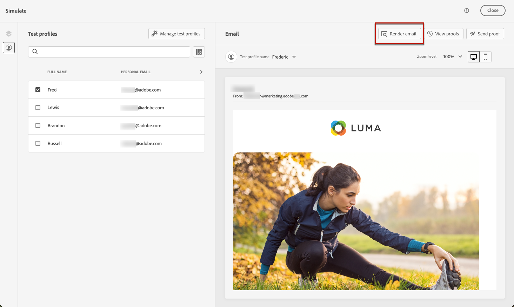
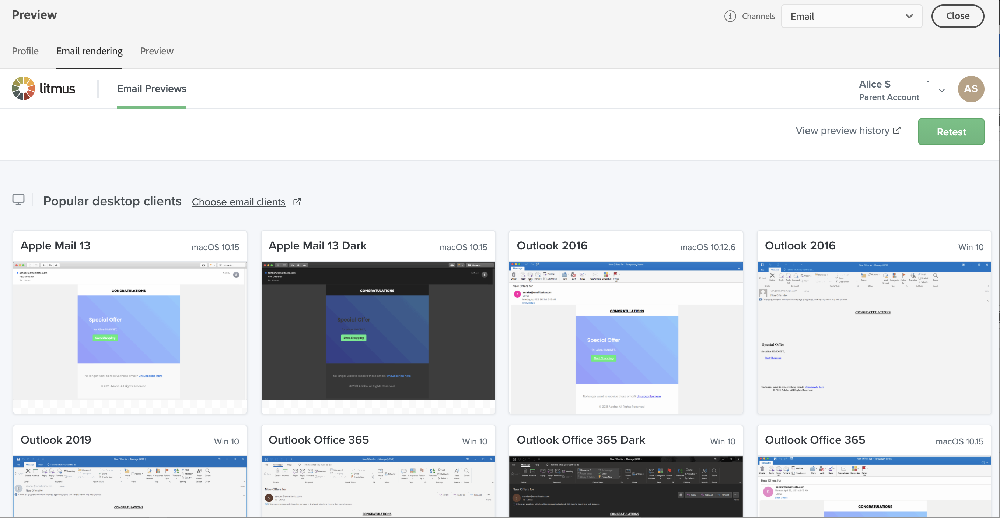

# 测试电子邮件呈现 {#email-rendering}

>[!BEGINSHADEBOX]

**在此页面上：**&#x200B;了解如何将您的Litmus帐户连接到Adobe Journey Optimizer以测试跨常用电子邮件客户端的电子邮件渲染，并了解已知的渲染限制，包括移动Web浏览器环境。

>[!ENDSHADEBOX]

您可以将&#x200B;**Litmus**&#x200B;帐户用于[!DNL Journey Optimizer]，以即时预览您的&#x200B;**电子邮件呈现**&#x200B;在常用电子邮件客户端中的呈现方式。 然后，您可以确保您的电子邮件内容在各种收件箱中都具有美观的显示效果且正常工作。

要检查电子邮件渲染，请执行以下步骤：

1. 在邮件的编辑内容屏幕或电子邮件Designer中，单击&#x200B;**[!UICONTROL 模拟内容]**，然后从下拉列表中选择&#x200B;**[!UICONTROL 模拟内容（AEP配置文件）]**。

1. 选择&#x200B;**[!UICONTROL 渲染电子邮件]**&#x200B;按钮。

   

1. 单击右上角的&#x200B;**连接您的Litmus帐户**。

   

1. 输入您的凭据并登录。

   

1. 单击&#x200B;**运行测试**&#x200B;按钮以生成电子邮件预览。

1. 在常用的桌面、移动和基于Web的客户端中查看您的电子邮件内容。

   

>[!CAUTION]
>
>将您的&#x200B;**Litmus**&#x200B;帐户与[!DNL Journey Optimizer]连接时，您同意将测试邮件发送到Litmus：发送后，Adobe将不再管理这些电子邮件。 因此，Litmus数据保留电子邮件策略适用于这些电子邮件，包括可能包含在这些测试消息中的个性化数据。

## 移动Web浏览器限制 {#rendering-limitations}

当收件人通过移动Web浏览器&#x200B;**（例如，手机上的Chrome）打开Gmail或Outlook**，而不是使用本机移动设备应用程序或桌面客户端时，电子邮件渲染可能会有所不同。 这是移动Web邮件环境的已知限制，并非特定于Journey Optimizer。

这种呈现差异源于Web邮件客户端在移动浏览器中的行为。 浏览器首先渲染完整的桌面Web邮件UI，将电子邮件置于两层深处 — 超出任何响应式CSS或媒体查询的覆盖范围。 Gmail Web还剥离了CSS `<style>`块，并将电子邮件内容包装在其自己的`
`中，这会覆盖您的样式并产生对齐冲突。

典型症状包括文本对齐偏移（左对齐文本居中显示居中）、内容部分之间的额外白色分隔行以及与模板设计不同的整体布局。

仅当通过移动浏览器访问时，Gmail Web和Outlook Web中才会出现这些问题。 Outlook和Gmail本机移动设备应用程序以及所有桌面客户端都不会受到影响。

>[!TIP]
>
>要最大限度地减少影响，请执行以下操作：
>
>* 使用基于表的简单布局和完全内联CSS。
>
>* 避免依赖媒体查询或`<style>`块获取关键布局属性，如文本对齐方式。
