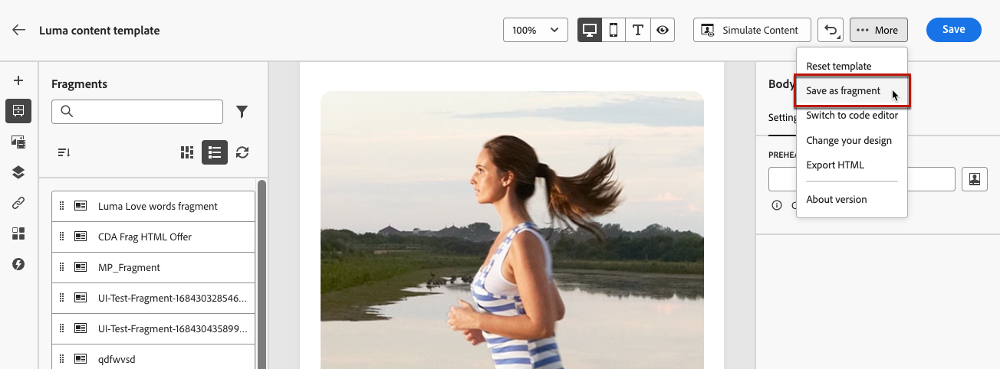

# 将内容另存为片段 {#save-as-fragment}

在[!DNL Journey Optimizer]中编辑内容时，您可以将全部或部分内容另存为片段以供将来重用。 您可以从电子邮件Designer[&#128279;](#save-as-visual-fragment)中将内容另存为片段[，或者从表达式编辑器](#save-as-expression-fragment)中将内容另存为片段。

>[!NOTE]
>
>片段中不支持[上下文属性](../personalization/personalization-build-expressions.md)。
>
>在历程或营销策划中启用跟踪时，如果保存的片段中存在链接，并且消息中使用此片段，则会跟踪这些链接，例如消息中包含的所有其他链接。 [了解有关链接和跟踪的更多信息](../email/message-tracking.md)

## 另存为可视化片段 {#save-as-visual-fragment}

要将电子邮件Designer中的内容另存为片段，请执行以下步骤：

1. 在[电子邮件Designer](../email/get-started-email-design.md)中，单击屏幕右上方的省略号。

1. 从下拉菜单中选择&#x200B;**[!UICONTROL 另存为片段]**。

   

   >[!NOTE]
   >
   >可视化片段不能超过 100KB。

1. 将显示&#x200B;**[!UICONTROL 另存为片段]**&#x200B;屏幕。 其中选择要包含在片段中的元素，包括个性化字段和动态内容。

   

   >[!CAUTION]
   >
   >您只能选择彼此相邻的部分。 您不能选择空的结构或其他片段。

1. 单击&#x200B;**[!UICONTROL 创建]**&#x200B;并填写片段名称和描述（如果需要）。

1. 要为片段分配自定义或核心数据使用标签，请单击屏幕上方的&#x200B;**[!UICONTROL 管理访问权限]**&#x200B;按钮。 [了解有关对象级访问控制(OLAC)的更多信息](../administration/object-based-access.md)。

1. 从&#x200B;**标记**&#x200B;字段中选择或创建Adobe Experience Platform标记以对您的模板进行分类，从而改进搜索。 [了解详情](../start/search-filter-categorize.md#tags)

1. 单击&#x200B;**[!UICONTROL 创建]**。 片段已添加到状态为&#x200B;**草稿**&#x200B;的[片段列表](#access-manage-fragments)中。 它会变成一个独立的片段，可用作该列表中的任何其他可视化片段。

   >[!NOTE]
   >
   >对该新片段所做的任何更改都不会传播到它来自的电子邮件或模板。 同样，在该电子邮件或模板中编辑原始内容时，不会修改新片段。

1. 为了能够在您的历程和营销活动中使用片段，您需要让它上线。 [了解如何预览和发布片段](../content-management/create-fragments.md#publish)

## 另存为表达式片段 {#save-as-expression-fragment}

>[!CONTEXTUALHELP]
>id="ajo_perso_library"
>title="另存为表达式片段"
>abstract="[!DNL Journey Optimizer]个性化编辑器可让您将内容另存为表达式片段。 之后，这些表达式可用于生成个性化内容。"

[!DNL Journey Optimizer]个性化编辑器可让您将内容另存为表达式片段。 之后，这些表达式可用于生成个性化内容。

要将内容另存为表达式片段，请执行以下步骤。

1. 在[个性化编辑器](../personalization/personalization-build-expressions.md)界面中生成表达式，然后单击&#x200B;**[!UICONTROL 另存为片段]**。

   >[!NOTE]
   >
   >表达式不能超过200KB。

1. 在右侧窗格中，输入表达式的名称和说明，以帮助用户更轻松地找到它。

   

1. 单击&#x200B;**[!UICONTROL 保存片段]**。

   <!--An expression fragment cannot be nested inside another fragment.-->

1. 片段已添加到状态为&#x200B;**草稿**&#x200B;的[片段列表](#access-manage-fragments)中。 它会变成一个独立的片段，可用作该列表中的任何其他表达式片段。

1. 为了能够在您的历程和营销活动中使用片段，您需要让它上线。 [了解如何预览和发布片段](../content-management/create-fragments.md#publish)
