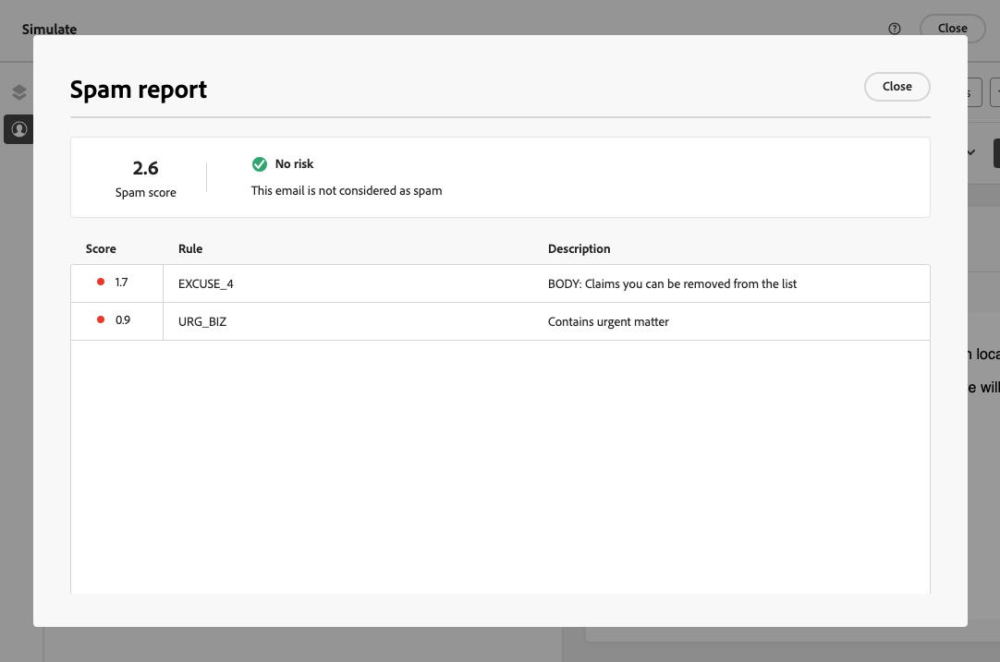
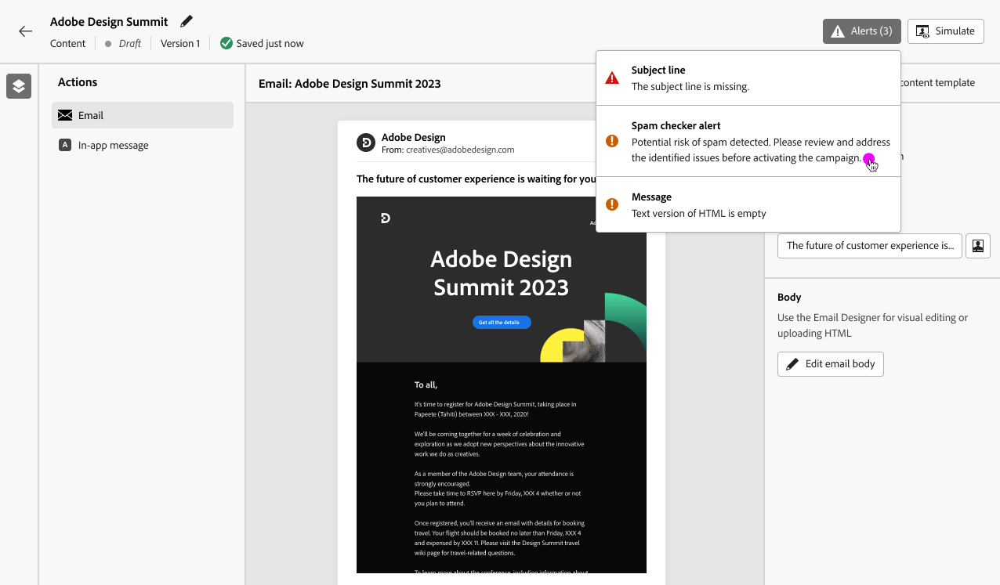

# 垃圾邮件报告 {#spam-report}

>[!BEGINSHADEBOX]

**在此页面上：**&#x200B;了解如何使用Adobe Journey Optimizer中的垃圾邮件报告检查您的电子邮件内容垃圾邮件评分，并在发送之前应用可改进投放性的建议。

>[!ENDSHADEBOX]

>[!CONTEXTUALHELP]
>id="ajo_simulate_spam_report"
>title="垃圾邮件报告"
>abstract="垃圾邮件报告可让您检查电子邮件内容垃圾邮件评分。 此得分表明 ISP 或邮箱提供商是否会将您的邮件视为垃圾邮件。 得分越低越好。 如果您的电子邮件内容得分高于 2，您应该考虑修复导致测试失败的问题。"

您可以在专用的垃圾邮件报告中检查您的电子邮件内容垃圾邮件评分。 使用[SpamAssassin](https://spamassassin.apache.org/){target="_blank"}，Adobe Journey Optimizer可以测试您的电子邮件内容并为其打分，以指示ISP或邮箱提供商是否将其视为垃圾邮件。

在编辑或预览电子邮件内容时，**[!UICONTROL 垃圾邮件报告]**&#x200B;按钮会提供评分和建议以提高列出的每个项目的分数。

此功能允许您确定邮件在接收时是否会被反垃圾邮件工具视为垃圾邮件，并在出现这种情况时执行操作。 许多电子邮件收件箱提供商使用工具作为其垃圾邮件过滤流程的一部分。 发送得分不佳的电子邮件可能会严重影响您的可投放性。

要访问&#x200B;**[!UICONTROL 垃圾邮件报告]**，请执行以下步骤。

1. 在&#x200B;**[!UICONTROL 模拟]**&#x200B;屏幕中，单击&#x200B;**[!UICONTROL 垃圾邮件报告]**&#x200B;按钮。

   

<!--
    You can also open the [Email Designer](../email/content-from-scratch.md), click the **[!UICONTROL More]** button and select **[!UICONTROL Check spam score]** from the menu.

    
-->

1. 自动执行反垃圾邮件检查，**[!UICONTROL 垃圾邮件报告]**&#x200B;窗口显示结果。 它可以在正文布局、结构、图像大小、垃圾邮件触发词（如果有）等方面显示您内容的运行情况。

   

1. 检查每个项目的得分和描述。

   得分越低越好。 如果得分高于5，则会显示警告：表示某些邮件在收到时可能被阻止或标记为垃圾邮件。 最佳实践为分数小于2。

   >[!NOTE]
   >
   >垃圾邮件分数是通过[SpamAssassin](https://spamassassin.apache.org/){target="_blank"}派生的，规则不归Adobe所有。 有关这些规则的更多详细信息，请参阅SpamAssassin文档。
   >

1. 根据该得分，如果您认为某些元素可以改进，请在[电子邮件Designer](../email/content-from-scratch.md)中编辑您的内容并进行必要的更新。

1. 完成更改后，浏览回&#x200B;**[!UICONTROL 垃圾邮件报告]**&#x200B;屏幕以确保分数提高。

   

<!--
You can also check the message's alerts for warnings on potential risk of spam detection. Follow the steps below.

1. Click the **[!UICONTROL Alerts]** button on top right of the screen. [Learn more about email alerts](../email/create-email.md#check-email-alerts)

1. If **[!UICONTROL Spam checker alert]** is displayed, you should check your content for a potential risk of spam using the **[!UICONTROL Spam report]** feature as detailed above.

    
-->
