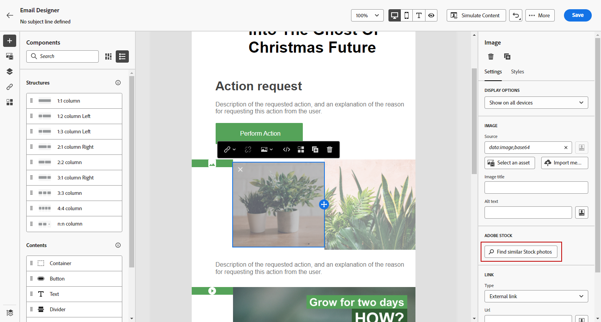
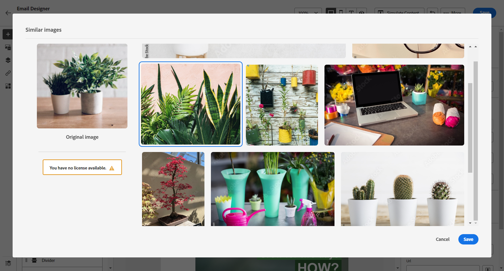

# 处理[!DNL Adobe Stock]图像 {#stock}

## 开始使用 [!DNL Adobe Stock] {#get-started-stock}

[!DNL Adobe Stock] 和 [!DNL Adobe Journey Optimizer] 电子邮件设计器集成增效工具可帮助客户在创作消息时轻松进行导航、许可并保存图像。

[Adobe Stock](https://helpx.adobe.com/stock/get-started.html){target="_blank"}提供对数百万张高品质、精选的、免版税的照片、视频、插图和矢量图形的访问。 您可以选择购买信用包以许可资产，或者为所需资产仅购买一个Standard或Extended许可。 Adobe Stock还提供免费的资产收藏集。

通过 [!DNL Adobe Journey Optimizer]，您可以将图像直接从 [!DNL Adobe Stock] 上传到电子邮件，并使用&#x200B;**[!UICONTROL 查找 Adobe Stock 照片]**&#x200B;选项将其添加到&#x200B;**[!UICONTROL 资源]**&#x200B;文件夹中。此外，**[!UICONTROL 查找类似 Stock 照片]**&#x200B;选项可帮助您查找与投放中所用资源的内容、颜色和合成相匹配的图像。

## 权限{#stock-permissions}

**[!UICONTROL 查找Adobe Stock照片]**&#x200B;和&#x200B;**[!UICONTROL 查找类似图像]**&#x200B;选项可供有权访问AEM Assets Essentials产品配置文件的用户使用。

有关详细信息，请参阅[Experience Manager Assets文档](https://experienceleague.adobe.com/docs/experience-manager-assets-essentials/help/get-started-admins/deploy-administer.html#add-users-to-essentials){target="_blank"}。

## 插入来自[!DNL Adobe Stock]的图像 {#add-stock-image}

要将[!DNL Adobe Stock]中的图像添加到您的内容，请执行以下步骤：

1. 从Email Designer的&#x200B;**[!UICONTROL Content components]**&#x200B;部分拖放&#x200B;**图像**。

1. 单击Email Designer左侧的&#x200B;**[!UICONTROL 查找Adobe Stock照片]**&#x200B;按钮。

   

1. 浏览库或在搜索字段中输入搜索词。

   

1. 选择所选图像并单击&#x200B;**[!UICONTROL 保存]**。

   如果您选择的图像未获得许可，您必须[获取许可证](#license-stock-image)。

## 查找类似照片 {#similar-stock-image}

您可以用[!DNL Adobe Stock]中的照片替换电子邮件内容中的任何现有图像。 请注意，此选项适用于所有图像：已许可/未许可的Assets文件夹中的Stock图像和图像。

要浏览类似的照片，请执行以下步骤：

1. 选择要替换的图像。
1. 单击&#x200B;**[!UICONTROL 查找类似Stock照片]**&#x200B;按钮可在[!DNL Adobe Stock]中显示与图像的内容、颜色和合成匹配的资产。

   

1. 选择所选图像并单击&#x200B;**[!UICONTROL 保存]**。

   

   如果您选择的图像未获得许可，您必须[获取许可证](#license-stock-image)。

1. 如果需要，请使用&#x200B;**[!UICONTROL 设置]**&#x200B;和&#x200B;**[!UICONTROL 样式]**&#x200B;选项卡自定义图像。 [了解有关组件设置的更多信息](../email/content-components.md)。

## 从[!DNL Adobe Stock]获取许可证 {#license-stock-image}

如果您的图像已获得许可，则它由图标表示。 否则，您必须为其授予许可。

要许可并下载映像，请执行以下步骤：

1. 选择它并单击&#x200B;**[!UICONTROL 许可Adobe Stock图像]**&#x200B;图标。

   

   然后，您将被重定向到[!DNL Adobe Stock]网站以购买许可证。

   

1. 从[!DNL Adobe Stock]网站，您需要购买资产才能下载图像并删除水印。

   此次购买取决于您的Adobe Stock计划或订阅。 请注意，如果您有多个Adobe Stock帐户，您将被重定向到上次使用的Stock ID。 在这种情况下，请确保在授权资产之前登录到正确的帐户。

   有关Adobe Stock计划和价格的更多信息，请参阅[Adobe Stock文档](https://stock.adobe.com/plans){target="_blank"}。

   >[!WARNING]
   > 如果发送了包含未授权图像的电子邮件，则图像会使用水印保留其未授权形式。

1. 完成购买后，您现在可以在[!DNL Adobe Journey Optimizer]中返回电子邮件并选择&#x200B;**[!UICONTROL 导入库存图像]**&#x200B;以将许可图像导入您的资产。

   

1. 选择要将资源存储到的文件夹。 有关[!DNL Experience Manager Assets]的详细信息，请参阅此[页面](assets.md#get-started-assets)。

## 相关主题{#stock-related-topics}

* [Journey Optimizer中的电子邮件设计](../email/get-started-email-design.md)
* [电子邮件设计的组件设置](../email/content-components.md)
* [Adobe Stock入门](https://helpx.adobe.com/stock/get-started.html){target="_blank"}。

