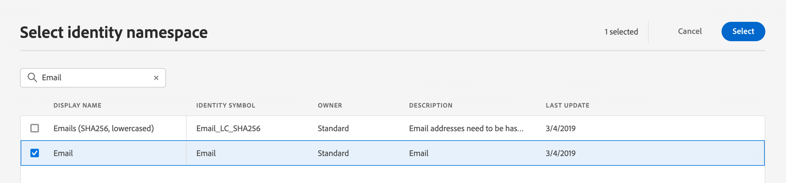

# 选择测试轮廓 {#select-test-profiles}

>[!CONTEXTUALHELP]
>id="ajo_preview_test_profiles"
>title="使用测试轮廓检查您的内容"
>abstract="使用测试轮廓预览和测试您的内容。如果您添加了个性化字段，则可以使用测试轮廓数据检查它们的显示方式。"

测试用户档案是与定义的定向标准不匹配的其他收件人。 [了解如何创建测试用户档案](../audience/creating-test-profiles.md)

在使用测试用户档案测试内容之前，您首先需要选择它们。 为此，请执行以下步骤：

1. 从邮件的编辑内容屏幕或电子邮件Designer中，单击&#x200B;**[!UICONTROL 模拟内容]**&#x200B;按钮，然后选择&#x200B;**[!UICONTROL 模拟内容]**。

1. 单击&#x200B;**[!UICONTROL 管理测试配置文件]**&#x200B;按钮，然后单击&#x200B;**[!UICONTROL 标识命名空间]**&#x200B;选择图标以选择要用于标识测试配置文件的命名空间。 [了解有关Adobe Experience Platform标识命名空间的更多信息](../audience/get-started-identity.md)。

   在以下示例中，我们使用&#x200B;**电子邮件**&#x200B;命名空间。

   

1. 使用搜索字段查找命名空间，选择它并单击&#x200B;**[!UICONTROL 选择]**

   

1. 在&#x200B;**[!UICONTROL 标识值]**&#x200B;字段中，输入值（此处为电子邮件地址）以标识测试配置文件，然后单击&#x200B;**[!UICONTROL 添加配置文件]**。

   <!---->

1. 如果您为消息添加了个性化设置，请添加其他用户档案，以便根据用户档案数据测试消息的不同变体。 添加后，用户档案会列在选定字段下。

   

   此列表根据消息个性化元素，在相关列中显示每个测试用户档案的数据。

>[!NOTE]
>
>除了测试用户档案之外，[!DNL Journey optimizer]还允许您测试内容的不同变体，方法是预览内容并使用从CSV/JSON文件上传或手动添加的示例输入数据发送校样。 [了解如何模拟内容变体](../test-approve/simulate-sample-input.md)
