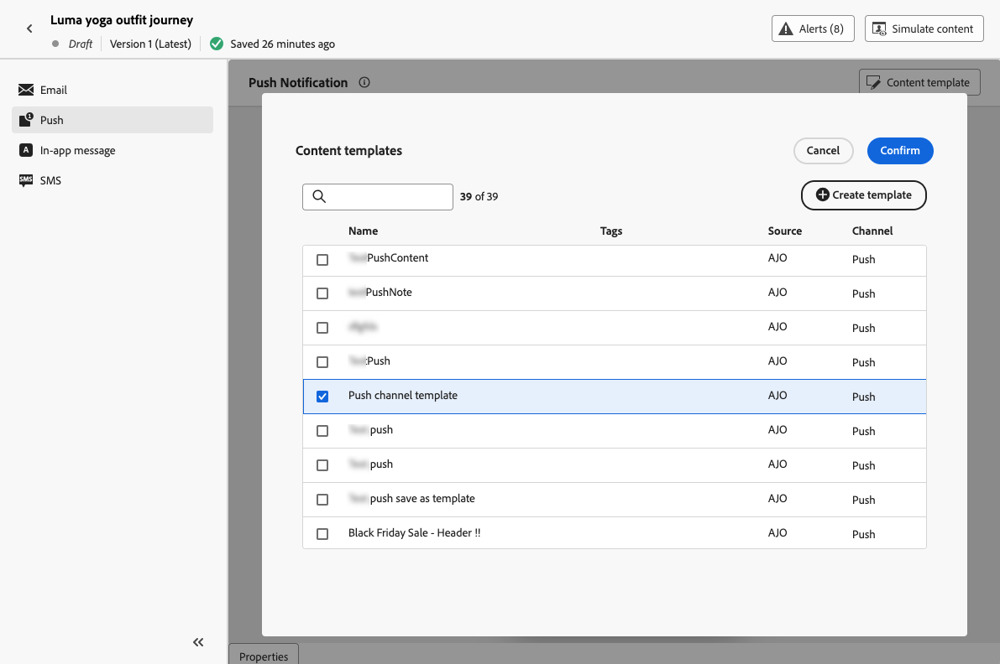

# 使用内容模板 {#use-content-templates}

在[!DNL Journey Optimizer]中为任何渠道（Web除外）创建内容时，您可以使用具有以下任一特性的自定义模板：

* 使用&#x200B;**[!UICONTROL 内容模板]**&#x200B;菜单从头开始创建。 [了解详情](#create-template-from-scratch)

* 使用&#x200B;**[!UICONTROL 另存为内容模板]**&#x200B;选项从历程或营销活动中的现有内容保存。 [了解详情](#save-as-template)

要开始使用这些模板之一构建内容，请执行以下步骤。

1. 在营销活动或历程中，选择&#x200B;**[!UICONTROL 编辑内容]**&#x200B;后，单击&#x200B;**[!UICONTROL 内容模板]**&#x200B;按钮。

1. 选择&#x200B;**[!UICONTROL 应用内容模板]**。

   

1. 从列表中选择您选择的模板。 仅显示与所选渠道和/或类型兼容的模板。

   

   >[!NOTE]
   >
   >在此屏幕中，您还可以使用专用按钮创建新模板，该按钮将打开一个新选项卡。

1. 单击&#x200B;**[!UICONTROL 确认]**。 模板将应用于您的内容。

1. 根据需要继续编辑您的内容。

>[!NOTE]
>
>要使用[电子邮件Designer](../email/get-started-email-design.md)从内容模板开始设计电子邮件，请按照[此部分](../email/use-email-templates.md)中描述的步骤操作。
