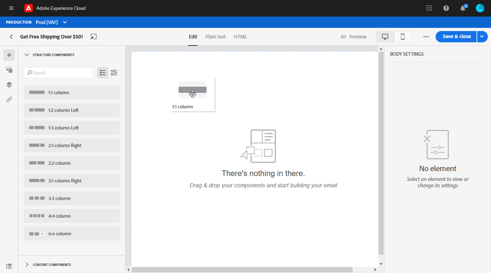
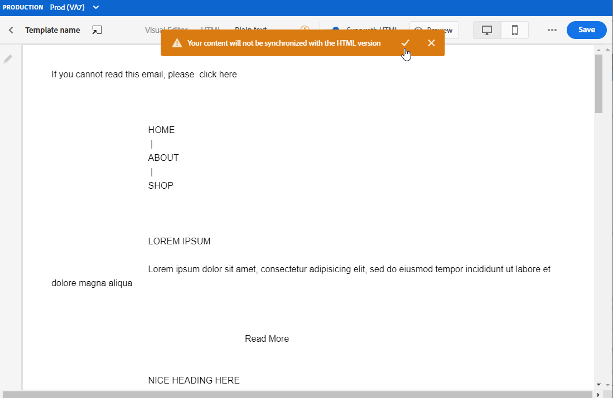

# 在用户界面{#create-email-content}中设计电子邮件内容

创建[消息](create-message.md)后，即可开始创建电子邮件内容。

1. 在新创建的消息中，选择&#x200B;**[!UICONTROL Edit content]**&#x200B;部分中的&#x200B;**[!UICONTROL Email designer]**。

   

1. 在Email Designer主页中，从以下选项中选择设计电子邮件的方式：

   * 选择&#x200B;**[!UICONTROL Design from scratch]**&#x200B;以使用电子邮件设计器功能创建电子邮件内容。

   * 选择&#x200B;**[!UICONTROL Start from template]**&#x200B;以从内置的模板列表创建电子邮件。 请注意，您无法创建其他模板。

   * 选择&#x200B;**[!UICONTROL Code your own]**&#x200B;以输入或粘贴HTML原始代码。 [了解详情](existing-content.md#import-raw-html-code)。

   * 选择&#x200B;**[!UICONTROL Import HTML]**&#x200B;以导入HTML文件或.zip文件夹。 [了解详情](existing-content.md#import-html-content-from-file)。

   

## 从头开始设计

要开始使用电子邮件设计器构建电子邮件内容，请执行以下步骤：

1. 选择&#x200B;**[!UICONTROL Design from scratch]**&#x200B;选项后，通过拖放&#x200B;**[!UICONTROL Structure components]**&#x200B;以定义电子邮件的布局，开始设计电子邮件内容。

   

1. 从&#x200B;**[!UICONTROL Content components]**&#x200B;下拉列表中，您可以根据需要在结构组件中添加任意数量的&#x200B;**[!UICONTROL Content components]**。 [了解有关内容组件的更多信息](content-components.md)。

   

1. 可以使用&#x200B;**[!UICONTROL Component settings]**&#x200B;部分进一步自定义每个组件。 例如，您可以更改组件的文本样式、内边距或边距。 [进一步了解电子邮件编辑器中的样式](https://experienceleague.adobe.com/docs/campaign-standard/using/designing-content/styles.html)。

   

1. 从&#x200B;**[!UICONTROL Assets picker]**&#x200B;中，您可以直接将存储在&#x200B;**[!UICONTROL Assets library]**&#x200B;中的资产添加到电子邮件中。 [了解有关资产管理的更多信息](assets-essentials.md)。

   双击包含您的资产的文件夹，然后将要添加的资产拖放到电子邮件中。

   

1. 添加个性化字段以自定义用户档案数据的内容。 [了解有关内容个性化的更多信息](personalization/personalize.md)。

   

1. 在左窗格的&#x200B;**[!UICONTROL Links]**&#x200B;选项卡中，检查要跟踪的内容的所有URL列表。 如果需要，您可以修改其&#x200B;**[!UICONTROL Tracking Type]**、**[!UICONTROL Label]**&#x200B;和&#x200B;**[!UICONTROL Tags]**。

   

1. 如果需要，您可以切换到代码编辑器，通过单击高级菜单中的&#x200B;**[!UICONTROL Switch to code editor]**&#x200B;进一步个性化电子邮件。 有关代码编辑器的详细信息，请参阅此[page](existing-content.md#import-raw-html-code)。

   >[!NOTE]
   >
   >切换到代码编辑器后，您将无法对此电子邮件使用可视设计器。

   

1. 单击&#x200B;**[!UICONTROL Preview]**&#x200B;以检查电子邮件的呈现。 您可以选择桌面视图或移动设备视图。

   

1. 电子邮件准备就绪后，单击&#x200B;**[!UICONTROL Save & Close]**。

您的电子邮件内容现在可用于消息。 [了解如何发送消息](publish-manage-message.md)。

## 定义电子邮件结构{#defining-the-email-structure}

>[!CONTEXTUALHELP]
>id="ac_structure_components"
>title="关于结构组件"
>abstract="结构组件可定义电子邮件的布局。"

>[!CONTEXTUALHELP]
>id="ac_edition_columns"
>title="定义电子邮件列"
>abstract="Email Designer允许您通过定义列结构轻松定义电子邮件的布局。"

通过Email Designer，可轻松定义电子邮件的结构。 通过通过简单的拖放操作添加和移动结构元素，您可以在几秒内设计电子邮件的形状。

要编辑电子邮件的结构，请执行以下操作：

1. 打开现有内容或创建新的电子邮件内容。
1. 通过选择左侧的&#x200B;**+**&#x200B;图标访问&#x200B;**[!UICONTROL Structure components]**。
1. 拖放形成电子邮件形状所需的结构组件。
在放置结构组件之前，使用蓝线可实现其确切位置。 您可以将其放置在任何其他组件的上方、中间或下方，但不能放在内部。

   >[!NOTE]
   >
   >请注意，列堆叠与所有电子邮件程序不兼容。 不支持时，不会堆叠列。
   >
   >将组件放入电子邮件中后，除非内部已放置内容组件或片段，否则将无法移动或删除组件。

1. 可使用由一个或多个列组成的多个结构组件。

   选择&#x200B;**[!UICONTROL n:n column]**&#x200B;组件以定义所选列数（在3到10之间）。 您还可以通过在每列底部移动箭头来定义每列的宽度。

   >[!NOTE]
   >
   >每个列大小不能低于结构组件总宽度的10%。 无法删除不为空的列。

定义结构后，您便可以向电子邮件中添加内容片段和组件。

## 使用预标头 {#preheader}

>[!CONTEXTUALHELP]
>id="ac_edition_preheader"
>title="使用预标头"
>abstract="利用预标题，可配置简短的摘要文本，以帮助您更好地跟踪和自定义电子邮件。"

前标是简短的摘要文本，在从电子邮件客户端查看电子邮件时，该文本将遵循主题行。 预标题可帮助您更好地跟踪和自定义电子邮件。

选择&#x200B;**[!UICONTROL Preheader]**&#x200B;编辑框并添加内容。

您可以在前标内容中添加&#x200B;**[!UICONTROL Content block]**、**[!UICONTROL Dynamic content]**&#x200B;或&#x200B;**[!UICONTROL Personalization fields]**。

>[!NOTE]
>
>请注意，preheader并非与所有电子邮件客户端都兼容。 不受支持时，不显示预标头。

## 背景设置{#about-backgrounds}

>[!CONTEXTUALHELP]
>id="ac_edition_backgroundimage"
>title="背景设置"
>abstract="电子邮件设计工具允许您个性化内容的背景颜色或背景图像。请注意，并非所有电子邮件客户都支持背景图像。"
>additional-url="https://docs.google.com/spreadsheets/d/1TLo62YKm3tThUWDOIliCQFWs3dpNjpDfw6DdTr1oGOw/edit#gid=0" text="其他信息"

在使用Email Designer设置背景时，Adobe建议执行以下操作：

1. 根据您的设计需要，将背景颜色应用于电子邮件正文。
1. 在大多数情况下，在列级别设置背景颜色。
1. 请尽量不要在图像或文本组件上使用背景颜色，因为它们很难管理。

以下是您可以使用的可用背景设置。

* 为整个电子邮件设置&#x200B;**[!UICONTROL Background color]**。 确保在可从左侧面板访问的导航树中选择主体设置。

* 通过选择&#x200B;**[!UICONTROL Viewport background color]**&#x200B;为所有结构组件设置相同的背景颜色。 此选项允许您从背景颜色中选择其他设置。

* 为每个结构组件设置不同的背景颜色。 在导航树中选择从左侧调色板可访问的结构，以仅将特定背景颜色应用于该结构。

   确保未设置视区背景颜色，因为它可能隐藏结构背景颜色。

* 为结构组件的内容设置&#x200B;**[!UICONTROL Background image]**。

   >[!NOTE]
   >
   >某些电子邮件程序不支持背景图像。 不支持时，将改用行背景颜色。 确保在图像无法显示的情况下选择适当的回退背景颜色。

* 在列级别设置背景颜色。

   >[!NOTE]
   >
   >这是最常见的用例。 Adobe建议在列级别设置背景颜色，因为这样在编辑整个电子邮件内容时就更灵活了。

   您也可以在列级别设置背景图像，但很少使用此方法。

### 示例：调整垂直对齐和内边距{#example--adjusting-vertical-alignment-and-padding}

要在由三列组成的结构组件中调整内边距和垂直对齐方式。 为此，请执行以下步骤：

1. 直接在电子邮件中或使用左侧&#x200B;**Palette**&#x200B;中提供的结构树选择结构组件。
1. 在&#x200B;**上下文工具栏**&#x200B;中，单击&#x200B;**[!UICONTROL Select a column]**&#x200B;并选择要编辑的工具栏。 也可以从结构树中选择它。

   该列的可编辑参数显示在右侧的&#x200B;**[!UICONTROL Settings]**&#x200B;窗格中。

1. 在&#x200B;**[!UICONTROL Vertical alignment]**&#x200B;下，选择&#x200B;**[!UICONTROL Up]**。

   内容组件显示在列顶部。

1. 在&#x200B;**[!UICONTROL Padding]**&#x200B;下，定义列内的顶部内边距。 单击锁图标以中断与底部内边距的同步。

   定义该列的左边距和右边距。

1. 以类似方式继续调整其他列的对齐方式和内边距。

1. 保存更改。

## 为链接定义样式{#about-styling-links}

您可以在Email Designer中为链接加下划线并选择其颜色和目标。

1. 在插入链接的组件中，选择链接的标签文本。

1. 在组件设置中，选中&#x200B;**[!UICONTROL Underline link]**&#x200B;可为链接的标签文本添加下划线。

1. 要选择将打开您的链接的浏览上下文，请选择&#x200B;**[!UICONTROL Target]**。

1. 要更改链接的颜色，请单击&#x200B;**[!UICONTROL Link color]**。

1. 选你需要的颜色。

1. 保存更改。

## 添加内联样式属性{#adding-inline-styling-attributes}

在Email Designer界面中，当您选择某个元素并在侧面板上显示其设置时，可以自定义该特定元素的内联属性及其值。

1. 在内容中选择一个元素。
1. 在侧面板中，查找&#x200B;**[!UICONTROL Styles Inline]**&#x200B;设置。

1. 修改现有属性的值，或使用&#x200B;**+**&#x200B;按钮添加新属性的值。 您可以添加任何符合CSS的属性和值。

样式随后将应用于所选元素。 如果子元素未定义特定的样式属性，则会继承父元素的样式。

## 创建电子邮件的文本版本{#generate-text-version}

建议创建电子邮件正文的文本版本，当HTML内容无法显示时，会使用该文本版本。

默认情况下，Email Designer会创建电子邮件的&#x200B;**[!UICONTROL Plain text]**&#x200B;版本，包括个性化字段。 此版本将自动生成并与内容的HTML版本同步。

如果您希望对纯文本版本使用其他内容，请执行以下步骤：

1. 在您的电子邮件中，选择&#x200B;**[!UICONTROL Plain text]**&#x200B;选项卡。

1. 使用&#x200B;**[!UICONTROL Sync with HTML]**&#x200B;切换开关禁用同步。

   

1. 单击复选标记以确认您的选择。

   

1. 然后，您可以根据需要编辑纯文本版本。

>[!CAUTION]
>
>* 在&#x200B;**[!UICONTROL Plain text]**&#x200B;视图中所做的更改不会反映在HTML视图中。
   >
   >
* 如果在更新纯文本内容后重新启用&#x200B;**[!UICONTROL Sync with HTML]**&#x200B;选项，则更改将丢失，并替换为从HTML版本生成的文本内容。

>

