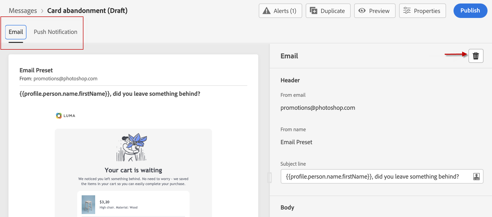

# 创建消息{#create-message}

可从左边栏上的&#x200B;**[!UICONTROL Messages]**&#x200B;快捷键访问消息。 将列出所有消息，并按发布日期（对于已发布消息）或创建日期（对于草稿消息）排序。

>[!NOTE]
>
>每个用户都可以访问、创建、编辑和发布消息。 了解有关用户权限[的更多信息，请参阅本节](permissions.md)。

使用&#x200B;**[!UICONTROL Show recents]**&#x200B;切换键可添加指向过去5天内访问过的消息的直接链接。

使用过滤器图标可仅显示起草、发布或正在发布的消息。 您还可以在邮件标签上搜索，如下所示：

## 创建新消息

要创建新消息，请执行以下步骤：

1. 访问消息列表，然后单击&#x200B;**[!UICONTROL Create Message]**。

1. 定义消息属性。

   

   * 输入&#x200B;**[!UICONTROL Title]**（必填）和&#x200B;**[!UICONTROL Description]**。

   * 选择要用于消息的&#x200B;**[!UICONTROL Preset]**。

      预设包括根据您的品牌发送电子邮件和/或推送通知所需的所有参数。 [了解有关品牌的更多信息](administration.md#cjm-branding)。

   * 选择要用于该消息的渠道:电子邮件和/或推送通知。 您必须至少选择一个渠道才能创建消息。
   请注意，您可以随时使用消息接口中的&#x200B;**[!UICONTROL Properties]**&#x200B;按钮访问和修改消息的标题、说明和预设。

   

1. 单击&#x200B;**[!UICONTROL Create]**&#x200B;确认消息创建。 消息将添加到消息列表中，处于&#x200B;**[!UICONTROL Draft]**&#x200B;状态。

   每个选定渠道都有一个选项卡。 使用这些选项卡为每个渠道配置内容。 您可以通过选择某个选项卡并单击右侧的&#x200B;**[!UICONTROL Delete channel]**&#x200B;按钮来删除该选项卡。

   

   您现在可以创建消息的内容并调整设置。 有关电子邮件和推送通知配置的详细信息请参阅以下部分：

   * [配置电子邮件](configure-email.md)
   * [配置推送通知](configure-push.md)

   >[!NOTE]
   >   
   >您可以使用用户档案数据使用表达式编辑器个性化您的信息。 有关个性化的详细信息，请参阅[此部分](personalization/personalize.md)。

1. 使用左侧的“预览”部分控制消息的呈现，并使用测试用户档案检查个性化设置。 如需详细信息，请参阅[此部分](preview.md)。

   

1. 检查编辑器上半部分的警报。  其中一些是简单的警告，但其他警告可能会阻止您发布消息。 请阅读[本节](alerts.md)了解更多信息。

1. 您现在可以单击&#x200B;**[!UICONTROL Publish]**&#x200B;按钮发布消息，或将消息保留为草稿并稍后发布。 有关如何发布消息的详细信息，请参阅[本节](publish-manage-message.md)。

## 重复消息

要从现有消息创建消息，请使用消息接口中的&#x200B;**[!UICONTROL Duplicate]**&#x200B;按钮。 所有设置和配置都将复制到新消息中

您可以在确认重复之前重命名消息。

创建新消息后，窗口底部将显示确认消息。

您还可以使用专用图标重复消息列表中的消息。

同样的确认过程也适用。
