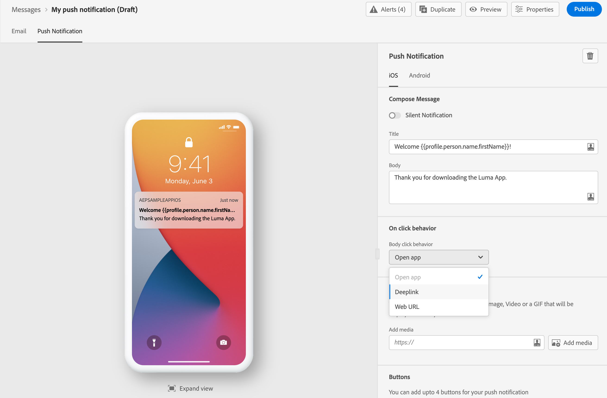
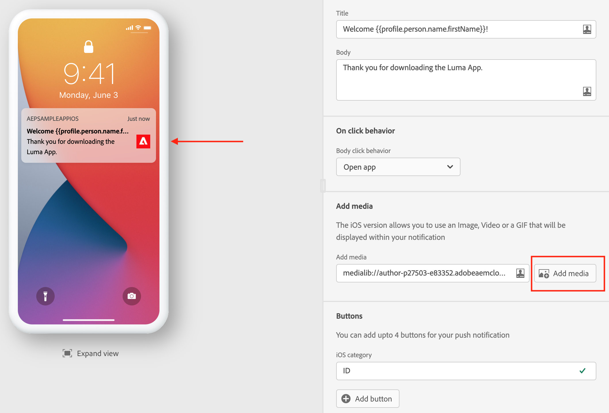

# 创建推送通知 {#create-push-notification}

创建消息[后，单击&#x200B;**[!UICONTROL Push Notification]**&#x200B;选项卡以定义推送通知的设置和内容。](create-message.md)

使用专用选项卡为&#x200B;**iOS**&#x200B;和&#x200B;**Android**&#x200B;操作系统定义推送通知设置。

>[!NOTE]
>
>**[!UICONTROL Compose Message]**&#x200B;部分对于&#x200B;**[!UICONTROL iOS]**&#x200B;和&#x200B;**[!UICONTROL Android]**&#x200B;选项卡都是通用的。 此部分中的任何更改都将应用于这两个选项卡。

## 标题与正文

要撰写消息，请单击&#x200B;**[!UICONTROL Title]**&#x200B;和&#x200B;**[!UICONTROL Body]**&#x200B;字段。 使用表达式编辑器定义内容和个性化数据。 在[此部分](personalization/personalize.md)的表达式编辑器中了解有关个性化的更多信息

使用设备预览部分可视化推送通知在iOS和Android设备上的显示方式。

## 点击行为 {#on-click-behavior}

选择收件人单击推送通知正文时的行为。

* 使用&#x200B;**[!UICONTROL Open app]**&#x200B;选项打开与消息&#x200B;**[!UICONTROL Preset]**&#x200B;关联的应用程序。
* 使用&#x200B;**[!UICONTROL Deeplink]**&#x200B;选项将收件人重定向到位于应用程序内的特定内容。 在关联的字段中输入深层链接。
* 使用&#x200B;**[!UICONTROL Web URL]**&#x200B;选项将收件人重定向到外部URL。 在关联的字段中输入URL。

## 添加媒体

在iOS版本的推送通知中，您可以添加将在通知中显示的图像、视频或GIF。

在Android版本中，您只能添加图像图标和用于扩展通知的图像。

有两个选项可用。 您可以：

* 单击&#x200B;**[!UICONTROL Add media]**&#x200B;按钮以选择&#x200B;**[!DNL Adobe Experience Manager Assets Essentials]**&#x200B;中的资产。

   了解如何在[此页面](assets-essentials.md)中使用&#x200B;**[!DNL Adobe Experience Manager Assets Essentials]**。

* 或通过单击&#x200B;**[!UICONTROL Add media]**&#x200B;字段输入媒体的URL。 在这种情况下，您可以添加个性化。

添加后，媒体会显示在通知正文的右侧。

## 添加按钮

您可以通过向推送内容添加按钮来创建可操作的通知。

如果设备屏幕已锁定，则不会显示以下按钮：只有通知的&#x200B;**标题**&#x200B;和&#x200B;**消息**&#x200B;可见。 如果其设备已解锁，则收件人将看到这些按钮。

在iOS版本中，最多可添加4个按钮。 在Android版本中，最多可添加3个按钮。

>[!NOTE]
>
>对于iOS，使用&#x200B;**[!UICONTROL iOS category]**&#x200B;字段将操作与通知类别关联。

单击&#x200B;**[!UICONTROL Add button]**&#x200B;以定义设置：标签和关联的操作。 可能的操作与[点击行为](#on-click-behavior)的操作相同。

单击&#x200B;**[!UICONTROL Expand view]**&#x200B;以预览个性化按钮。

## 发送无提示通知

无提示推送通知（或后台通知）是交付给应用程序的隐藏指令。 例如，它用于通知您的应用程序新内容的可用性或在后台启动下载。

选择&#x200B;**[!UICONTROL Silent Notification]**&#x200B;选项以静默通知应用程序：在这种情况下，通知会直接转给应用程序。 设备屏幕上未显示任何警报。

使用&#x200B;**[!UICONTROL Custom data]**&#x200B;部分添加键/值对。

## 自定义数据

在&#x200B;**[!UICONTROL Custom data]**&#x200B;部分中，您可以根据移动应用程序配置将自定义变量添加到有效负载中。 有关如何在Adobe Experience Platform中设置推送通知和AdobeLaunch的更多信息，请参阅[此部分](push-gs.md)

## 高级选项

您可以为推送通知配置&#x200B;**[!UICONTROL Advanced options]**。 以下列出了可用参数：

| 参数 | 描述 |
|---------|---------|
| **[!UICONTROL Collapsible]** (iOS / Android) | 可折叠的消息是一种消息，如果消息已过时，则可以用新消息替换该消息。 可折叠消息的常见用例是消息，用于告知移动设备应用程序从服务器同步数据。 例如，一个可更新用户最新得分的体育应用程序。 只有最新的消息才相关。 另一方面，通过不可折叠的消息，非常的消息对客户端应用程序很重要，需要发送。 |
| **[!UICONTROL Custom sound]** (iOS / Android) | 移动终端在收到通知时要播放的声音。 需要在应用程序中捆绑声音。 |
| **[!UICONTROL Badges]** (iOS / Android) | 标记用于直接在应用程序图标上显示新的未读信息数。 当用户打开或从应用程序中读取新内容时，标记值将消失。在设备上收到通知时，可能会刷新或增加相关应用程序的标记值。 例如，如果您存储的是客户的未读文章数，则可以利用个性化功能为每个客户发送唯一的未读文章标记值。如需更多个性化信息，请参阅[此部分](personalization/personalize.md)。 |
| **[!UICONTROL Notification group]**  （仅限iOS） | 将通知组与推送通知关联。 从iOS 12开始，通知组允许您将消息线程和通知主题合并到线程ID中。例如，品牌可能会在一个组ID下发送营销通知，而在一个或多个不同ID下保留更多操作类型通知。 为了说明这一点，您可以具有groupID:123 “查看新的Sweaters春季系列”和groupID:456 “您的包已送达”通知组。在本例中，所有投放通知都将捆绑在组ID下：456。 |
| **[!UICONTROL Notification channel]** （仅限Android） | 将通知渠道关联到推送通知。 从Android 8.0（API级别26）开始，必须将所有通知分配给渠道才能显示。有关更多信息，请参阅[Android开发人员文档](https://developer.android.com/guide/topics/ui/notifiers/notifications#ManageChannels)。 |
| **[!UICONTROL Add content-availability flag]** （仅限iOS） | 发送推送负载中的可用内容标志，以确保应用程序在收到推送通知后立即唤醒，这意味着应用程序将能够访问有效载荷数据。  即使应用程序在后台运行且无需任何用户交互（例如点按推送通知），这项操作仍可正常运行。 但是，如果应用程序未运行，则不适用此设置。有关更多信息，请参阅 [Apple 开发人员文档](https://developer.apple.com/library/content/documentation/NetworkingInternet/Conceptual/RemoteNotificationsPG/CreatingtheNotificationPayload.html)。 |
| **[!UICONTROL Add mutable-content flag]** （仅限iOS） | 发送推送负载中的可变内容标记，并将允许iOS SDK中提供的通知服务应用程序扩展修改推送通知内容。 有关更多信息，请参阅 [Apple 开发人员文档](https://developer.apple.com/library/content/documentation/NetworkingInternet/Conceptual/RemoteNotificationsPG/ModifyingNotifications.html)。 然后，您可以利用移动应用程序扩展进一步修改从发送的推送通知的内容或演 [!DNL Journey Optimizer]示。例如，用户可以利用此选项解密数据、更改通知的正文或标题文本、向通知添加线程标识符等。 |
| **[!UICONTROL Notification visibility]** （仅限Android） | 定义推送通知的可见性。  <b></b> 隐私将在所有锁屏上显示通知，但在安全的锁屏上隐藏敏感或隐私信息。 <b></b> Public将在所有锁屏上显示整个通知。 <b></b> Secretwill不要在安全的锁屏上透露通知的任何部分。 有关更多信息，请参阅Android开 [发人员文档](https://developer.android.com/reference/android/app/Notification)。 |
| **[!UICONTROL Notification priority]** （仅限Android） | 将推送通知的重要性从“低”定义为“最大”。 这可确定发送推送通知时“侵入”的程度。 有关更多信息，请参阅[Android开发人员文档](https://developer.android.com/guide/topics/ui/notifiers/notifications#importance) |
| **[!UICONTROL Delivery priority]** （仅限Android） | 为推送通知设置高优先级或普通优先级。 有关消息优先级的更多信息，请参阅 [Google 开发人员文档](https://firebase.google.com/docs/cloud-messaging/concept-options#setting-the-priority-of-a-message)。 |

**相关主题**

<!--
* [Understand push notification flow](push-gs.md)
-->

* [配置推送渠道](push-gs.md)
* [创建新消息](create-message.md)
* [在历程中添加消息](building-journeys/journeys-message.md)

