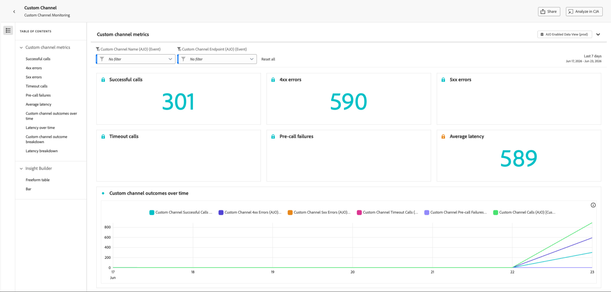

# 监测自定义渠道 {#monitor-custom-channel}

创建并激活自定义渠道后，您可以[管理其生命周期](create-custom-channel.md#access-channel-builder)，并通过[!DNL Journey Optimizer]界面监控投放性能。

## 利用营销活动和历程报告 {#reporting}

[!DNL Journey Optimizer]为自定义渠道提供现成的报告。

以下量度可用于实时(24h)和全局(CJA)报表中的自定义渠道。<!--TBC and add or replace with CJA link when available-->

| 量度 | 描述 |
|--------|-------------|
| **尝试的投放** | 发送到外部端点的消息总数。 |
| **成功投放** | 端点返回HTTP 2xx响应的消息。 |
| **目标配置文件** | 已达到唯一配置文件的数量。 |
| **单击次数** | 有效负载中跟踪的链接点击次数。 需要为自定义渠道委派子域。 |
| **错误/失败** | 尝试投放失败的次数，按错误原因细分。 |

了解有关[实时报告](../reports/live-report.md)和[全局报告](../reports/report-gs-cja.md)的更多信息。 有关报告功能的详细信息，请参阅[本文档](../reports/report-cja-manage.md)。

<!--
### Journey reports {#journey-reports}

To view delivery data for a custom channel action in a journey:

1. Open the journey from the **[!UICONTROL Journeys]** list.
1. Click **[!UICONTROL View report]** in the top-right area.
   * **[!UICONTROL Live report]** – Data for the last 24 hours.
   * **[!UICONTROL All time]** – Full lifetime data via Customer Journey Analytics (CJA).

### Campaign reports {#campaign-reports}

To view delivery data for a custom channel campaign:

1. Open the campaign from the **[!UICONTROL Campaigns]** list.
1. Click **[!UICONTROL Reports]** in the top-right area.

The campaign report includes execution count, successful deliveries, errors, and click data (if link tracking is enabled).
-->

## 监控投放效果 {#monitoring}

除了营销活动和历程报告外，[!DNL Journey Optimizer]还提供专用的自定义渠道监视仪表板。 从&#x200B;**[!UICONTROL 管理]** > **[!UICONTROL 渠道]** > **[!UICONTROL 渠道生成器]** > **[!UICONTROL 自定义渠道监控]**&#x200B;访问它。

{width="100%"}

此仪表板允许您监视在传递自定义渠道消息时[!DNL Journey Optimizer]对外部端点进行的API调用的可靠性和性能。 使用它可以快速发现集成问题、延迟和限制因素。

**[!UICONTROL 自定义渠道监控]**&#x200B;仪表板的功能与[!DNL Journey Optimizer]中的其他所有时间报告类似。 您可以选择时间范围、按渠道或端点筛选，并深入查看依赖每个自定义渠道的营销活动和历程。 [了解详情](../reports/report-cja-manage.md)

### 自定义渠道量度 {#monitoring-kpis}

**[!UICONTROL 自定义渠道量度]**&#x200B;部分提供了自定义渠道调用的运行状况和可靠性的综合视图。

{width="100%"}

+++ 了解有关自定义渠道量度的更多信息

* **[!UICONTROL 成功的调用]**：返回有效响应且无错误的HTTP调用总数。

* **[!UICONTROL 4xx/5xx错误]**：由于客户端(4xx)或服务器端(5xx)错误，突出显示配置问题或终结点故障而失败的调用数。

* **[!UICONTROL 超时调用]**：因超过最大响应时间而失败的调用数。 这有助于显示外部端点的滞后或性能问题。

* **[!UICONTROL 预调用失败]**：在对外部端点进行HTTP调用之前失败的自定义渠道发送次数。 这些故障发生在[!DNL Journey Optimizer]自己的基础结构层，而不是外部系统中。 有三种类别：

  | 类别 | 描述 |
  |----------|-------------|
  | **身份验证失败** (`AUTH_*`) | [!DNL Journey Optimizer]无法获取或刷新调用终结点所需的OAuth令牌或凭据。 检查链接到渠道配置的API凭据是否有效且未过期。 |
  | **请求生成错误** (`REQUEST_GENERATION_ERROR`) | [!DNL Journey Optimizer]无法构造有效的HTTP请求 — 例如，因为无法解析URL模板或缺少所需的个性化字段。 |
  | **HTTP分析错误** (`HTTP_PARSE_ERROR`) | [!DNL Journey Optimizer]收到来自终结点的响应，但无法将其解析为可用的结构。 |

  >[!TIP]
  >
  >预调用失败表示[!DNL Journey Optimizer]端或渠道配置中出现问题，而不是外部端点出现问题。 通过查看API凭据和必需的有效负载字段开始故障排除。

* **[!UICONTROL 平均延迟]**：所有HTTP调用的平均端到端响应时间（以毫秒为单位），包括成功的调用、错误和超时。

<!--
* **[!UICONTROL Capped calls]**: Number of calls that were blocked due to capping limits, ensuring downstream systems are not overloaded.

* **[!UICONTROL Average RPS]**: Number of requests per second processed by the custom channel over the selected time range.

* **[!UICONTROL Average successful latency]**: Average end-to-end response time (in milliseconds) for successful calls only, excluding failed requests and timeouts.

* **[!UICONTROL Average queue time]**: Average time (in milliseconds) calls spent waiting in the execution queue before being sent. This only applies to throttled endpoints, where [!DNL Journey Optimizer] queues calls when the throughput limit is reached.
-->

+++

### 随时间变化的自定义渠道结果 {#outcomes-overtime}

{width="100%"}

**[!UICONTROL 随时间变化的自定义渠道结果]**&#x200B;图形显示选定时间段内的HTTP调用KPI趋势。 时间序列的粒度取决于所选的时间范围：

* 对于为期7天的报表，每个数据点显示一天的KPI。
* 对于1天的时间范围，此图表显示每小时的KPI。
* 对于1小时时间范围，此图表显示每分钟的KPI。

### 一段时间内的延迟 {#latency-overtime}

{width="100%"}

**[!UICONTROL 一段时间内的延迟]**&#x200B;图形可显示所选时段内的延迟量度趋势。 通过这个时间序列视图，您可以跟踪性能模式、识别高峰延迟时段并监视优化或系统更改随时间变化的影响。

### 自定义渠道结果细分 {#outcome-breakdown}

{width="100%"}

**[!UICONTROL 自定义渠道结果细分]**&#x200B;表提供了HTTP调用量度的层次细分 — 从最顶层的每个端点的总体量度，到使用该端点的每个自定义渠道的量度，再到最底层依赖它们的营销活动和历程。

### 延迟细分 {#latency-breakdown}

**[!UICONTROL 延迟细分]**&#x200B;表提供了自定义渠道中延迟量度的详细细分。 此视图可帮助您识别哪些特定端点或通道遇到性能问题，使您能够有效地查明并解决延迟瓶颈。

### insight Builder {#insight-builder}

使用&#x200B;**[!UICONTROL Insight Builder]**&#x200B;根据自定义渠道指标创建自定义可视化图表和功能板。 通过此工具，您可以合并多个KPI、应用过滤器以及创建量身定制的视图，以满足您的监控和报告需求。 [了解详情](../reports/report-cja-manage.md#insight-builder)

## 故障排除 {#troubleshooting}

如果您遇到自定义渠道问题，下表列出了常见症状、可能的原因和建议的解决方案。

| 症状 | 可能的原因 | 解决方法 |
|---------|----------------|------------|
| **HTTP 401 / 403错误** | 身份验证失败 — 凭据过期或不正确。 | 在&#x200B;**[!UICONTROL 管理]** > **[!UICONTROL 渠道]** > **[!UICONTROL API凭据]**&#x200B;中更新凭据。 |
| **HTTP 429错误** | 外部终结点正在限制来自[!DNL Journey Optimizer]的请求。 | 查看端点的速率限制。 减少Channel Builder策略配置中的限制设置。 |
| **HTTP 5xx错误** | 外部系统已关闭或返回服务器错误。 | 检查外部系统的运行状况仪表板。 在历程操作活动上配置错误路径以正常处理暂时性故障。 |
| **未解析的个性化令牌** | 表达式引用了配置文件上不存在的特性。 | 验证XDM属性路径是否正确。 添加默认值回退： `{{profile.person.name.firstName \| default("Valued Customer")}}`。 |
| **必填字段验证错误** | 创作时必需的有效负载字段没有值。 | 确保在内容编辑器中填充所有必填字段。 或者，如果字段确实是可选的，则在渠道生成器中删除所需的限制。 |

<!--
## Related resources {#related}

* [Get started with custom channels](get-started-custom-channel.md)
* [Configure a custom channel](custom-channel-configuration.md)
* [Global report overview](../reports/report-gs-cja.md)
* [Journey live report](../reports/live-report.md
-->