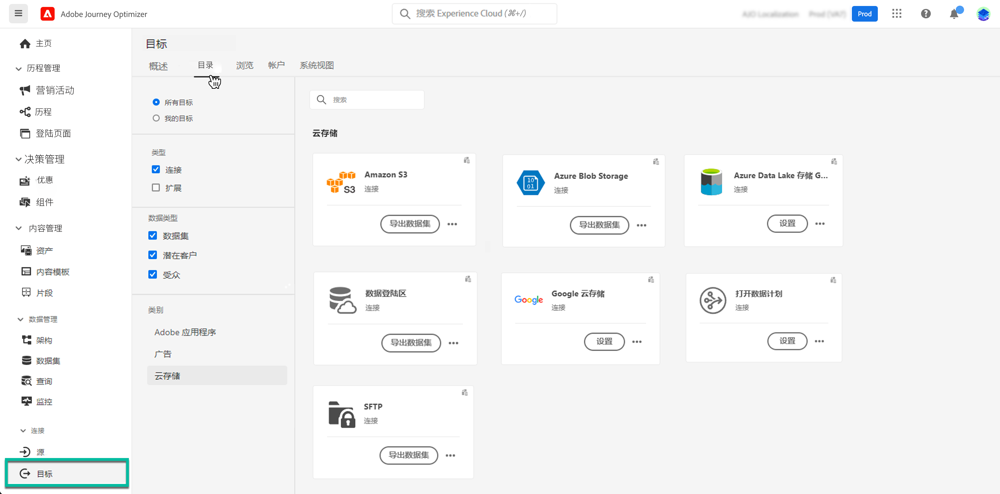

# 将数据集导出到云存储位置 {#export-datasets}

>[!AVAILABILITY]
>
>数据集导出功能当前为测试版，可供所有Adobe Journey Optimizer用户使用。 如果您尚未拥有访问权限，请与 Adobe 代表联系，获取目标的访问权限。

Journey Optimizer允许您与云存储位置建立实时连接，以导出数据集的内容。

通过定期导出数据，您可以确保对客户交互有完整和最新的记录，将此信息用于报告或分析目的，并保持对法律要求的遵守。

## 可用的云存储目标 {#destinations}

您可以将数据集导出到6个云存储目标，可从访问 **[!UICONTROL 目标]** 菜单，在 **[!UICONTROL 目录]** 选项卡。

>[!AVAILABILITY]
>
>这些目标均提供测试版并且可能会发生更改。

有关每个目标的详细信息，请参阅Adobe Experience Platform文档：

* [Amazon S3](https://experienceleague.adobe.com/docs/experience-platform/destinations/catalog/cloud-storage/amazon-s3.html)
* [Azure Blob](https://experienceleague.adobe.com/docs/experience-platform/destinations/catalog/cloud-storage/azure-blob.html)
* [Azure Data Lake Gen 2](https://experienceleague.adobe.com/docs/experience-platform/destinations/catalog/cloud-storage/adls-gen2.html)
* [数据登陆区](https://experienceleague.adobe.com/docs/experience-platform/destinations/catalog/cloud-storage/data-landing-zone.html)
* [Google云存储](https://experienceleague.adobe.com/docs/experience-platform/destinations/catalog/cloud-storage/google-cloud-storage.html)
* [SFTP](https://experienceleague.adobe.com/docs/experience-platform/destinations/catalog/cloud-storage/sftp.html)

## 先决条件 {#prerequisites}

在开始导出数据集之前，请检查以下先决条件：

* 要导出数据集，您需要 **管理目标**， **查看目标**， **激活目标**、和 **管理和激活数据集目标** [访问控制权限](https://experienceleague.adobe.com/docs/experience-platform/access-control/home.html#permissions). 阅读 [访问控制概述](https://experienceleague.adobe.com/docs/experience-platform/access-control/ui/overview.html) 或与产品管理员联系以获取所需的权限。

* 此功能仅支持导出第一代数据，即中定义的原始数据 [Real-time Customer Data Platform产品描述](https://helpx.adobe.com/legal/product-descriptions/real-time-customer-data-platform-b2c-edition-prime-and-ultimate-packages.html). 确保要导出的数据集不包含第二代数据。

## 导出数据集的主要步骤 {#main-steps}

将数据集导出到云存储位置的主要步骤如下：

有关每个步骤的详细信息，请参阅Adobe Experience Platform文档： [将数据集导出到云存储目标](https://experienceleague.adobe.com/docs/experience-platform/destinations/ui/activate/export-datasets.html?lang=en).

1. **设置云存储目标**. 如果您尚未这样做，请从目标目录连接到云存储目标。 [了解如何创建新的目标连接](https://experienceleague.adobe.com/docs/experience-platform/destinations/ui/connect-destination.html?lang=en#setup)

   <!---->

1. **选择云存储目标** 从中导出数据集。 在目标目录中，单击 **[!UICONTROL 导出数据集]** 按钮，并选择要使用的连接。

   <!---->

   >[!NOTE]
   >
   >如果您同时使用Adobe Journey Optimizer和实时客户档案，则目标信息卡将显示“激活”按钮，根据您启用的权限，允许您导出数据集并激活此目标的区段。

1. **选择数据集** 导出到选定目标的属性。

   <!---->

1. **计划导出** 数据集的URL。 指定导出的开始时间和频率。

   <!---->

1. **查看并确认导出** 检查配置结束时显示的摘要。

   <!---->

导出完成后，数据集的内容将根据您配置的计划存储在云存储位置。 [了解如何验证成功的数据集导出](https://experienceleague.adobe.com/docs/experience-platform/destinations/ui/activate/export-datasets.html#verify)
