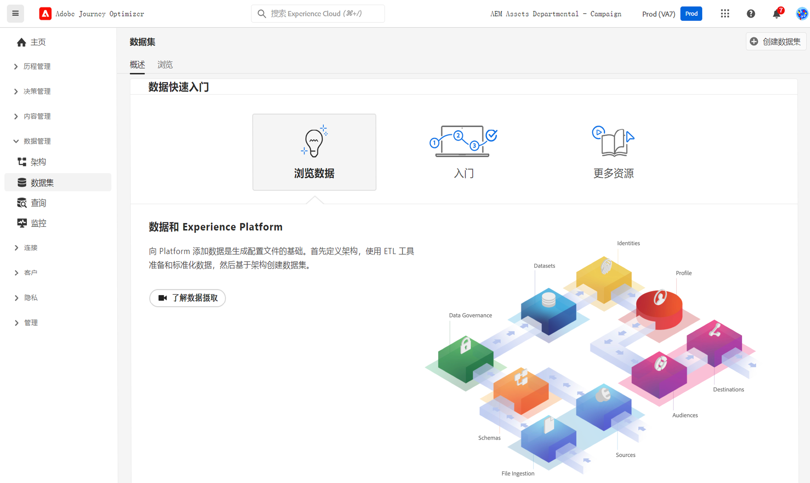

# 数据集入门 {#datasets-gs}

摄取到 Adobe Experience Platform 中的所有数据将作为数据集保留在数据湖中。数据集是用于数据集合的存储和管理结构，通常是表格，其中包含架构（列）和字段（行）。

## 访问数据集{#access-datasets}

[!DNL Adobe Journey Optimizer] 用户界面中的&#x200B;**数据集**&#x200B;工作区允许您浏览数据并创建数据集。

在左侧导航中选择&#x200B;**数据集**，打开“数据集”仪表板。

将数据添加到 [!DNL Adobe Experience Platform] 是构建个人资料的基础。然后，您便能够在 [!DNL Adobe Journey Optimizer] 中利用个人资料。首先定义架构，使用 ETL 工具准备数据并使其标准化，然后根据架构创建数据集。

选择&#x200B;**浏览**&#x200B;选项卡，显示贵组织的所有可用数据集的列表。会显示每个列出数据集的详细信息，包括其名称、数据集所遵循的架构以及最近摄取运行的状态。

默认情况下，只会显示已摄取到的数据集。如果要查看系统生成的数据集，请在筛选器中启用&#x200B;**显示系统数据集**。

>[!NOTE]
>
>从 2024 年 11 月 1 日开始，将对 Journey Optimizer 系统生成的数据集实施生存时间 (TTL) 护栏，如下所示：
>
>* 配置文件存储中的数据为 90 天
>* 数据湖中的数据为 13 个月
>
>此外，届时，流式分段将不再支持在跟踪和反馈数据集中使用发送和打开事件。

选择数据集的名称以访问其数据集活动屏幕，并查看所选数据集的详细信息。活动选项卡包含一个图表，其中可查看消息使用率，以及成功批次和失败批次的列表。

下面列出了 Adobe Journey Optimizer 的系统数据集。

>[!CAUTION]
>
> 系统数据集&#x200B;**不得修改**。每次产品更新都会自动还原任何更改。

**报告**

* _报告 - 消息反馈事件数据集_：消息投放日志。有关从 Journey Optimizer 执行用于报告和创建受众的所有消息投放的信息。此数据集中还记录了电子邮件 ISP 退回的反馈。
* _报告 - 电子邮件跟踪体验事件数据集_：电子邮件渠道的交互日志，用于报告和创建受众。存储的信息便于您了解最终用户在电子邮件中执行的操作（打开次数、点击次数等）。
* _报告 - 推送跟踪体验事件数据集_：推送渠道的交互日志，用于报告和创建受众。存储的信息便于您了解最终用户针对推送通知执行的操作。
* _报表 - 历程步骤事件_：捕获从 Journey Optimizer 生成的所有历程步骤体验事件，以供报告等服务使用。还可以在 Customer Journey Analytics 中生成报告以便进行 YoY 分析，这一点也非常重要。绑定到历程元数据。
* _报表 - 历程_：元数据数据集包含历程中每个步骤的信息。
* _报表 - 密送_：用于存储密送电子邮件投放日志的反馈事件数据集。可用于报告用途。

**同意**

* _同意服务数据集_：存储个人资料的同意信息。

**智能服务**

* _发送-时间优化得分/参与度得分_：历程 AI 的输出分数。

要查看每个架构字段和属性的完整列表，请参阅 [Journey Optimizer 架构字典](https://experienceleague.adobe.com/tools/ajo-schemas/schema-dictionary.html?lang=zh-Hans){target="_blank"}。

## 预览数据集{#preview-datasets}

从“数据集”活动屏幕中，在屏幕的右上角附近选择&#x200B;**预览数据集**，预览此数据集中最新成功处理的批次。当数据集为空时，预览链接将不可用。

## 创建数据集{#create-datasets}

要创建新数据集，请首先选择“数据集”仪表板中的&#x200B;**创建数据集**。

您可以：

* 从架构创建数据集。[在本文档中了解详情](https://experienceleague.adobe.com/docs/experience-platform/catalog/datasets/user-guide.html?lang=zh-Hans#schema){target="_blank"}
* 从 CSV 文件创建数据集。[在本文档中了解详情](https://experienceleague.adobe.com/docs/experience-platform/ingestion/tutorials/map-a-csv-file.html?lang=zh-Hans){target="_blank"}

观看此视频，了解如何创建数据集、将其映射到架构、向其添加数据、确认已摄取数据。

>[!VIDEO](https://video.tv.adobe.com/v/334293?quality=12)

## 数据治理

在数据集中，浏览&#x200B;**数据治理**&#x200B;选项卡，检查数据集和字段级别的标签。“数据治理”根据适用的策略类型对数据进行分类。

[!DNL Adobe Experience Platform] 的核心功能之一是将多个企业系统中的数据整合在一起，以便营销人员能够更好地识别、了解和吸引客户。贵组织或法律法规可能会对此数据设置使用限制。因此，请务必确保您的数据操作符合数据使用策略。

[!DNL Adobe Experience Platform Data Governance]允许您管理客户数据，并确保符合适用于数据使用的法规、限制和策略。它在 Experience Platform 的各个层面中发挥着关键作用，包括编目、数据谱系、数据使用标签、数据使用策略以及控制营销活动数据的使用。

在[数据治理文档](https://experienceleague.adobe.com/docs/experience-platform/data-governance/labels/user-guide.html?lang=zh-Hant){target="_blank"}中，了解数据治理和数据使用标签的更多信息。

## 示例和用例{#uc-datasets}

在[此端到端示例](../audience/creating-test-profiles.md)中，了解如何在 Adobe Journey Optimizer 中创建架构、数据集和摄取数据以添加到“测试”个人资料

在 [Adobe Experience Platform 文档](https://experienceleague.adobe.com/docs/experience-platform/catalog/datasets/overview.html?lang=zh-Hans){target="_blank"}中，了解有关数据集创建的更多信息。

在[数据摄取概述文档](https://experienceleague.adobe.com/docs/experience-platform/ingestion/home.html?lang=zh-Hans){target="_blank"}中，了解如何使用数据集 UI。

点击[此处](../data/datasets-query-examples.md)获取包含查询示例的用例列表。

>[!MORELIKETHIS]
>
>* [流式摄取概述](https://experienceleague.adobe.com/docs/experience-platform/ingestion/streaming/overview.html?lang=zh-Hans){target="_blank"}
>* [将数据摄取到 Adobe Experience Platform](https://experienceleague.adobe.com/docs/experience-platform/ingestion/tutorials/ingest-batch-data.html?lang=zh-Hans){target="_blank"}
