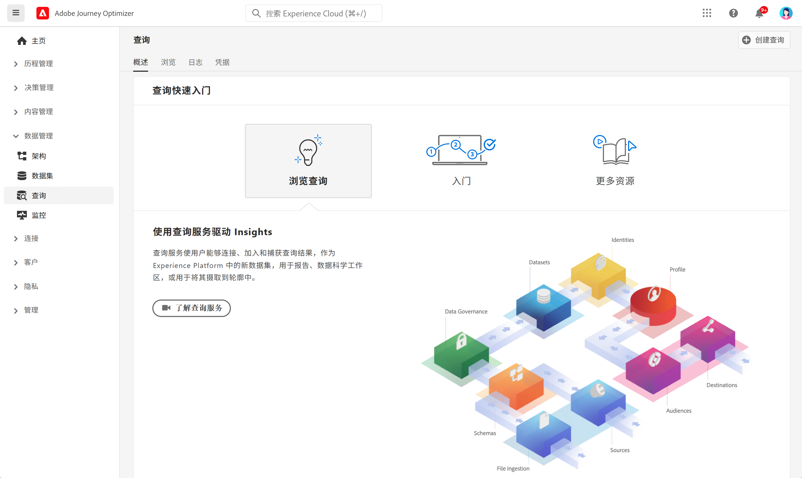

# 查询入门 {#queries-gs}

查询编辑器是 Adobe Experience Platform 查询服务提供的一款交互式工具，它允许您在 [!DNL Adobe Journey Optimizer] 用户界面中编写、验证和运行客户体验数据查询。

查询编辑器支持开发用于分析和数据探索的查询，并且允许您运行交互式查询以用于开发目的，以及非交互式查询以用于填充[数据集](get-started-datasets.md)。

在[本文档](https://experienceleague.adobe.com/docs/experience-platform/query/ui/user-guide.html?lang=zh-Hans){target="_blank"}中了解如何使用查询编辑器。

**另请参阅**

* [查询服务文档](https://experienceleague.adobe.com/docs/experience-platform/query/home.html?lang=zh-Hans){target="_blank"}
* [查询服务概述视频](https://experienceleague.adobe.com/docs/platform-learn/tutorials/queries/understanding-query-service.html?lang=zh-Hans){target="_blank"}
