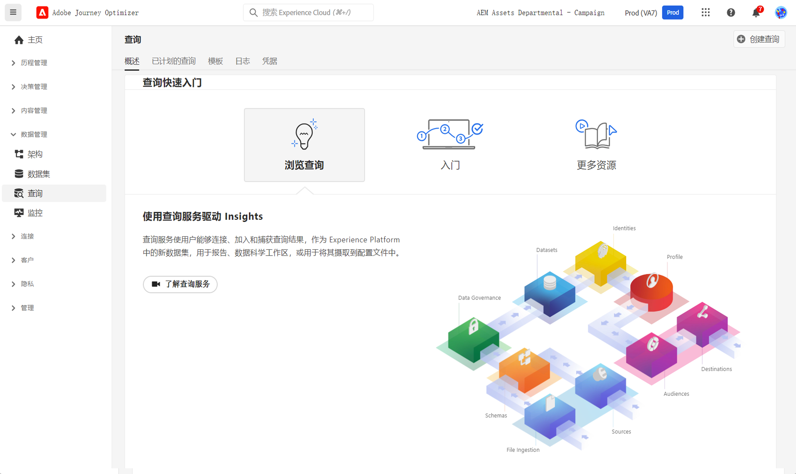

# 查询入门 {#queries-gs}

查询编辑器是Adobe Experience Platform查询服务提供的一款交互式工具，它允许您在中编写、验证和运行客户体验数据查询 [!DNL Adobe Journey Optimizer] 用户界面。

查询编辑器支持开发用于分析和数据分析的查询，并且允许您运行交互式查询以用于开发目的，以及用于填充的非交互式查询 [数据集](get-started-datasets.md).

了解如何在中使用查询编辑器 [本文档](https://experienceleague.adobe.com/docs/experience-platform/query/ui/user-guide.html){target="_blank"}.

**另请参阅**

* [查询服务文档](https://experienceleague.adobe.com/docs/experience-platform/query/home.html?lang=zh-Hans){target="_blank"}
* [查询服务概述视频](https://experienceleague.adobe.com/docs/platform-learn/tutorials/queries/understanding-query-service.html?lang=zh-CN){target="_blank"}
