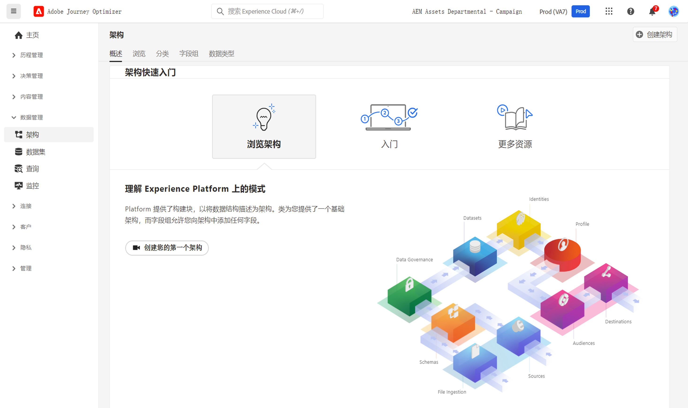

# 架构入门 {#schemas-gs}

架构是用于描述 Experience Platform 中数据的标准方式，符合架构的所有数据可以在组织中重复使用，而不会发生冲突，甚至可以在多个组织之间共享。

➡️ [在此视频中了解如何创建和配置架构](#video-schema)（视频）

架构是一组规则，用于表示和验证数据的结构和格式。在高层面上，架构提供了真实世界对象（如人）的抽象定义，并概括了该对象的每个实例中应包含哪些数据（如名字、姓氏、生日等）。

在本[文档](https://experienceleague.adobe.com/docs/experience-platform/xdm/schema/composition.html?lang=zh-Hans){target="_blank"}中了解如何构建架构

[!DNL Adobe Journey Optimizer] 用户界面中的&#x200B;**架构**&#x200B;工作区允许您管理 Experience Data Model (XDM) 资源，包括架构、类别、架构字段组和数据类型。您可以查看和浏览由 Adobe 提供的核心资源，并为贵组织创建自定义资源和架构。

在[本文档](https://experienceleague.adobe.com/docs/experience-platform/xdm/ui/overview.html?lang=zh-Hans){target="_blank"}中了解如何使用“架构”用户界面

有关使用“架构编辑器”创建架构的分步文档，请参阅[本页](https://experienceleague.adobe.com/docs/experience-platform/xdm/tutorials/create-schema-ui.html?lang=zh-Hans){target="_blank"}

要查看每个架构字段和属性的完整列表，请参阅 [Journey Optimizer 架构词典](https://experienceleague.adobe.com/tools/ajo-schemas/schema-dictionary.html?lang=zh-Hans){target="_blank"}。

## 操作方法视频{#video-schema}

了解如何创建架构、添加字段组、创建和配置自定义字段组。

>[!VIDEO](https://video.tv.adobe.com/v/334461?quality=12)

**另请参阅**

* [创建架构、数据集并摄取数据，以在 Journey Optimizer 中添加测试用户档案](../audience/creating-test-profiles.md)
* [XDM 系统概述](https://experienceleague.adobe.com/docs/experience-platform/xdm/home.html?lang=zh-Hans){target="_blank"}
* [数据建模的最佳实践](https://experienceleague.adobe.com/docs/experience-platform/xdm/schema/best-practices.html?lang=zh-Hans){target="_blank"}
* [使用“架构注册表 API”创建架构](https://experienceleague.adobe.com/docs/experience-platform/xdm/tutorials/create-schema-api.html?lang=zh-Hans){target="_blank"}
* [使用“架构编辑器”定义两个架构之间的关系](https://experienceleague.adobe.com/docs/experience-platform/xdm/tutorials/relationship-ui.html?lang=zh-Hans){target="_blank"}
