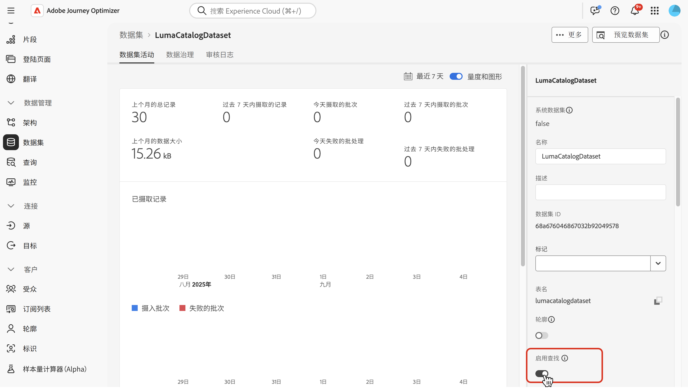
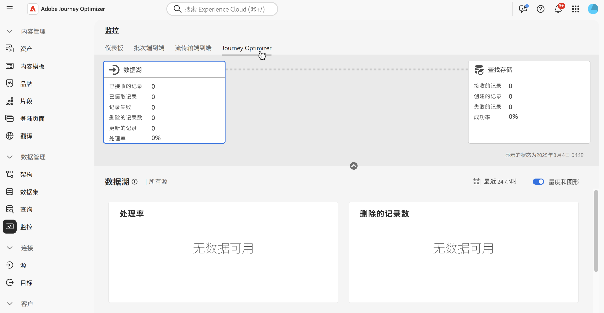

# 使用 Adobe Experience Platform 数据 {#aep-data}

>[!CONTEXTUALHELP]
>id="lookup-aep-data"
>title="启用查找"
>abstract="为查找启用数据集允许您在Journey Optimizer个性化、Decisioning和Journey Orchestration功能中利用其数据。"

通过Journey Optimizer，您可以利用来自Adobe Experience Platform数据的个性化、决策和Journey Orchestration功能。 要实现此目的，必须首先按照如下所述为查找服务启用查找个性化所需的基于记录的数据集。

## 必读

### 护栏和准则 {#guidelines}

在开始之前，请查看以下限制和准则：

* 启用查找的数据集不应包含任何个人身份信息(PII)。
* 为查找而启用并在个性化中使用的数据集无法防止删除。 至于将哪些数据集用于个性化，将由您自行跟踪，以确保不会删除或删除这些数据集。
* 数据集必须与不属于配置文件或事件类型的架构关联。
* 架构必须具有主标识。 只能使用单个主键进行查找。

### 查找服务的权利

| 功能组件 | 限制 | 注释 |
| ------- | ------- | ------- |
| 已启用查找数据集 | 每个组织最多10个 | 可配置为在任意给定时间进行查找的最大数据集数。 此限制适用于客户实例内生产和开发沙盒中的查找数据集的总组合数。 |
| 数据集记录计数 | 每个数据集最多200万条记录 | 单个数据集中允许的最大记录数，计算为该数据集内所有批次的总数。 |
| 记录大小 | 每条记录高达2 KB | 支持的默认最大记录大小。 |
| 数据集大小 | 高达4 GB | 单个数据集的最大大小，而不是沙盒中所有数据集的组合大小。 记录数和数据集大小限制是独立的护栏 — 必须同时满足这两个条件。 |
| 数据集频率更新 | 每个数据集每天最多可进行5次更新 | 每天单个数据集允许的最大更新操作频率。 |

>[!NOTE]
>
>如果除了上面列出的护栏之外还需要其他卷，请联系您的Adobe代表。

## 启用数据集进行数据查找 {#enable}

要将数据集中的数据用于个性化，您需要启用数据集以进行查找。

### 先决条件 {#prerequisites-enable}

与要启用查找的数据集关联的架构必须是记录类型。 架构不应属于配置文件或事件类。

+++示例


+++

架构必须定义主标识。

+++示例


+++

如果尚未定义自定义命名空间，请确保该身份是非人员标识符。

+++示例


+++

### 在数据集管理界面中启用数据集以进行查找

在数据集管理用户界面中，使用切换开关启用数据集以供查找。



>[!NOTE]
>
>建议不要为配置文件启用该数据集，因为这样可能会导致配置文件丰富度增加，并且无需执行查找。

### API方法

按照[本文档](https://developer.adobe.com/journey-optimizer-apis/references/authentication/)中详述的说明配置环境以发送API命令。

#### 先决条件

* 开发人员项目必须将Adobe Journey Optimizer和Adobe Experience Platform API添加到其项目中。

  

* 作为您的角色的一部分，您必须具有管理数据集权限。

* 数据集所基于的架构必须包含一个可充当查找键的主标识。

#### API调用结构

```shell
curl -s -XPATCH "https://platform.adobe.io/data/core/entity/lookup/dataSets/${DATASET_ID}/${ACTION}" \ -H "Authorization: Bearer ${ACCESS_TOKEN}" \ -H "x-api-key: ${API_KEY}" \ -H "x-gw-ims-org-id: ${IMS_ORG}" \ -H "x-sandbox-name: ${SANDBOX_NAME}" 
```

其中：

* URL为`https://platform.adobe.io/data/core/entity/lookup/dataSets/${DATASET_ID}/${ACTION}`
* 数据集ID是您希望启用的数据集。
* 操作是启用或禁用。
* 可以从开发人员控制台中检索访问令牌。
* 可以从开发人员控制台检索API密钥。
* IMS组织ID是您的Adobe组织。
* 沙盒名称是数据集所在的沙盒名称（即prod、dev等）。

>[!NOTE]
>
>如果在尝试通过API调用启用数据集时遇到以下错误，请尝试从开发人员控制台项目中移除Adobe Journey Optimizer API，然后重新添加它们：
>
>`"error_code": "403003",`
>`"message": "Api Key is invalid"`

## 数据集监控

启用数据集进行查找后，您可以通过转到&#x200B;**[!UICONTROL 监视]**&#x200B;菜单并选择&#x200B;**[!UICONTROL Journey Optimizer]**&#x200B;选项卡来查看摄取到查找服务的状态。

此流程指示器有助于了解查找服务中何时提供了新批次的数据。



## 后续步骤

在使用API调用启用数据集查找后，您可以将数据用于[!DNL Journey Optimizer]个性化和决策功能。 有关详细信息，请参阅以下部分：

* [使用 Adobe Experience Platform 数据进行个性化设置](../personalization/aep-data-perso.md)
* [使用 Adobe Experience Platform 数据进行决策制定](../experience-decisioning/aep-data-exd.md)
* [将Adobe Experience Platform数据用于Journey Orchestration](../building-journeys/dataset-lookup.md)
