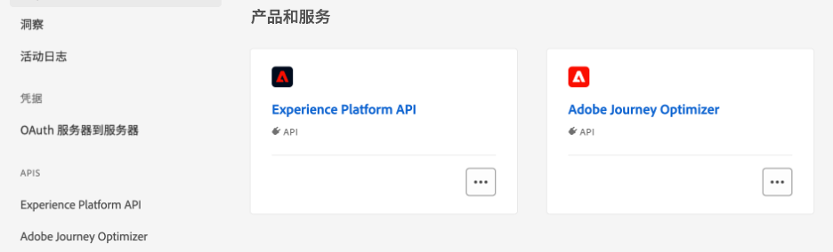

# 使用Adobe Experience Platform数据 {#aep-data}

>[!AVAILABILITY]
>
>此功能目前作为公共测试版向所有客户提供。
>
>要使用此功能，您必须首先接受贵组织的Beta版条款。

Journey Optimizer允许您在[!DNL Journey Optimizer]中利用Adobe Experience Platform中的数据。 为此，必须首先通过API调用启用查找个性化所需的数据集，如下所述。 完成后，您可以将其数据用于[!DNL Journey Optimizer]个性化和决策功能。

## Beta限制和准则 {#guidelines}

在开始之前，请查看以下限制和准则：

* **数据集大小**&#x200B;在生产数据集上限制为5 GB，在开发沙盒数据集中限制为1 GB
* **在任何时候，每个组织最多可以启用50个数据集**&#x200B;以进行查找。
* **记录数**&#x200B;在生产数据集中限制为5M，在开发沙盒数据集中限制为1M。
* **数据使用标签和强制执行**&#x200B;目前未对启用查找的数据集强制执行。
* **启用查找并用于个性化设置的数据集不受删除保护**。 至于将哪些数据集用于个性化，将由您自行跟踪，以确保不会删除或删除这些数据集。
* **数据使用标签和强制执行**&#x200B;目前未对启用查找的数据集强制执行。

## 启用数据集进行数据查找 {#enable}

为了利用来自数据集的数据进行个性化，您需要使用API调用检索其状态并启用查找服务。

### 先决条件 {#prerequisites-enable}

* 按照[本文档](https://developer.adobe.com/journey-optimizer-apis/references/authentication/)中详述的说明配置环境以发送API命令。
* 开发人员项目必须将Adobe Journey Optimizer和Adobe Experience Platform API添加到其项目中。

  

* 作为您的角色的一部分，您必须具有管理数据集权限。
* 数据集所基于的架构必须包含可用作查找键的&#x200B;**主标识**。

### API调用结构 {#call}

```
curl -s -XPATCH "https://platform.adobe.io/data/core/entity/lookup/dataSets/${DATASET_ID}/${ACTION}" \ -H "Authorization: Bearer ${ACCESS_TOKEN}" \ -H "x-api-key: ${API_KEY}" \ -H "x-gw-ims-org-id: ${IMS_ORG}" \ -H "x-sandbox-name: ${SANDBOX_NAME}"
```

其中：

* **URL**&#x200B;是`https://platform.adobe.io/data/core/entity/lookup/dataSets/${DATASET_ID}/${ACTION}`
* **数据集ID**&#x200B;是您希望启用的数据集。
* **操作**&#x200B;被启用或禁用。
* 可以从开发人员控制台检索&#x200B;**访问令牌**。
* 可从开发人员控制台检索&#x200B;**API密钥**。
* **IMS组织ID**&#x200B;是您的Adobe组织。
* **沙盒名称**&#x200B;是数据集所在的沙盒名称（即prod、dev等）。

>[!NOTE]
>
>如果在尝试通过API调用启用数据集时遇到以下错误，请尝试从开发人员控制台项目中移除Adobe Journey Optimizer API，然后重新添加它们。
>
>```
>
>"error_code": "403003", 
>"message": "Api Key is invalid"
>
>```

在使用API调用启用数据集查找后，您可以将其数据用于[!DNL Journey Optimizer]个性化和决策功能。

* [使用 Adobe Experience Platform 数据进行个性化设置](../personalization/aep-data-perso.md)
* [使用Adobe Experience Platform数据做出决策](../experience-decisioning/aep-data-exd.md)
