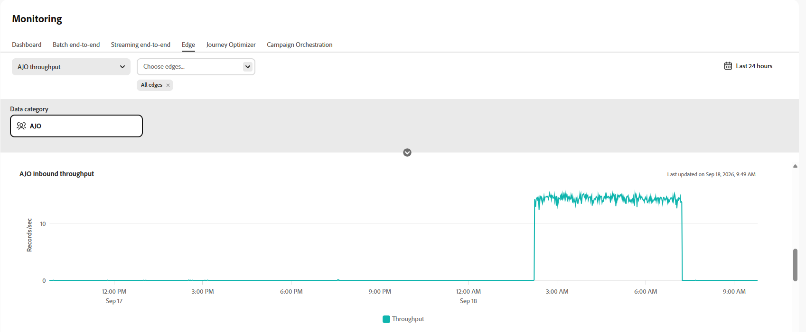
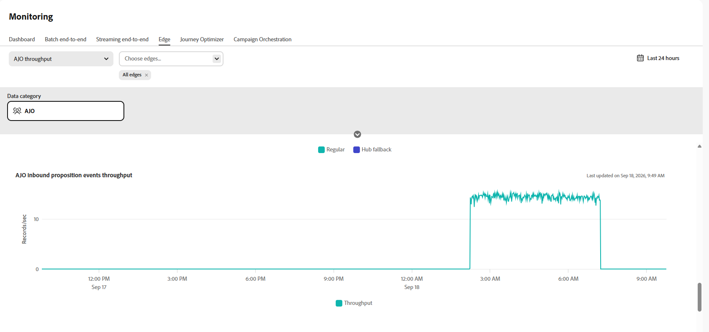

# 监测入站数据{#monitoring-edge}

>[!BEGINSHADEBOX]

**在此页面上：**&#x200B;使用&#x200B;**[!UICONTROL 数据管理]** > **[!UICONTROL 监控]** > **[!UICONTROL Edge]**&#x200B;中提供的图形监视[!DNL Adobe Journey Optimizer]中的入站数据运行状况。

>[!ENDSHADEBOX]

**[!UICONTROL 监控]**&#x200B;工作区包含以下选项卡：

| 选项卡 | 描述 | 文档 |
|---|---|---|
| **[!UICONTROL 仪表板]** | 查看数据流中的数据流活动和状态。 | [数据流监视仪表板](https://experienceleague.adobe.com/zh-hans/docs/experience-platform/dataflows/ui/monitor){target="_blank"} |
| **[!UICONTROL 批次端对端]** | 监测批量摄取数据的端到端流量和质量。 | [批处理端到端数据摄取](https://experienceleague.adobe.com/zh-hans/docs/experience-platform/ingestion/quality/monitor-data-ingestion#monitor-batch-end-to-end-data-ingestion){target="_blank"} |
| **[!UICONTROL 流传输端到端]** | 监控流摄取数据的端到端流量和质量。 | [流式处理端对端数据摄取](https://experienceleague.adobe.com/zh-hans/docs/experience-platform/ingestion/quality/monitor-data-ingestion#monitor-streaming-end-to-end-data-ingestion){target="_blank"} |
| **[!UICONTROL Edge]** | 监测发送到Edge Network的数据。 本页记录了该选项卡中可用的Journey Optimizer特定图形。 | [监视Edge数据流](https://experienceleague.adobe.com/zh-hans/docs/experience-platform/dataflows/ui/monitor-edge){target="_blank"} |

## 在Edge中监控Journey Optimizer数据

以下图形在&#x200B;**[!UICONTROL 数据管理]** > **[!UICONTROL 监控]** > **[!UICONTROL Edge]**&#x200B;中可用。

从下拉菜单中选择&#x200B;**[!UICONTROL AJO吞吐量]**。

### AJO网关吞吐量 {#gateway-throughput}

**[!UICONTROL AJO网关吞吐量]**&#x200B;图形显示一段时间内每秒由Journey Optimizer网关处理的记录总数。 使用此量度可监视网关处理的入站请求的总量。

### AJO入站吞吐量 {#inbound-throughput}

**[!UICONTROL AJO入站吞吐量]**&#x200B;图形显示一段时间内每秒接收的入站记录总数。 此量度测量集客记录到达Edge服务的速率。 使用此图表可查看入站数据量，并识别流量级别的更改。

### AJO入站吞吐量细分 {#inbound-throughput-breakdown}

**[!UICONTROL AJO入站吞吐量细分]**&#x200B;图形显示一段时间内每秒接收的入站记录，并按位置进行细分。 此量度测量每个位置的入站记录率。 使用此图表可以比较不同位置的入站流量，并识别流量出现异常增加或减少的位置。

### AJO入站延迟 {#inbound-latency}

**[!UICONTROL AJO入站延迟]**&#x200B;图形显示处理入站请求所需的时间（以毫秒为单位）。 此量度以延迟值的分布形式呈现，包括百分位数如P50和P90。 使用这些值可以了解典型的请求延迟并识别延迟较高的请求。

### AJO入站建议事件吞吐量 {#inbound-proposition-events-throughput}

**[!UICONTROL AJO入站建议事件吞吐量]**&#x200B;图形显示建议事件随时间变化的吞吐量。 此量度测量当用户与个性化优惠交互、查看或触发个性化优惠时生成的跟踪信号。

### AJO入站建议事件吞吐量（按渠道） {#inbound-proposition-events-throughput-channel}

**[!UICONTROL AJO按渠道列出的入站建议事件吞吐量]**&#x200B;图形显示按入站渠道列出的建议事件吞吐量。 此量度衡量按渠道分组的建议事件活动。 可用的渠道包括CBE、应用程序内和内容卡。 使用此图表可比较入站渠道中的活动。

### AJO入站建议事件吞吐量（按事件类型） {#inbound-proposition-events-throughput-event-type}

**[!UICONTROL AJO按事件类型列出的入站建议事件吞吐量]**&#x200B;图形显示按事件类型列出的建议事件吞吐量。 此量度衡量按结果分组的建议事件活动。 可用的事件类型包括已消除、已抑制、已显示、已触发、已交互和已发送。 使用此图表可以确定哪些建议事件结果对总体活动做出了贡献。

{{$include /help/_includes/do-not-localize/data/ai-augmented-monitoring.md}}