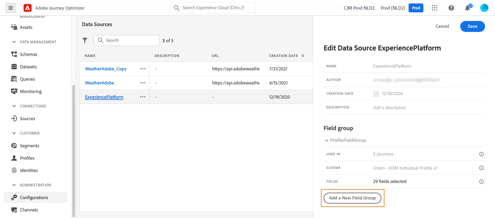

# Adobe Experience Platform 数据源 {#adobe-experience-platform-data-source}

>[!CONTEXTUALHELP]
>id="ajo_journey_data_source_built_in"
>title="Adobe Experience Platform 数据源"
>abstract="Adobe Experience Platform 数据源定义与 Adobe 实时客户轮廓的连接。 此数据源是内置数据源，经过预先配置，无法删除。 它设计用于从实时客户轮廓服务中检索并使用数据（例如，检查进入历程的人是否为女性）。"

Adobe Experience Platform 数据源定义与 Adobe 实时客户轮廓的连接。 此数据源是内置数据源，经过预先配置，无法删除。 此数据源旨在检索和使用来自Real-time Customer Profile Service的数据（例如，检查进入历程的人员是否为女性）。 有关Adobe Real-time Customer Profile的详细信息，请参阅[Adobe Experience Platform文档](https://experienceleague.adobe.com/docs/experience-platform/profile/home.html?lang=zh-Hans){target="_blank"}。

要允许与Real-time Customer Profile Service的连接，我们必须使用键来识别人员，并使用命名空间来将键进行上下文化。 因此，仅当历程以包含键和命名空间的事件开始时，才能使用此数据源。 [了解详情](../building-journeys/journey.md)。

您可以编辑名为“ProfileFieldGroup”的预配置字段组、添加新字段组并删除任何草稿或实时历程中未使用的字段组。 [了解更多](../datasource/configure-data-sources.md#define-field-groups)。

>[!CAUTION]
>
>不支持在历程表达式/条件中使用体验事件。 如果您的用例需要使用体验事件，请考虑替代方法。 [了解详情](../building-journeys/exp-event-lookup.md)

将字段组添加到内置数据源的主要步骤详述如下：

1. 从数据源列表中，选择内置&#x200B;**Adobe Experience Platform**&#x200B;数据源。

   这将打开屏幕右侧的数据源配置窗格。

   

1. 选择&#x200B;**[!UICONTROL 添加新字段组]**&#x200B;以定义要检索的[新字段系列](../datasource/configure-data-sources.md#define-field-groups)。

   

1. 从&#x200B;**[!UICONTROL 架构]**&#x200B;下拉列表中选择架构。 架构创建在Adobe Experience Platform中执行，而不是在Adobe Journey Optimizer中执行。

   >[!NOTE]
   >
   >[!DNL Journey Optimizer] Data Source配置中仅支持XDM基于个人资料的架构。 有关详细信息，请参阅[XDM个人配置文件类](https://experienceleague.adobe.com/zh-hans/docs/experience-platform/xdm/classes/individual-profile){target="_blank"}。

1. 选择要使用的字段，并保存更改。

>[!TIP]
>
>将鼠标悬停在字段组的名称上可在右侧显示两个图标。 使用这些字段&#x200B;**复制**&#x200B;或&#x200B;**删除**&#x200B;字段组。 请注意，仅当字段组未用于任何&#x200B;**实时**、**草稿**&#x200B;或&#x200B;**已完成**&#x200B;历程时，**[!UICONTROL 删除]**&#x200B;图标才可用。 请参阅&#x200B;**[!UICONTROL Used in]**&#x200B;字段以检查是否出现这种情况。
