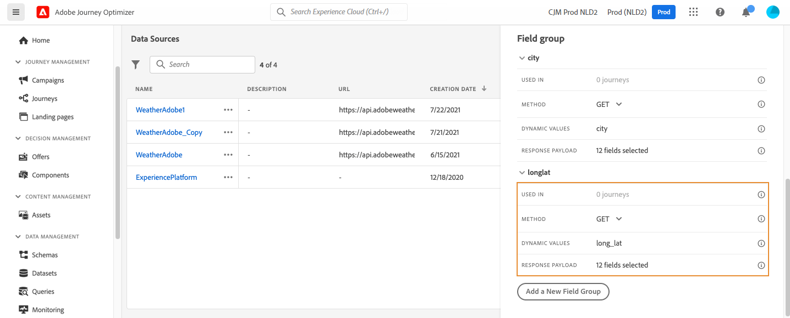

# 外部数据源 {#external-data-sources}

>[!CONTEXTUALHELP]
>id="ajo_journey_data_source_custom"
>title="外部数据源"
>abstract="外部数据源允许您定义与第三方系统的连接，例如，如果您使用酒店预订系统来检查人员是否已注册了房间。 与内置的Adobe Experience Platform数据源不同，您可以根据需要创建尽可能多的外部数据源。"

外部数据源允许您定义与第三方系统的连接，例如，如果您使用酒店预订系统来检查人员是否已注册了房间。 与内置的Adobe Experience Platform数据源不同，您可以根据需要创建尽可能多的外部数据源。

>[!NOTE]
>
>使用外部系统时的护栏列在 [本页](../configuration/external-systems.md).

支持使用POST或GET的REST API以及返回JSON。 支持API密钥、基本和自定义身份验证模式。

让我们以天气API服务为例，我想使用该服务根据实时天气数据自定义我的历程的行为。

以下是两个API调用示例：

* _https://api.adobeweather.org/weather?city=London,uk&amp;appid=1234_
* _https://api.adobeweather.org/weather?lat=35&amp;lon=139&amp;appid=1234_

调用由一个主URL(_https://api.adobeweather.org/weather_)、两个参数集（“city”表示城市，“lat/long”表示纬度和经度）和API密钥(appid)。

以下是创建和配置新外部数据源的主要步骤：

1. 在数据源列表中，单击 **[!UICONTROL Create Data Source]** 创建新的外部数据源。

   

   这将打开屏幕右侧的数据源配置窗格。

   

1. 输入数据源的名称。

   >[!NOTE]
   >
   >请勿使用空格或特殊字符。 请勿使用超过30个字符。

1. 向数据源添加描述。 此步骤是可选的。
1. 添加外部服务的URL。 在本例中： _https://api.adobeweather.org/weather_.

   >[!CAUTION]
   >
   >出于安全原因，我们强烈建议使用HTTPS。 另请注意，我们不允许使用非公开的Adobe地址和IP地址。

   

1. 根据外部服务配置配置身份验证： **[!UICONTROL No authentication]**, **[!UICONTROL Basic]**, **[!UICONTROL Custom]** 或 **[!UICONTROL API key]**. 有关自定义身份验证模式的更多信息，请参阅 [此部分](../datasource/external-data-sources.md#custom-authentication-mode). 在本例中，我们选择：

   * **[!UICONTROL Type]**:&quot;API密钥&quot;
   * **[!UICONTROL Name]**:&quot;appid&quot;（这是API密钥参数名称）
   * **[!UICONTROL Value]**:“1234”（这是API密钥的值）
   * **[!UICONTROL Location]**:“查询参数”（API密钥位于URL中）

   

1. 通过单击 **[!UICONTROL Add a New Field Group]**. 请勿在字段组名称中使用空格或特殊字符。 在本例中，我们需要创建两个字段组，每个参数集（城市和长/纬度）各一个。

对于“long/lat”参数集，我们会创建一个包含以下信息的字段组：

* **[!UICONTROL Used in]**:显示使用字段组的历程数。 您可以单击 **[!UICONTROL View journeys]** 图标以显示使用此字段组的历程列表。
* **[!UICONTROL Method]**:选择POST或GET方法。 在本例中，我们选择GET方法。
* **[!UICONTROL Dynamic Values]**:在我们的示例中，输入以逗号分隔的不同参数“long，lat”。 由于参数值取决于执行上下文，因此将在历程中定义它们。 [了解更多](../building-journeys/expression/expressionadvanced.md)
* **[!UICONTROL Response Payload]**:在 **[!UICONTROL Payload]** 字段并粘贴由调用返回的有效负载示例。 例如，我们使用了在天气API网站上找到的有效负载。 验证字段类型是否正确。 每次调用API时，系统将检索有效负载示例中包含的所有字段。 请注意，您可以单击 **[!UICONTROL Paste a new payload]** 如果要更改当前传递的有效负载。
* **[!UICONTROL Sent Payload]**:在我们的示例中不显示此字段。 仅当选择POST方法时，才可使用该函数。 粘贴将发送到第三方系统的有效负载。

如果GET调用需要参数，请在 **[!UICONTROL Dynamic Values]** 字段中，且这些字段会在调用结束时自动添加。 如果发生POST调用，您需要：

* 列出在 **[!UICONTROL Dynamic Values]** 字段(在以下示例中为：&quot;identifier&quot;)。
* 在发送的有效负载正文中，使用完全相同的语法指定它们。 为此，您需要添加：&quot;param&quot;:“您的参数名称”(在以下示例中为：&quot;identifier&quot;)。 请遵循以下语法：

   ```
   {"id":{"param":"identifier"}}
   ```



单击 **[!UICONTROL Save]**.

数据源现已配置完毕，可随时用于您的历程，例如在您的条件中或个性化电子邮件中。 如果温度高于30°C，您可以决定发送特定通信。

## 自定义身份验证模式{#custom-authentication-mode}

>[!CONTEXTUALHELP]
>id="jo_authentication_payload"
>title="关于自定义身份验证"
>abstract="自定义身份验证模式用于复杂身份验证，以调用OAuth2等API封装协议。 操作执行分为两步。 首先，执行对端点的调用以生成访问令牌。 然后，访问令牌将插入操作的HTTP请求中。"

此身份验证模式用于复杂的身份验证，通常用于调用OAuth2等API封装协议，以检索要插入到操作的实际HTTP请求中的访问令牌。

配置自定义身份验证时，您可以单击下面的按钮以检查自定义身份验证有效负载是否正确配置。


如果测试成功，按钮将变为绿色。


通过此身份验证，操作执行分为两步：

1. 调用端点以生成访问令牌。
1. 通过以正确的方式插入访问令牌来调用REST API。

此身份验证分为两部分。

要调用以生成访问令牌的端点的定义：

* 端点：用于生成端点的URL
* 端点上HTTP请求的方法（GET或POST）
* 标题：键值对将作为标头插入此调用（如果需要）
* 正文：描述在方法为POST时调用的正文。 我们支持在bodyParams（键值对）中定义的有限主体结构。 bodyType描述调用中主体的格式和编码：
   * “form”：这意味着内容类型将为application/x-www-form-urlencoded(charset UTF-8)，键值对将按原样序列化：key1=value1&amp;key2=value2&amp;...
   * “json”：这表示内容类型将为application/json(charset UTF-8)，键值对将序列化为json对象，如下所示： _{ &quot;key1&quot;:&quot;value1&quot;, &quot;key2&quot;:&quot;value2&quot;,...}_

在操作的HTTP请求中必须插入访问令牌方式的定义：

* authorizationType:定义如何在操作的HTTP调用中插入生成的访问令牌。 可能的值包括：

   * 持牌人：指示必须在授权标头中插入访问令牌，例如： _授权：持有者 &lt;access token=&quot;&quot;>_
   * 标题：指示必须作为标头插入访问令牌，即由tokenTarget属性定义的标头名称。 例如，如果tokenTarget是myHeader，则访问令牌将作为标头插入，如下所示： _myHeader: &lt;access token=&quot;&quot;>_
   * queryParam:指示访问令牌必须作为queryParam插入，查询参数名称由属性tokenTarget定义。 例如，如果tokenTarget是myQueryParam，则操作调用的URL将为： _&lt;url>?myQueryParam=&lt;access token=&quot;&quot;>_

* tokenInResponse:指示如何从身份验证调用中提取访问令牌。 此属性可以是：
   * “response”：指示HTTP响应是访问令牌
   * json中的选择器（假定响应是json，我们不支持XML等其他格式）。 此选择器的格式为 _json://&lt;path to=&quot;&quot; the=&quot;&quot; access=&quot;&quot; token=&quot;&quot; property=&quot;&quot;>_. 例如，如果调用的响应为： _{ &quot;access_token&quot;:&quot;theToken&quot;、&quot;timestamp&quot;:12323445656 }_，则tokenInResponse将为： _json://access_token_

此身份验证的格式为：

```
{
    "type": "customAuthorization",
    "authorizationType": "<value in 'bearer', 'header' or 'queryParam'>",
    (optional, mandatory if authorizationType is 'header' or 'queryParam') "tokenTarget": "<name of the header or queryParam if the authorizationType is 'header' or 'queryParam'>",
    "endpoint": "<URL of the authentication endpoint>",
    "method": "<HTTP method to call the authentication endpoint, in 'GET' or 'POST'>",
    (optional) "headers": {
        "<header name>": "<header value>",
        ...
    },
    (optional, mandatory if method is 'POST') "body": {
        "bodyType": "<'form'or 'json'>,
        "bodyParams": {
            "param1": value1,
            ...

        }
    },
    "tokenInResponse": "<'response' or json selector in format 'json://<field path to access token>'"
}
```

您可以更改自定义身份验证数据源的令牌的缓存时长。 以下是自定义身份验证有效负载的示例。 缓存持续时间在“cacheDuration”参数中定义。 它指定缓存中生成的令牌的保留持续时间。 单位可以是毫秒、秒、分钟、小时、天、月、年。

```
"authentication": {
    "type":"customAuthorization",
    "authorizationType":"Bearer",
    "endpoint":"http://localhost:${port}/epsilon/oauth2/access_token",
    "method":"POST",
    "headers": {
        "Authorization":"Basic EncodeBase64(${epsilonClientId}:${epsilonClientSecret})"
        },
    "body": {
        "bodyType":"form",
        "bodyParams": {
             "scope":"cn mail givenname uid employeeNumber",
             "grant_type":"password",
             "username":"${epsilonUserName}",
             "password":"${epsilonUserPassword}"
             }
        },
    "tokenInResponse":"json://access_token",
    "cacheDuration":
             { "duration":5, "timeUnit":"seconds" }
    }
```

>[!NOTE]
>
>缓存持续时间有助于避免对身份验证端点的调用过多。 身份验证令牌保留已缓存在服务中，不存在持久性。 如果服务重新启动，则会以干净的缓存启动。 默认情况下，缓存持续时间为1小时。 在自定义身份验证有效负载中，可以通过指定另一个保留持续时间来调整该有效负载。
