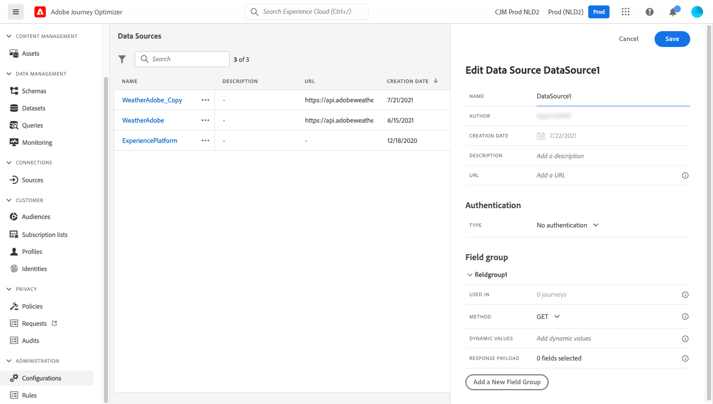

# 外部数据源 {#external-data-sources}

>[!CONTEXTUALHELP]
>id="ajo_journey_data_source_custom"
>title="外部数据源"
>abstract="外部数据源允许您与第三方系统建立连接，例如在使用酒店预订系统时，可通过该连接检查用户是否已登记房间。与内置 Adobe Experience Platform 数据源相反，您可以根据需要创建尽可能多的外部数据源。"

## 使用外部数据源 {#gs-ext-data-sources}

外部数据源允许您与第三方系统建立连接，例如在使用酒店预订系统时，可通过该连接检查用户是否已登记房间。与内置 Adobe Experience Platform 数据源相反，您可以根据需要创建尽可能多的外部数据源。

>[!NOTE]
>
>* [此页面](../configuration/external-systems.md)上列出了使用外部系统时的护栏。
>
>* 由于现在支持响应，因此您应该对外部数据源用例使用自定义操作而不是数据源。 有关回应的详细信息，请参阅此[部分](../action/action-response.md)

支持使用 POST 或 GET 的 REST API 和返回 JSON。支持 API 密钥、基本和自定义身份验证模式。

让我们举一个天气 API 服务的例子，我想借助该服务根据实时天气数据定制我的历程的行为。

以下是两个 API 调用示例：

* _https://api.adobeweather.org/weather?city=London,uk&amp;appid=1234_
* _https://api.adobeweather.org/weather?lat=35&amp;lon=139&amp;appid=1234_

该调用由一个主 URL (_https://api.adobeweather.org/weather_)、两个参数集（“city”表示城市，“lat/long”表示纬度和经度）和 API 密钥 (appid) 组成。

>[!TIP]
>
>我们建议在外部API的令牌有效期与Journey Optimizer [`cacheDuration`设置](#custom-authentication-access-token)之间至少保留一分钟的缓冲区，特别是在工作负载较重的情况下，以避免过期不匹配和401错误。

## 创建和配置外部数据源 {#create-ext-data-sources}

以下是创建和配置新外部数据源的主要步骤：

1. 在数据源列表中，单击&#x200B;**[!UICONTROL 创建数据Source]**&#x200B;以创建新的外部数据源。

   

   这将打开屏幕右侧的数据源配置窗格。

   

1. 输入数据源的名称。

只允许使用字母数字字符和下划线。 最大长度为30个字符。

1. 向数据源添加描述。此步骤是可选的。
1. 添加外部服务的 URL。在我们的示例中：_https://api.adobeweather.org/weather_。

   >[!CAUTION]
   >
   >出于安全原因，我们强烈建议使用 HTTPS。另请注意，我们不允许使用非公开的Adobe地址和IP地址。

   

1. 根据外部服务配置配置身份验证： **[!UICONTROL 无身份验证]**、**[!UICONTROL 基本]**、**[!UICONTROL 自定义]**&#x200B;或&#x200B;**[!UICONTROL API密钥]**。

   对于基本身份验证模式，您需要填写用户名和密码。

   >[!NOTE]
   >
   >* 执行身份验证调用时，在Authentication标头中添加以base64编码的字符串`<username>:<password>`。
   >
   >* Adobe Journey Optimizer会自动加密在自定义操作中定义的密钥。 每个组织的加密密钥都在一个与其组织绑定的专用保险库中受到安全管理。 当凭据显示在界面中时，默认情况下它们会被掩盖，以防止意外泄露。


   有关自定义身份验证模式的详细信息，请参阅[此部分](../datasource/external-data-sources.md#custom-authentication-mode)。 在我们的示例中，我们选择API密钥身份验证模式，如下所示：

   * **[!UICONTROL 类型]**： &quot;API密钥&quot;
   * **[!UICONTROL 名称]**：“appid”（这是API密钥参数名称）
   * **[!UICONTROL 值]**：“1234”（这是我们API密钥的值）
   * **[!UICONTROL 位置]**：“查询参数”（API密钥位于URL中）

     

1. 通过单击&#x200B;**[!UICONTROL 添加新字段组]**，为每个API参数集添加新字段组。 字段组名称中只允许使用字母数字字符和下划线。 最大长度为30个字符。 在我们的示例中，我们需要创建两个字段组，每个参数集（“city”和“long/lat”）各一个。

对于“long/lat”参数集，我们创建一个包含以下信息的字段组：

* **[!UICONTROL 用于]**：显示使用字段组的历程数。 您可以单击&#x200B;**[!UICONTROL 查看历程]**&#x200B;图标以显示使用此字段组的历程列表。
* **[!UICONTROL 方法]**：选择POST或GET方法。 在我们的示例中，我们选择 GET 方法。
* **[!UICONTROL 动态值]**：在我们的示例中，输入以逗号分隔的不同参数“long，lat”。 由于参数值取决于执行上下文，因此将在历程中进行定义。[了解详情](../building-journeys/expression/expressionadvanced.md)
* **[!UICONTROL 响应有效负载]**：在&#x200B;**[!UICONTROL 有效负载]**&#x200B;字段中单击，并粘贴调用返回的有效负载示例。 例如，我们使用了在天气 API 网站上找到的有效负载。验证字段类型是否正确。每次调用 API 时，系统将检索有效负载示例中包含的所有字段。请注意，如果要更改当前传递的有效负载，可以单击&#x200B;**[!UICONTROL 粘贴新的有效负载]**。
* **[!UICONTROL 已发送有效负载]**：在我们的示例中不显示此字段。 仅当选择 POST 方法时才可用。粘贴将发送到第三方系统的有效负载。

如果GET调用需要参数，请在&#x200B;**[!UICONTROL 动态值]**&#x200B;字段中输入参数，这些参数将在调用结束时自动添加。 如果是 POST 调用，您需要：

* 在&#x200B;**[!UICONTROL 动态值]**&#x200B;字段中列出调用时要传递的参数（在以下示例中：“标识符”）。
* 在发送的有效负载主体中使用完全相同的语法指定它们。为此，您需要添加“param”：“您的参数名称”（在以下示例中为“identifier”）。 请遵循以下语法：

```json
{"id":{"param":"identifier"}}
```


保存更改后，数据源即配置完毕，可随时用于您的历程，例如在您的条件下或个性化电子邮件时。 如果温度高于 30°C，您可以决定发送特定通信。

## 自定义身份验证模式 {#custom-authentication-mode}

>[!CONTEXTUALHELP]
>id="jo_authentication_payload"
>title="关于自定义身份验证"
>abstract="自定义身份验证模式用于复杂身份验证，以调用 OAuth2 等 API 封装协议。操作执行分为两步。首先，执行对端点的调用以生成访问令牌。然后，访问令牌将插入操作的 HTTP 请求中。"

自定义身份验证模式用于复杂身份验证，通常用于调用OAuth2等API封装协议，以检索要插入到操作的实际HTTP请求中的访问令牌。

配置自定义身份验证时，请使用&#x200B;**[!UICONTROL 单击以检查身份验证]**&#x200B;按钮来控制自定义身份验证有效负载是否已正确配置。


测试成功后，按钮将变为绿色。


在此身份验证模式下，操作执行分为两步：

1. 调用端点以生成访问令牌。
1. 通过以正确的方式插入访问令牌以调用 REST API。


>[!NOTE]
>
>**此身份验证分为两部分。**

### 要调用以生成访问令牌的端点的定义{#custom-authentication-endpoint}

* `endpoint`：用于生成终结点的URL
* 终结点（`GET`或`POST`）上的HTTP请求方法
* `headers`：键值对将作为标头插入此调用（如果需要）
* `body`：描述方法为POST时的调用正文。 我们支持一个有限的主体结构，在bodyParams（键值对）中定义。 bodyType 描述调用中主体的格式和编码：
   * `form`：表示内容类型将为application/x-www-form-urlencoded (charset UTF-8)，并且键值对将按如下方式进行序列化：key1=value1&amp;key2=value2&amp;...
   * `json`：表示内容类型将为application/json (charset UTF-8)，并且键值对将序列化为json对象，如下所示： _{ &quot;key1&quot;： &quot;value1&quot;， &quot;key2&quot;： &quot;value2&quot;， ...}_

### 在操作的HTTP请求中必须插入访问令牌方式的定义{#custom-authentication-access-token}

* **authorizationType**：定义如何在操作的HTTP调用中插入生成的访问令牌。 可能的值包括：

   * `bearer`：表示必须在授权标头中插入访问令牌，如： _授权：持有者&lt;access token>_
   * `header`：指示访问令牌必须作为标头插入，该标头名称由属性`tokenTarget`定义。 例如，如果`tokenTarget`是`myHeader`，则访问令牌将作为标头插入： _myHeader： &lt;access token>_
   * `queryParam`：指示访问令牌必须作为queryParam插入，即由属性tokenTarget定义的查询参数名称。 例如，如果 tokenTarget 是 myQueryParam，则操作调用的 URL 将为：_&lt;url>?myQueryParam=&lt;access token>_

* **tokenInResponse**：指示如何从身份验证调用中提取访问令牌。 此属性可以是：
   * `response`：指示HTTP响应是访问令牌
   * json中的选择器（假定响应为json，我们不支持XML等其他格式）。 此选择器的格式为 _json://&lt;path to the access token property>_。例如，如果调用的响应为 _{ &quot;access_token&quot;: &quot;theToken&quot;、&quot;timestamp&quot;: 12323445656 }_，则 tokenInResponse 将为 _json: //access_token_

此身份验证的格式为：

```json
{
    "type": "customAuthorization",
    "endpoint": "<URL of the authentication endpoint>",
    "method": "<HTTP method to call the authentication endpoint, in 'GET' or 'POST'>",
    (optional) "headers": {
        "<header name>": "<header value>",
        ...
    },
    (optional, mandatory if method is 'POST') "body": {
        "bodyType": "<'form'or 'json'>,
        "bodyParams": {
            "param1": value1,
            ...
        }
    },
    "tokenInResponse": "<'response' or json selector in format 'json://<field path to access token>'",
    "cacheDuration": {
        (optional, mutually exclusive with 'duration') "expiryInResponse": "<json selector in format 'json://<field path to expiry>'",
        (optional, mutually exclusive with 'expiryInResponse') "duration": <integer value>,
        "timeUnit": "<unit in 'milliseconds', 'seconds', 'minutes', 'hours', 'days', 'months', 'years'>"
    },
    "authorizationType": "<value in 'bearer', 'header' or 'queryParam'>",
    (optional, mandatory if authorizationType is 'header' or 'queryParam') "tokenTarget": "<name of the header or queryParam if the authorizationType is 'header' or 'queryParam'>",
}
```

>[!NOTE]
>
>Encode64是身份验证有效负载中唯一可用的函数。

您可以更改自定义身份验证数据源的令牌的缓存时间。以下是自定义身份验证有效负载的示例。缓存持续时间在`cacheDuration`参数中定义。 它指定缓存中生成的令牌的保留持续时间。单位可以是毫秒、秒、分钟、小时、天、月、年。

以下是持有者身份验证类型的示例：

```json
{
    "type": "customAuthorization",
    "endpoint": "https://<your_auth_endpoint>/epsilon/oauth2/access_token",
    "method": "POST",
    "headers": {
      "Authorization": "Basic EncodeBase64(<epsilon Client Id>:<epsilon Client Secret>)"
    },
    "body": {
      "bodyType": "form",
      "bodyParams": {
        "scope": "cn mail givenname uid employeeNumber",
        "grant_type": "password",
        "username": "<epsilon User Name>",
        "password": "<epsilon User Password>"
      }
    },
    "tokenInResponse": "json://access_token",
    "cacheDuration": {
      "duration": 5,
      "timeUnit": "minutes"
    },
  },
```

>[!NOTE]
>
>* 每个历程都会缓存身份验证令牌：如果两个历程使用相同的自定义操作，则每个历程都会缓存自己的令牌。 该令牌不会在这些历程之间共享。
>
>* 缓存持续时间有助于避免对身份验证端点的调用过多。 身份验证令牌保留缓存在服务中，没有持久性。 如果重新启动服务，它会从干净的缓存开始。 默认情况下，缓存持续时间为1小时。 在自定义身份验证有效负载中，可以通过指定另一个保留持续时间来调整该有效负载。
>

标头身份验证类型的示例如下：

```json
{
  "type": "customAuthorization",
  "endpoint": "https://myapidomain.com/v2/user/login",
  "method": "POST",
  "headers": {
    "x-retailer": "any value"
  },
  "body": {
    "bodyType": "form",
    "bodyParams": {
      "secret": "any value",
      "username": "any value"
    }
  },
  "tokenInResponse": "json://token",
  "cacheDuration": {
    "expiryInResponse": "json://expiryDuration",
    "timeUnit": "minutes"
  },
  "authorizationType": "header",
  "tokenTarget": "x-auth-token"
} 
```

以下是登录API调用的响应示例：

```json
{
  "token": "xDIUssuYE9beucIE_TFOmpdheTqwzzISNKeysjeODSHUibdzN87S",
  "expiryDuration" : 5
}
```

>[!CAUTION]
>
>为自定义操作配置自定义身份验证时，请注意，当前不支持`bodyParams`嵌套的JSON对象（如&#x200B;**中的子对象）**。 最终请求有效负载中将只包含平面键值对。 如果身份验证端点需要嵌套对象，这可能会导致缺少字段和身份验证失败。
