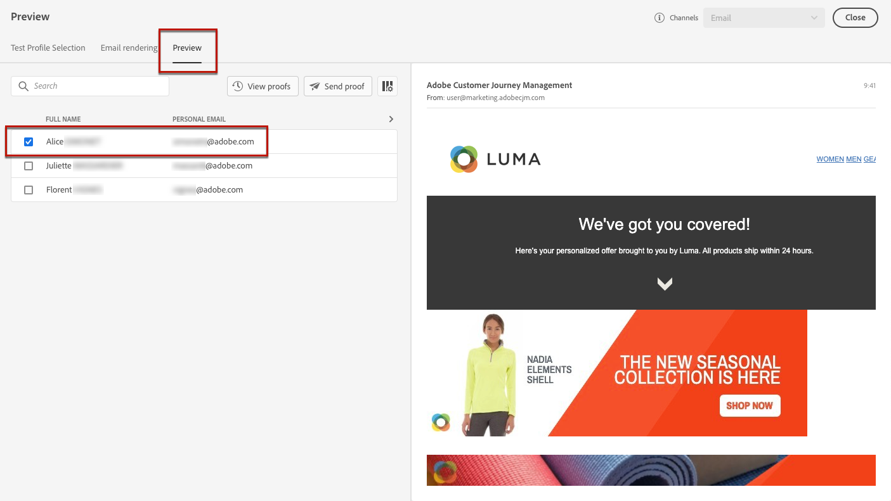

# 添加个性化优惠 {#deliver-personalized-offers}

在[!DNL Journey Optimizer]电子邮件中，您可以插入决策（以前称为“选件活动”），以便利用选件决策引擎来选择要交付给客户的最佳选件。

例如，您可以添加一个决策，该决策会在电子邮件中显示一个特殊折扣选件，该选件将因收件人的忠诚度级别而异。

有关如何创建和管理选件的更多信息，请参阅[此部分](offers/get-started/starting-offer-decisioning.md)。

有关&#x200B;**完整的端到端示例**，其中显示了如何配置选件，在决策中使用这些选件并在电子邮件中利用此决策，请参阅[此部分](offers/offers-e2e.md#insert-decision-in-email)。

➡️ [了解如何将选件添加为个性化](#video-offers)（视频）

## 在电子邮件中插入决策 {#insert-offers}

>[!CAUTION]
>
>在开始之前，您必须[定义选件决策](offers/offer-activities/create-offer-activities.md)。

要在电子邮件中插入决策，请执行以下步骤：

1. 创建电子邮件，然后打开Email Designer以配置其内容。

1. 添加&#x200B;**[!UICONTROL Offer decision]**&#x200B;内容组件。

   

   了解如何在[此部分](content-components.md)中使用内容组件。

1. **[!UICONTROL Offer decision]**&#x200B;选项卡显示在右侧面板中。 单击 **[!UICONTROL Select Offer decision]**。

   

1. 在显示的窗口中，选择与要显示的选件对应的版面。

    版面是用于显示选件的容器。在此示例中，我们将使用“电子邮件顶部图像”放置。 此位置已在选件库中创建，用于显示位于消息顶部的图像类型选件。

1. 选择要在内容组件中使用的选件活动，然后单击&#x200B;**[!UICONTROL Add]**。

   >[!NOTE]
   >
   >列表中仅显示与所选版面兼容的决策。 在此示例中，只有一个选件活动与“电子邮件顶部图像”版面相匹配。

   

选件活动现已添加到组件中。

## 在电子邮件中预览选件 {#preview-offers-in-email}

您可以使用&#x200B;**[!UICONTROL Offers]**&#x200B;部分或内容组件箭头预览添加到电子邮件中的决策所包含的不同选件。

要通过客户用户档案显示决策中所包含的不同选件，请执行以下步骤。

1. 单击 **[!UICONTROL Preview]**。

   

   >[!NOTE]
   >
   >您需要提供测试用户档案才能预览消息。 了解如何[创建测试用户档案](building-journeys/creating-test-profiles.md)。

1. 要选择用于标识测试用户档案的命名空间，请从&#x200B;**[!UICONTROL Identity namespace]**&#x200B;字段中选择&#x200B;**[!UICONTROL Email]**。

   >[!NOTE]
   >
   >在此示例中，我们将使用&#x200B;**Email**&#x200B;命名空间。 在此部分](https://experienceleague.adobe.com/docs/experience-platform/identity/namespaces.html?lang=en#getting-started)中了解有关Adobe Experience Platform身份命名空间[的更多信息。

1. 在身份命名空间列表中，选择&#x200B;**[!UICONTROL Email]**&#x200B;并单击&#x200B;**[!UICONTROL Select]**。

1. 在&#x200B;**[!UICONTROL Identity value]**&#x200B;字段中，输入值以标识测试用户档案。 在本例中，输入测试用户档案的电子邮件地址。

   <!--For example enter smith@adobe.com and click the **[!UICONTROL Add profile]** button.-->

1. 添加其他用户档案，以便根据用户档案数据测试消息的不同变体。

   

1. 单击&#x200B;**[!UICONTROL Preview]**&#x200B;选项卡以测试消息。

1. 选择测试用户档案。 将显示与所选用户档案（女性）对应的选件。

   

1. 选择其他测试用户档案以预览消息每个变体的电子邮件内容。 在消息内容中，将显示与选定测试用户档案（现为人员）对应的选件。

   

详细了解在[此部分](#preview-your-messages)中查看消息预览的详细步骤。

## 操作方法视频{#video-offers}

了解如何向[!DNL Journey Optimizer]中的消息添加offer decisioning组件。

>[!VIDEO](https://video.tv.adobe.com/v/334088?quality=12)
