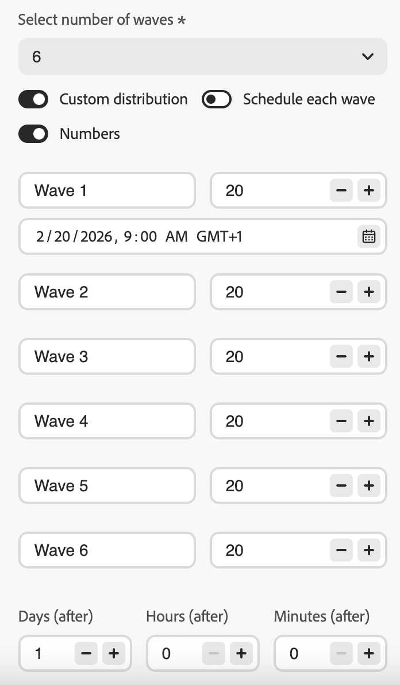

# 按波次发送 {#send-using-waves}

>[!BEGINSHADEBOX]

**在此页面上：**&#x200B;了解如何将出站邮件投放拆分为称为批次的计划批次，以平衡负载、保护发件人信誉并提高可投放性。 波次发送可用于读取受众历程、操作营销活动和编排的营销活动。

>[!ENDSHADEBOX]

您可以计划按名为&#x200B;**批次**&#x200B;的受控批次进行投放，而不是一次发送所有消息。 波次发送可帮助您：

* 平衡负载并保护下游系统（如呼叫中心或登陆页面）不被淹没
* 支持可投放性和发件人信誉，特别是对于高容量发送
* 在预热新IP或平台时逐步增加投放量

您可以定义批次的数量、大小（以受众百分比或绝对数字表示）以及每个批次运行的时间。

## 限制和防护 {#limitations-guardrails}

以下限制适用于任何上下文中的波形发送：

* 您必须至少定义&#x200B;**2波**，并且最多可添加&#x200B;**10波**。
* 两个批次开始的最小间隔为&#x200B;**30分钟**。
* 不能在过去设置波次开始。

其他上下文特定约束适用：

>[!BEGINTABS]

>[!TAB 读取受众历程]

* 波次发送仅适用于计划程序类型为&#x200B;**[!DNL As soon as possible]**&#x200B;和&#x200B;**[!UICONTROL 一次]**&#x200B;的读取受众历程。 [了解有关历程计划的更多信息](../building-journeys/read-audience.md#schedule)。
* 波动发送不适用于定期、事件触发、业务事件、测试模式或模拟历程。
* 波次开始时间不能早于历程开始时间。
* 将受众拆分为批次最多可能需要1小时。 在拆分完成之前，用户档案可能不会进入历程。
* 在单个历程版本中，两个批次不会同时运行。 下一波只在上一波结束后开始。 例如，如果波形间隔1小时而第一个波形运行2小时，则第二个波形在第一次结束时开始，而不是在它的原始计划时间开始。
* 当平台应用配额限制或系统容量负荷较重时，波动启动可能会延迟。

>[!TAB 操作营销活动]

* 波动发送仅适用于&#x200B;**出站**&#x200B;操作（电子邮件、短信、推送、直邮）。
* 波次开始不能早于营销活动开始。

<!--
>[!TAB Orchestrated campaigns]

* Wave sending applies to **outbound** channel activities only (Email, SMS, Push, Direct mail).
* Wave sending is configured at the **channel activity level**, independently for each channel activity in the campaign.
-->

>[!ENDTABS]

## 配置波次发送 {#configure-wave-sending}

>[!CONTEXTUALHELP]
>id="ajo_wave_sending"
>title="按波次发送"
>abstract="将消息投放拆分为计划的批次（批次），以控制随时间变化的数量。 您最多可以定义10个相同或自定义大小和时间的波段。"

>[!CONTEXTUALHELP]
>id="ajo_orchestration_wave_sending"
>title="按波次发送"
>abstract="将消息投放拆分为计划的批次（批次），以控制随时间变化的数量。 您最多可以定义10个相同或自定义大小和时间的波段。"

启用波次发送的步骤取决于您的上下文 — 读取受众历程或操作营销活动。 选择下面的相关选项卡，然后参阅[波形大小和计时](#wave-options)部分以完成配置。

>[!BEGINTABS]

>[!TAB 读取受众历程]

1. 通过[读取受众](../building-journeys/read-audience.md)活动开始您的历程。

1. 双击&#x200B;**[!UICONTROL 读取受众]**&#x200B;活动以打开其属性并选择&#x200B;**[!UICONTROL 以批次方式交付历程操作]**&#x200B;选项。

   {width="100%"}

1. 设置&#x200B;**批次数**（例如，4）。

   {width="80%"}

   >[!NOTE]
   >
   >您必须至少定义2个波段，并且最多可添加10个波段。

1. 选择如何定义波次大小和时间，如下面的[波次大小和时间](#wave-options)部分所述。

>[!TAB 操作营销活动]

1. 创建或打开包含出站操作（电子邮件、短信、推送或直邮）的[操作营销活动](../campaigns/create-campaign.md)。

1. 在营销活动的&#x200B;**[!UICONTROL 计划]**&#x200B;选项卡中，选择&#x200B;**[!UICONTROL 分批次投放营销活动操作]**。

   {width="100%"}

   >[!NOTE]
   >
   >只有在营销活动的&#x200B;**[!UICONTROL 操作]**&#x200B;选项卡中选择了叫客操作时，才会显示&#x200B;**[!UICONTROL 以批次交付营销活动操作]**&#x200B;选项。 [了解详情](../campaigns/campaign-action.md)

1. 设置批次数（例如，4）。

   >[!NOTE]
   >
   >您必须至少定义2个波段，并且最多可添加10个波段。

1. 选择如何定义波次大小和时间，如下面的[波次大小和时间](#wave-options)部分所述。

>[!ENDTABS]

<!--
>[!TAB Orchestrated campaigns]

1. Open a channel activity (Email, SMS, Push, or Direct mail) in your orchestrated campaign canvas.

1. Go to the **[!UICONTROL Schedule]** tab of the channel activity.

1. Under **[!UICONTROL Wave schedule]**, enable the **[!UICONTROL Deliver in waves]** toggle.

    {width="90%"}

1. Set the number of waves using the **[!UICONTROL Select number of waves]** dropdown.

   >[!NOTE]
   >
   >You must define at least 2 waves and can add up to 10 waves.

1. Choose how to define wave size and timing as detailed in the [Wave size and timing](#wave-options) section below.
-->

## 波形大小和计时 {#wave-options}

设置批次数量后，请定义受众如何在这些批次中分布以及每个批次何时运行。 提供了三个选项：

* [相等批次](#equal-waves) — 将受众分成大小相等的部分，批次开始之间有固定间隔。 最适合直接、平均定时发送。
* [自定义分布](#custom-distribution) — 手动将每个批次的大小设置为百分比或配置文件绝对数。 最适合渐进式提升或不均匀的受众拆分。
* [自定义计划](#custom-schedule) — 为每个批次分配特定的开始日期和时间。 最适合需要不遵循有规律间隔的精确计时。

### 相等波段 {#equal-waves}

默认情况下，受众会拆分为大小相等的批次。 设置每个波次开始之间的固定间隔（例如，2小时）。 然后，系统自动安排后续波段，例如，第一个波段在早上9:00，第二个波段在晚上11:00，第三个波段在晚上1:00，第四个波段在晚上3:00。

{width="80%"}

>[!NOTE]
>
>两个批次开始的最小间隔为&#x200B;**30分钟**。

### 自定义分发 {#custom-distribution}

选择&#x200B;**[!UICONTROL 自定义分布]**&#x200B;选项，将每个波次的大小定义为总受众的百分比（例如，15%、20%、25%、40%）。

{width="80%"}

选择&#x200B;**[!UICONTROL 数字]**&#x200B;可将每个波次的大小定义为配置文件的绝对数（例如，10,000；50,000）。

{width="80%"}

>[!NOTE]
>
>* 使用百分比时，所有批次的总计必须为100%。 如果不是这种情况，将显示警告。
>
>* 使用数字时，系统不会验证总覆盖率 — 确保您的波次大小涵盖目标受众。 [了解详情](#faq)

### 自定义计划 {#custom-schedule}

选择&#x200B;**[!UICONTROL 计划每个波次]**&#x200B;以定义每个波次的特定开始日期和时间。 波形不需要均匀地隔开（例如，上午9:00、上午11:00、下午5:00、晚上8:30）。

{width="80%"}

>[!NOTE]
>
>两个批次开始的最小间隔为&#x200B;**30分钟**。

## 用例 {#use-cases}

Wave Sending可帮助您控制发送消息的时间和数量，这可以提高可投放性，保护发件人信誉，并使发送与您的运营容量相一致。 考虑在以下情况下使用波段：

* **呼叫中心或响应管理：**&#x200B;限制每天或每小时传出多少条消息，以便下游团队（例如，客户关怀团队）能够以可管理的速率处理响应。

  {width="50%"}

* **高音量和可投放性：**&#x200B;避免一次发送大量受众。 随时间分散投放有助于维护发件人的信誉并降低被标记为垃圾邮件的风险。

  {width="50%"}

* **IP预热：**&#x200B;使用新平台或IP地址时，逐步增加容量（例如，第一轮为10%，然后为15%、20%等）以逐步建立发送信誉。

  {width="50%"}

## 常见问题 {#faq}

+++ 如果我的波次大小之和不等于总受众会发生什么情况？

* 如果总和&#x200B;**超过**&#x200B;个受众（例如，您计划在第一轮中为80,000个受众设置100,000个受众），则第一轮将发送给所有受众，而剩余的轮次没有剩余的用户档案 — 它们不执行。
* 如果总和&#x200B;**小于受众**（例如，您为100,000的受众定义了四个批次共40,000个配置文件），则只有这些批次中包含的用户档案会收到消息。 其余用户档案不会收到通信，并且不会在后续批次中重试。

+++

+++ 我是否可以为各个批次分配不同的内容或受众区段？

没有。 您只能定义每个波次的大小和时间。 相同的受众和消息内容适用于所有波次 — 您不能定位不同的区段，也不能在每个波段使用不同的内容。

+++

+++ 是要在每次播放之前重新评估受众，还是激活时固定受众？

受众在激活时（触发历程或启动营销活动/活动时）为&#x200B;**评估一次**。 此时会拍摄符合条件的用户档案的快照，并在所有批次中使用 — 在后续每次批次之前不会重新评估受众成员资格。

但是，在每个批次处理&#x200B;**时读取**&#x200B;配置文件属性，而不是在激活时读取。 这意味着对于跨越多天的波段：

* Personalization属性（例如，用户档案的名字或忠诚度级别）反映用户档案在批次运行时的状态。
* **在发送时为每个批次重新应用同意和隐藏检查。** 如果个人资料在两个批次之间选择退出，则它们在后续批次中不会接收消息。

总而言之，包含&#x200B;*谁*&#x200B;是预先确定的，但&#x200B;*用于个性化并发送到这些用户档案的数据*&#x200B;在处理其批次时反映其当前状态。

+++

+++ 波次发送是否适用于入站渠道？

没有。 波动发送仅适用于&#x200B;**出站**&#x200B;渠道操作：电子邮件、短信、推送通知和直邮。 入站渠道（如Web、应用程序内或基于代码的体验）不受波次发送配置的影响。

+++

## 另请参阅 {#see-also}

* [在历程中使用受众](../building-journeys/read-audience.md) — 配置读取受众活动
* [计划一个操作营销活动](../campaigns/campaign-schedule.md) — 设置开始日期、结束日期和频率
<!-- * [Channel activities in Orchestrated campaigns](../orchestrated/activities/channels.md) — configure channel activities in the orchestrated canvas -->

+++ AI知识参考

本节包含结构化知识，用于支持与本主题相关的解释、检索和问答。

要全面了解相关信息，应将此信息与本页上的文档相结合。 这两个源都不是独立的；页面描述了功能，而本节提供了其他上下文来帮助消除术语、意图、适用性和约束条件的歧义。

* **TL；DR：**&#x200B;本页介绍如何在Adobe Journey Optimizer中配置波次发送，以便随着时间推移以受控批次发送出站消息，从而提高可投放性并保护发件人信誉。 波次发送可用于读取受众历程、操作营销活动和编排的营销活动。

**意图：**

* 在读取受众历程、操作营销活动或编排的营销活动渠道活动中启用波次发送
* 将相等的波次配置为每个波次之间有固定间隔
* 将自定义波次大小定义为百分比或绝对配置文件计数
* 为每个批次安排特定的开始日期和时间
* 控制投放量，以保护发件人的信誉或与运营容量相符

**术语表：**

* **批次发送**：一种投放模式，将受众分成批次（批次），并按照计划的间隔向每个批次发送消息，而不是一次向每个批次发送所有消息&#x200B;*（产品特定）*
* **相等批次**：将受众拆分为大小相等的部分的配置，批次开始&#x200B;*（产品特定）*&#x200B;之间具有固定间隔
* **自定义分布**：一种配置，其中每个波次的大小被手动定义为配置文件的百分比或绝对数&#x200B;*（产品特定）*
* **自定义计划**：每个批次都有特定的开始日期和时间，允许不均匀间距&#x200B;*（产品特定）*&#x200B;的配置

**波次发送可用的上下文：**

* 读取受众历程（仅限“尽快”或“一次”调度程序 — 不适用于定期、事件触发、业务事件、测试或模拟运行历程）
* 操作营销活动（仅限出站渠道操作）
<!-- * Orchestrated campaigns (outbound channel activities only, configured per channel activity) -->

**公共护栏（所有上下文）：**

* 最小2波，最大10波
* 两次连续批次开始之间至少间隔30分钟
* 波次开始不能是过去
* 基于百分比的自定义分配的总和必须为100%
* 基于数字的自定义分发不会自动验证总覆盖率

**特定于历程的护栏：**

* 波次开始不能早于历程开始
* 受众拆分最多可能需要1小时；配置文件可能会延迟
* 两个批次绝不会在同一历程版本中同时运行
* 波次启动可能会因平台配额限制或系统负载过重而延迟

**常见问题解答：**

* **问：波动发送是否适用于入站频道？**  — 否；仅出站（电子邮件、短信、推送、直邮）。
* **问：我可以为各个批次分配不同的内容吗？**  — 否；所有批次具有相同的受众和内容。 只有大小和时间可以不同。
* **问：两批次之间的最短间隔是多少？**  — 连续两批次开始之间的30分钟。
* **问：如果波次大小超过或少于受众，会发生什么情况？**  — 超出：第一个批次发送给完整受众，其余批次不执行。 不足：仅已定义的批次中分析的将收到消息；其余的不会重试。
* **问：是否按批次重新评估受众？**  — 否；受众会在激活时快照。 在批次处理时读取配置文件属性（个性化、同意）。

+++
