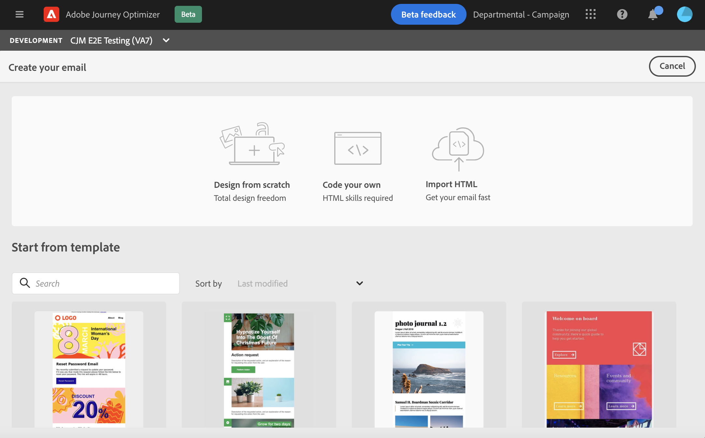

# 电子邮件设计入门 {#get-started-content-design}

在使用 [!DNL Journey Optimizer]，您可以：

* **从头开始设计电子邮件** 通过email designer的界面，并利用 [Adobe Experience Manager Assets Essentials](assets-essentials.md). 了解如何设计电子邮件内容或使用内置模板 [在此部分中](create-email-content.md).

* **代码或粘贴原始HTML** 直接在email designer中。 了解如何编码您自己的内容 [在此部分中](existing-content.md#import-raw-html-code).

* **导入现有HTML内容** 文件或.zip文件夹中。 了解如何导入电子邮件内容 [在此部分中](existing-content.md#import-html-content-from-file).

从消息创建屏幕访问Email Designer时，所有这些功能均可用。 [了解有关消息创建的更多信息](create-message.md).

>[!NOTE]
>
>请注意，下方区域中的模板是静态的，无法编辑。 这些仅供说明之用。
