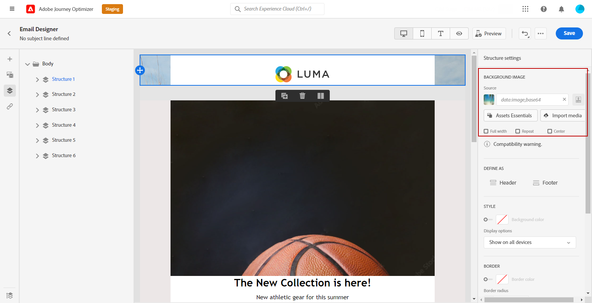

# 个性化您的电子邮件背景 {#backgrounds}

>[!CONTEXTUALHELP]
>id="ac_edition_backgroundimage"
>title="背景设置"
>abstract="您可以为内容个性化背景颜色或背景图像。 请注意，并非所有电子邮件客户端都支持背景图像。"

在使用Email Designer设置背景时，Adobe建议执行以下操作：

1. 根据您的设计需要，将背景颜色应用于电子邮件正文。
1. 在大多数情况下，在列级别设置背景颜色。
1. 请尽量不要在图像或文本组件上使用背景颜色，因为它们很难管理。

以下是您可以使用的可用背景设置。

* 设置 **[!UICONTROL 背景颜色]** 整封邮件。 确保在可从左侧面板访问的导航树中选择主体设置。

   

* 通过选择 **[!UICONTROL 视区背景颜色]**. 此选项允许您从背景颜色中选择其他设置。

   

* 为每个结构组件设置不同的背景颜色。 在导航树中选择从左侧调色板可访问的结构，以仅将特定背景颜色应用于该结构。

   确保未设置视区背景颜色，因为它可能隐藏结构背景颜色。

   

* 设置 **[!UICONTROL 背景图像]** ，以查看结构组件的内容。

   >[!NOTE]
   >
   >某些电子邮件程序不支持背景图像。 不支持时，将改用行背景颜色。 确保在图像无法显示的情况下选择适当的回退背景颜色。

   

* 在列级别设置背景颜色。

   >[!NOTE]
   >
   >这是最常见的用例。 Adobe建议在列级别设置背景颜色，因为这样在编辑整个电子邮件内容时就更灵活了。

   您也可以在列级别设置背景图像，但很少使用此方法。

   
