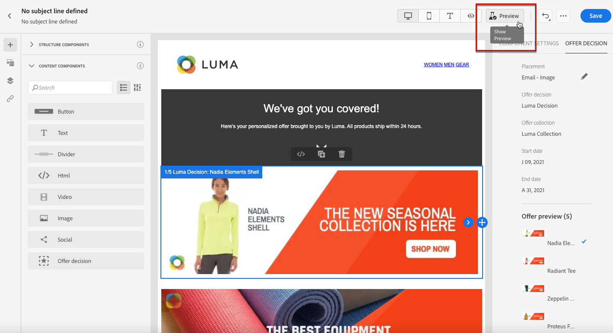

# 添加个性化优惠 {#deliver-personalized-offers}

在 [!DNL Journey Optimizer] 电子邮件中，您可以插入将利用选件决策引擎的决策，以便选择要交付给客户的最佳选件。

例如，您可以添加一个决策，该决策会在电子邮件中显示一个特殊折扣选件，该选件会因收件人的忠诚度级别而异。

有关如何创建和管理选件的更多信息，请参阅 [此部分](../offers/get-started/starting-offer-decisioning.md).

对于 **全端对端示例** 显示如何配置选件，在决策中使用它们并在电子邮件中利用此决策，请注销 [此部分](../offers/offers-e2e.md#insert-decision-in-email).

➡️ [在此视频中了解如何将选件添加为个性化](#video-offers)

## 在电子邮件中插入决策 {#insert-offers}

>[!CAUTION]
>
>在开始之前，您必须 [定义选件决策](../offers/offer-activities/create-offer-activities.md).

要在电子邮件中插入决策，请执行以下步骤：

1. 创建电子邮件，然后打开Email Designer以配置其内容。

1. 添加 **[!UICONTROL Offer decision]** 内容组件。

   

   了解如何在 [此部分](content-components.md).

1. 的 **[!UICONTROL Offer decision]** 选项卡。 单击 **[!UICONTROL Select Offer decision]**。

   

1. 在显示的窗口中，选择与要显示的选件对应的版面。

   [版面](../offers/offer-library/creating-placements.md) 是用于显示选件的容器。 在此示例中，我们将使用“电子邮件顶部图像”放置。 此位置已在选件库中创建，用于显示位于消息顶部的图像类型选件。

1. 显示与所选版面匹配的决策。 选择要在内容组件中使用的决策，然后单击 **[!UICONTROL Add]**.

   >[!NOTE]
   >
   >列表中仅显示与所选版面兼容的决策。 在此示例中，只有一个选件活动与“电子邮件顶部图像”版面相匹配。

   

选件活动现已添加到组件中。

保存更改后，在历程中发送消息时，您的选件即可显示给相关用户档案。

>[!NOTE]
>
>当您更新消息中直接或间接引用的选件、备用选件、选件收集或选件决策时，更新会自动反映在相应的消息中。

## 在电子邮件中预览选件 {#preview-offers-in-email}

您可以使用 **[!UICONTROL Offers]** 或内容组件箭头。

要通过客户用户档案显示决策中所包含的不同选件，请执行以下步骤。

1. 单击 **[!UICONTROL Preview]**。

   

   >[!NOTE]
   >
   >您需要提供测试用户档案才能预览消息。 了解如何 [创建测试用户档案](../segment/creating-test-profiles.md).

1. 要选择用于标识测试用户档案的命名空间，请选择 **[!UICONTROL Email]** 从 **[!UICONTROL Identity namespace]** 字段。

   >[!NOTE]
   >
   >在本例中，我们将使用 **电子邮件** 命名空间。 进一步了解Adobe Experience Platform身份命名空间 [在此部分中](../segment/get-started-identity.md).

1. 在身份命名空间列表中，选择 **[!UICONTROL Email]** 单击 **[!UICONTROL Select]**.

1. 在 **[!UICONTROL Identity value]** 字段中，输入用于标识测试用户档案的值。 在本例中，输入测试用户档案的电子邮件地址。

   <!--For example enter smith@adobe.com and click the **[!UICONTROL Add profile]** button.-->

1. 添加其他用户档案，以便根据用户档案数据测试消息的不同变体。

   

1. 单击 **[!UICONTROL Preview]** 选项卡来测试消息。

1. 选择测试用户档案。 将显示与所选用户档案（女性）对应的选件。

   

1. 选择其他测试用户档案以预览消息每个变体的电子邮件内容。 在消息内容中，将显示与选定测试用户档案（现为人员）对应的选件。

   

了解有关在中查看消息预览的详细步骤的更多信息 [此部分](#preview-your-messages).

## 操作方法视频{#video-offers}

了解如何将offer decisioning组件添加到 [!DNL Journey Optimizer].

>[!VIDEO](https://video.tv.adobe.com/v/334088?quality=12)

