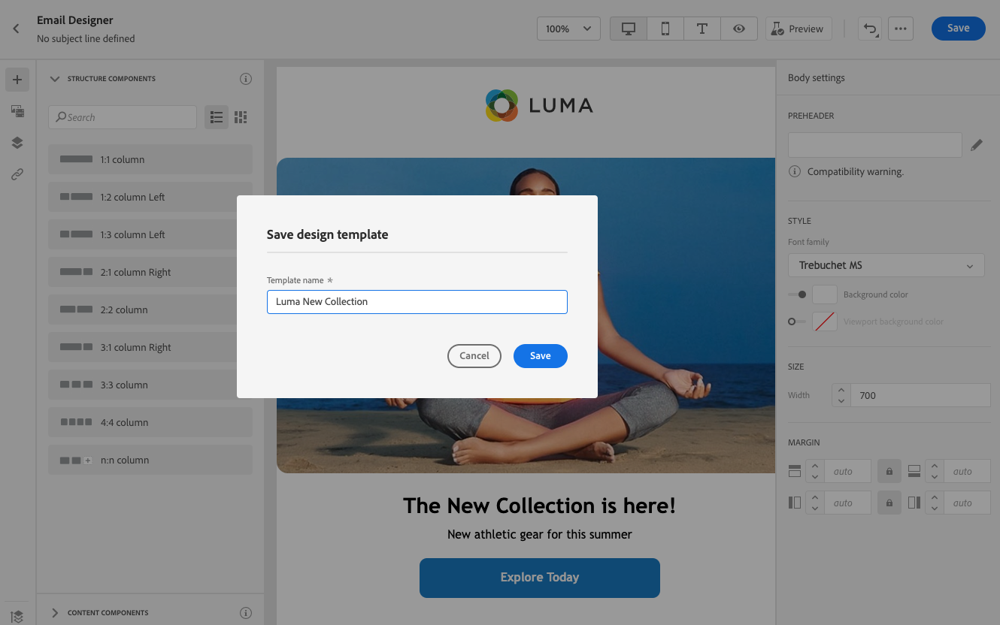
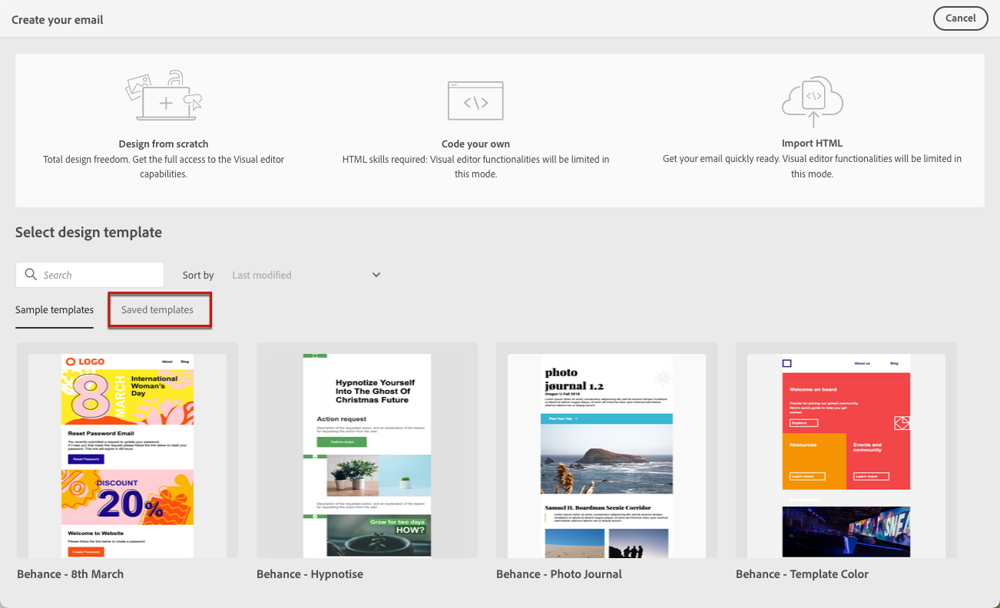

# 使用电子邮件模板 {#email-templates}

使用 **[!UICONTROL Select design template]** 部分以开始从模板构建内容。

您可以选择：
* 20个现成的电子邮件模板。
* 保存的模板。 [了解详情](#save-as-template)

## 另存为模板 {#save-as-template}

设计完 [电子邮件内容](design-emails.md)，则可以保存它以供将来重复使用。 为此，请执行以下步骤：

1. 单击屏幕右上方的省略号。

1. 选择 **[!UICONTROL Save design template]** 下拉菜单中。

   

1. 为此模板添加名称。

   

1. 单击 **[!UICONTROL Save]**。

下次创建电子邮件时，您可以使用此模板来构建内容。 [了解如何](#use-saved-template)

## 使用保存的模板 {#use-saved-template}

1. 打开 [电子邮件设计工具](create-email-content.md).

1. 在 **[!UICONTROL Create your email screen]**, **[!UICONTROL Sample templates]** 选项卡。 选择 **[!UICONTROL Saved templates]** 选项卡。

   

1. 以前所有 [保存的模板](#save-as-template) 显示。 你可以对它们进行排序 **[!UICONTROL By name]**, **[!UICONTROL Last modified]** 和 **[!UICONTROL Last created]**.

   

1. 从列表中选择所选的模板。

1. 选择后，您可以使用左右箭头在所有保存的模板之间导航。

   

1. 单击 **[!UICONTROL Use this email]** 屏幕右上方。

1. 使用电子邮件设计器根据需要编辑内容。
