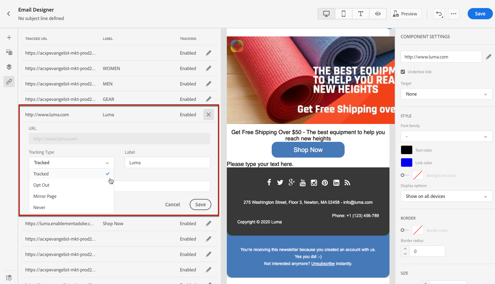

# 添加链接和跟踪消息 {#tracking}

使用 [!DNL Journey Optimizer] 添加指向内容的链接并跟踪发送的消息，以监控收件人的行为。

## 启用跟踪 {#enable-tracking}

您可以通过检查 **[!UICONTROL Open Tracking for email]** 和/或 **[!UICONTROL Click Tracking for email]** 选项时间 [创建消息](../messages/get-started-content.md).

>[!NOTE]
>
>默认情况下，这两个选项均处于启用状态。

这样，您就可以通过以下方式跟踪收件人的行为：

* **[!UICONTROL Open Tracking for email]**:已打开的消息。
* **[!UICONTROL Click Tracking for email]**:单击电子邮件中的链接。

## 插入链接 {#insert-links}

在设计消息时，您可以添加指向内容的链接。

>[!NOTE]
>
>When [跟踪已启用](#enable-tracking)，则会跟踪消息内容中包含的所有链接。

要在电子邮件内容中插入链接，请执行以下步骤：

1. 选择元素并单击 **[!UICONTROL Insert link]** 中。

   

1. 选择要创建的链接类型：

   * **[!UICONTROL External link]**:插入指向外部URL的链接。

   * **[!UICONTROL Landing page]**:插入指向登陆页面的链接。 [在本节](../landing-pages/get-started-lp.md)中了解详情

   * **[!UICONTROL One click Opt-out]**:插入链接，使用户能够快速退订您的通信，而无需确认选择退订。 在 [此部分](../messages/consent.md#one-click-opt-out).

   * **[!UICONTROL External Opt-in/Subscription]**:插入一个链接以接受从您的品牌接收通信。

   * **[!UICONTROL External Opt-out/Unsubscription]**:插入链接以取消订阅从您的品牌接收通信。 在[此部分中](../messages/consent.md#opt-out-management)中了解有关选择退出管理的更多信息。

   * **[!UICONTROL Mirror page]**:插入链接以在Web浏览器中显示电子邮件内容。 在 [此部分](#mirror-page).

   

1. 您可以个性化自己的链接。在[本节](../personalization/personalization-syntax.md#perso-urls)中了解更多关于个性化 URL 的信息。

1. 保存更改。

1. 创建链接后，您仍可以从 **[!UICONTROL Component settings]** 窗格。

   * 您可以编辑链接并更改其类型。
   * 您可以通过选中相应的选项来选择是否为链接添加下划线。

   

## 链接到镜像页面 {#mirror-page}

镜像页面是可通过Web浏览器在线访问的HTML页面。 其内容与电子邮件的内容相同。

要在电子邮件中添加指向镜像页面的链接， [插入链接](#insert-links) 选择 **[!UICONTROL Mirror page]** 作为链接类型。

将自动创建镜像页面。

>[!NOTE]
>
>您无法编辑自动生成的链接。

发送电子邮件后，当收件人单击镜像页面链接时，电子邮件的内容会显示在其默认的Web浏览器中。

>[!NOTE]
>
>在 [验证](preview.md#send-proofs) 发送到测试用户档案时，指向镜像页面的链接不处于活动状态。 它仅在最终消息中激活。

镜像页面的保留期为60天。 延迟后，镜像页面将不再可用。

## 管理跟踪 {#manage-tracking}

的 [Email Designer](create-email-content.md) 用于管理跟踪的URL，例如编辑每个链接的跟踪类型。

1. 单击 **[!UICONTROL Links]** 图标，以显示要跟踪的内容的所有URL的列表。

   利用此列表，可以集中查看并查找电子邮件内容中的每个URL。

1. 要编辑链接，请单击相应的铅笔图标。

   

1. 您可以修改 **[!UICONTROL Tracking Type]** （如果需要）：

   

   对于每个跟踪的URL，您可以将跟踪模式设置为以下值之一：

   * **[!UICONTROL Tracked]**:在此URL上激活跟踪。
   * **[!UICONTROL Opt out]**:将此URL视为选择退订或退订URL。
   * **[!UICONTROL Mirror page]**:将此URL视为镜像页面URL。
   * **[!UICONTROL Never]**:从不激活此URL的跟踪。 <!--This information is saved: if the URL appears again in a future message, its tracking is automatically deactivated.-->

已打开的消息数和已单击的链接数将列在 [“执行”选项卡](../reports/message-monitoring.md).

在 [电子邮件实时报表](../reports/email-live-report.md) 和 [电子邮件全局报告](../reports/email-global-report.md).
