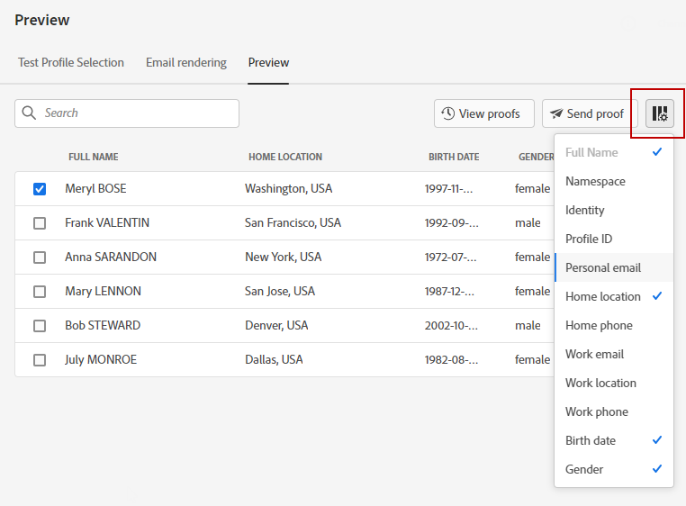

# 预览和测试消息{#preview-and-proof}

定义消息内容后，即可使用测试用户档案进行预览和测试。 如果插入 [个性化内容](../personalization/personalize.md)，您将能够利用测试用户档案数据检查此内容在消息中的显示方式。

要检测电子邮件内容或个性化设置中可能出现的错误，请向测试用户档案发送校样。 每次进行更改时都应发送验证，以验证最新内容。

>[!CAUTION]
>
>您需要提供测试用户档案才能预览消息和发送校样。
>
>了解如何在 [本页](../segment/creating-test-profiles.md).

要测试消息内容，您需要：

* [选择测试用户档案](#select-test-profiles)
* [检查消息预览](#preview-your-messages)

然后，您将能够 [发送校样](#send-proofs) 到测试用户档案。

此外，您还可以 **利特穆斯** 帐户 [!DNL Journey Optimizer] 立即预览 **电子邮件渲染** 在流行的电子邮件客户中。 然后，您可以确保电子邮件内容在每个收件箱中都显示正常且工作正常。 了解如何解锁Litmus电子邮件预览 [此部分](#email-rendering)

>[!CAUTION]
>
>预览消息或发送校样时，只显示用户档案个性化数据。 基于上下文数据（如事件信息）的个性化只能在历程的上下文中进行测试。 了解如何在 [此用例](../personalization/personalization-use-case.md).

➡️ [在此视频中了解如何预览、校样和发布电子邮件](#video-preview)

## 选择测试用户档案{#select-test-profiles}

>[!CONTEXTUALHELP]
>id="ac_preview_testprofiles"
>title="预览和测试消息"
>abstract="定义消息内容后，即可使用测试用户档案进行预览和测试。"
>additional-url="https://experienceleague.adobe.com/docs/journey-optimizer/using/messages/validate/preview.html?lang=en#email-rendering" text="电子邮件渲染"
>additional-url="https://experienceleague.adobe.com/docs/journey-optimizer/using/messages/validate/preview.html?lang=en#preview-your-messages" text="预览"

使用 [测试用户档案](../segment/creating-test-profiles.md) 以定位不符合所定义定位标准的其他收件人。

要选择测试用户档案，请执行以下步骤：

1. 在消息界面或电子邮件设计器中，单击 **[!UICONTROL Show preview]** 按钮以访问测试用户档案选择。

   

1. 通过单击 **[!UICONTROL Identity namespace]** 选择图标。

   

   进一步了解Adobe Experience Platform身份命名空间 [在此部分中](../segment/get-started-identity.md).

   在以下示例中，我们将使用 **电子邮件** 命名空间。

1. 使用搜索字段查找命名空间，选择该命名空间并单击 **[!UICONTROL Select]**

   

1. 输入值以标识测试用户档案，然后单击 **[!UICONTROL Find test profile]**.

   

1. 如果您在消息中添加了个性化，请添加其他用户档案，以便根据用户档案数据测试消息的不同变体。 添加后，用户档案会列在选择字段下。

   

   此列表根据消息个性化元素显示相关列中每个测试用户档案的数据。

## 预览消息{#preview-your-messages}

一次 [测试用户档案](#select-test-profiles) ，则可以预览消息并检查内容。

1. 单击 **[!UICONTROL Preview]** 选项卡来测试消息。

1. 选择测试用户档案。 您可以检查列中可用的值。 使用右/左箭头浏览数据。

   

1. 单击 **[!UICONTROL Select data]** 图标以添加或删除列。

   

   您可以在列表末尾查看特定于当前消息的个性化字段。 在此示例中，用户档案的城市、名字和姓氏。 选择这些字段，并确保在测试用户档案中填充这些值。

1. 在消息预览中，个性化元素会被替换为选定的测试用户档案数据。

   例如，对于此消息，电子邮件内容和电子邮件主题都进行了个性化：

   

1. 选择其他测试用户档案，以预览消息每个变体的电子邮件呈现。

对于推送通知预览：

1. 切换到 **[!UICONTROL Push]** 渠道 **[!UICONTROL Channels]** 下拉列表 **[!UICONTROL Preview]** 屏幕。

   

1. 应用与上述步骤相同的步骤来选择测试用户档案，然后选择要预览内容的设备类型： **[!UICONTROL iOS]** 或 **[!UICONTROL Android]**.

   

1. 在推送预览中，测试用户档案数据会在消息内容中使用。

   例如，对于此推送通知，标题和正文都是个性化的：

   

##   发送验证{#send-proofs}

校样是一种特定的消息，允许您在将消息发送到主受众之前对消息进行测试。 校样收件人负责批准邮件：呈现、内容、个性化设置、配置。

一次 [测试用户档案](#select-test-profiles) ，则可以发送校样。

1. 在 **[!UICONTROL Preview]** 屏幕，单击 **[!UICONTROL Send proof]** 按钮。

   

1. 从 **[!UICONTROL Send proof]** 窗口中，键入收件人的电子邮件并单击 **[!UICONTROL Add]** 将校样发送给您自己或您组织的成员。

   请注意，您最多可以为校样投放添加10个收件人。

   

1. 然后，选择 **测试用户档案** 用于个性化消息内容。

   校样的每个收件人将收到与选定测试用户档案数相同数量的消息。 例如，如果您添加了五封收件人电子邮件并选择了十个测试用户档案，则您将发送五十条校样消息，每个收件人将收到其中十条消息。

1. 如果需要，您可以向校样的主题行添加前缀。 仅字母数字字符和特殊字符，例如。 - _() [ ]，作为主题行的前缀。

1. 单击 **[!UICONTROL Send proof]**。

   

1. 返回  **[!UICONTROL Preview]** 屏幕，单击  **[!UICONTROL View proofs]** 按钮来检查状态。

   

建议在对消息内容进行每次修改后发送校样。

>[!NOTE]
>
>在发送到测试用户档案的校样中，指向镜像页面的链接不处于活动状态。 它仅在最终消息中激活。

## 电子邮件渲染{#email-rendering}

您可以利用 **利特穆斯** 帐户 [!DNL Journey Optimizer] 立即预览 **电子邮件渲染** 在流行的电子邮件客户中。

要访问电子邮件渲染功能，您需要：

* 拥有Litmus帐户
* [选择测试用户档案](#select-test-profiles)

然后，执行以下步骤：

1. 在Email Designer中，单击 **[!UICONTROL Preview]** 按钮并选择 **[!UICONTROL Email rendering]** 选项卡。

1. 单击 **连接您的Litmus帐户** 中。

   

1. 输入您的凭据并登录。

   

1. 单击 **运行测试** 按钮以生成电子邮件预览。

1. 在流行的桌面、移动设备和基于Web的客户端中查看您的电子邮件内容。

   

>[!CAUTION]
>
>连接 **利特穆斯** 帐户 [!DNL Journey Optimizer]，则您同意将测试消息发送到Litmus:发送后，这些电子邮件将不再由Adobe管理。 因此，Litmus数据保留电子邮件策略适用于这些电子邮件，包括可能包含在这些测试消息中的个性化数据。

## 操作方法视频{#video-preview}

了解如何跨收件箱测试电子邮件呈现，如何根据测试资料预览个性化电子邮件、发送验证和发布电子邮件。

>[!VIDEO](https://video.tv.adobe.com/v/334239?quality=12)
