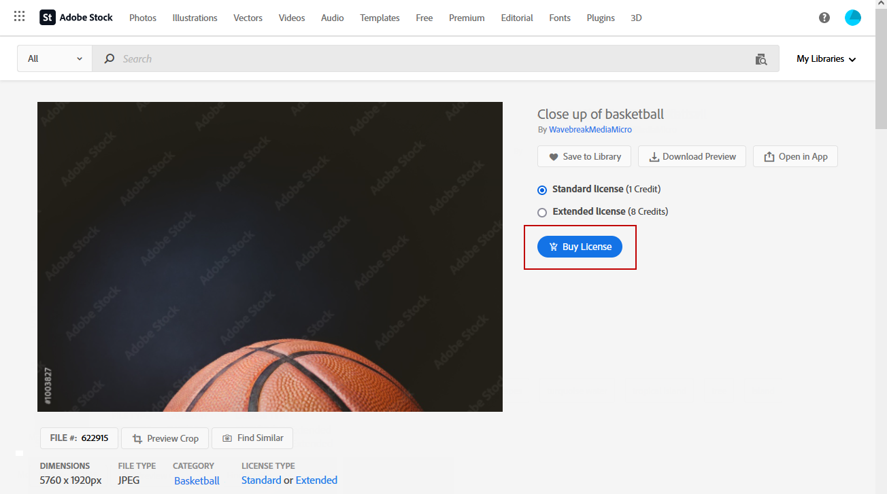
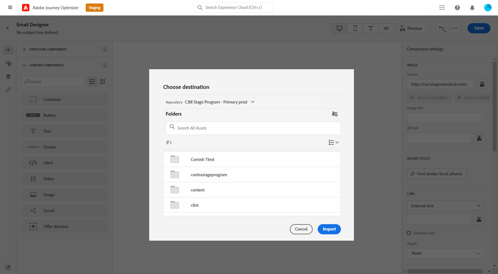

# 管理 [!DNL Adobe Stock] 图像 {#stock}

## 开始使用 [!DNL Adobe Stock] {#get-started-stock}

[!DNL Adobe Stock] 提供对数百万张高品质、精选且免版税的照片、视频、插图和矢量图形的访问。 您可以选择购买信用包以授权资产，或仅为所需资产购买一个Standard或Extended许可证。 Adobe Stock还提供免费的资产集合。

有关 [!DNL Adobe Stock]，请参阅 [Adobe Stock快速入门](https://helpx.adobe.com/stock/get-started.html).

使用 [!DNL Adobe Journey Optimizer]，则您可以从 [!DNL Adobe Stock] ，然后将其添加到您的Assets文件夹中。 的 **[!UICONTROL Find Similar Image]** 选项将帮助您查找与投放中所用资产的内容、颜色和组成相匹配的图像。
[了解有关电子邮件设计的更多信息](design-emails.md).

## 插入和导入 [!DNL Adobe Stock] 图像 {#add-stock-image}

编辑电子邮件并对其进行个性化设置后，您可以从 [!DNL Adobe Stock] 到模板：

1. 拖放图像 **[!UICONTROL Content components]** 电子邮件。

   

1. 从 **[!UICONTROL Component settings]** 菜单，选择 **[!UICONTROL Find Adobe Stock photos]**.

   

1. 浏览库或在字段中输入搜索词。 选择所选图像并单击 **[!UICONTROL Save]**.

   

1. 要授权并下载您的图像，请选择您的图像 **[!UICONTROL Content components]** 单击 **[!UICONTROL License Adobe Stock image]**. 您将被重定向到 [!DNL Adobe Stock] 网站。

   >[!NOTE]
   > 如果您的图像已获得许可，则将由  图标。 在这种情况下，您可以跳到步骤7。

   

1. 从 [!DNL Adobe Stock] 网站上，您需要购买您的资产才能下载图像并删除水印。

   此购买取决于您的Adobe Stock计划或订阅。 有关详细信息，请参见此 [ 页面](https://stock.adobe.com/plans)。

   >[!WARNING]
   > 如果发送包含未授权图像的电子邮件，则该图像将保留其未授权的表单，并带有水印。

   

1. 完成购买后，您现在可以返回至 [!DNL Adobe Journey Optimizer] 选择 **[!UICONTROL Import stock image]** 将授权图像导入资产。

   

1. 选择资产存储在哪个文件夹中。 有关 [!DNL Assets Essentials]，请参见 [页面](assets-essentials.md#get-started-assets-essentials).

   

1. 从 [!DNL Adobe Stock]，则使用 **[!UICONTROL Find similar Stock photos]** 选项，可查找与图像内容、颜色和组合匹配的资产。

   请注意，此选项适用于Assets文件夹中的已授权/未授权的Stock图像和图像。

   

1. 使用 **[!UICONTROL Components settings]** 菜单。 [了解有关组件设置的更多信息](content-components.md)

   

创建并个性化消息后，您可以将其发布以供执行。 [了解详情](../messages/publish-manage-message.md)